---
header-includes:
  - \usepackage{booktabs}
  - \usepackage{pdflscape}
  - \usepackage{tabularx}
  - \usepackage{ragged2e}
  - \newcolumntype{Y}{>{\RaggedRight\arraybackslash}X}
---

# Cybernetic Fault Domains: When Commitment Outruns Verification

**James Beck**
Independent Researcher
February 2026

## Abstract

We hypothesize that when irreversible commitments cross a boundary faster than verification can complete, unverified state transitions accumulate and systems exhibit recurring loss-of-control signatures. We formalize this condition as **cybernetic fault domains** — boundary-relative temporal regimes defined by a commitment boundary (C_k), commitment-verification lag (Δt), and boundary load (σ) — and provide a measurement protocol with nine domain instantiations spanning organizations, language models, censorship systems, security operations, safety tuning, platforms, representational transforms, optimization dynamics, and synthetic coherence. An architectural containment pattern — **governors** that separate proposal from commitment and gate crossings of C_k on evidence — is implemented and mechanically tested in one domain via an enforcement kernel with 37 verifiable claims and a dimensionless risk index (R_t = PD/E) that formalizes the gate as a single inequality. Four falsifiable claims, seven testable predictions, and the strongest adversarial target are specified: a system that sustains high Δt and σ without degradation would kill the framework.

---

## 1. Introduction

Across layered cybernetic systems, failure often looks domain-specific: institutional drift, model hallucination, security bypass, moderation capture, reward collapse. Across a corpus of prior studies (2023–2026), the same structural condition recurs: **commitment can become irreversible before verification could possibly complete**. This paper isolates and names that condition.

We define **cybernetic fault domains** as *boundary-relative temporal regimes* where fast-layer commitments outrun slow-layer verification. The core primitives are:

- **Commitment boundary (C_k):** an externally observable transition that becomes operationally irreversible within a correction horizon (H).
- **Commitment-verification lag (Δt):** the nonnegative lag by which verification and response trails irreversible commitment at C_k.
- **Boundary load (σ):** the accumulated count of *unverified* crossings of C_k over a window.

A system admits the mechanism when Δt > 0 (a race window exists). It becomes *actively loaded* when σ exceeds a calibrated threshold. This separates mere latency from an ordering defect: backlog alone is not the claim; **unverified crossings of an irreversibility boundary** are.

**Contributions:**

1. A boundary-relative definition of cybernetic fault domains in terms of Δt, C_k, H, and σ, with a minimal measurement protocol.
2. Nine domain instantiations mapping these parameters onto heterogeneous systems, each with concrete parameterization, σ operationalization, failure signature, and worked example.
3. An architectural containment pattern — governors — with an existence proof via an enforcement kernel (agent_gov) backed by 37 mechanically verifiable claims, a dimensionless risk index (Appendix C), and a threat model.
4. Four falsifiable claims, seven testable predictions, and the strongest adversarial target that would kill the framework.

**Backlog is not the claim.** Queueing theory describes accumulation when arrival rate exceeds service rate. This framework is narrower: σ counts *unverified* crossings of an *irreversibility boundary*. The fault-domain condition is not "work piles up" but "work commits before it can be verified," converting ordinary backlog into coherent-state damage.

We do **not** claim that Δt explains all failures, nor that temporal decoupling is always undesirable. The framework applies to cybernetic systems with separable fast/slow loops, irreversible commitment boundaries, and delayed observability. A structural limitation: the framework measures verification *coverage*, not verification *validity* — tools are sensors, not oracles, and a compromised evidence channel renders σ uninformative (§5.2, §6.1).

---

## 2. Definitions

### 2.1 Commitment Boundary (C_k)

A **commitment boundary** is a domain-chosen threshold at which a state transition becomes irreversible within a correction horizon H. We use four canonical levels:

- **C0 (ephemeral):** internal scratch/proposals; reversible by construction
- **C1 (communicative):** externally visible asserted claims / answer closure
- **C2 (actuated):** tool calls / state changes with side effects
- **C3 (institutional):** public commitments, policy, resource allocations

All Δt claims are evaluated relative to C_k.

**C_k selection rules.** When placing the commitment boundary for a domain analysis:

1. **Pick the earliest irreversible transition within H.** If rollback inside H is feasible, you are below the boundary.
2. **Prefer the smallest k that captures the claimed harm.** Do not jump to C3 if C2 already produces irrecoverable state.
3. **Must be timestampable.** If crossings cannot be marked with a clock (even proxy clocks), the analysis is Tier C by default.
4. **Verification must use an independent channel.** "The actor says it's fine" does not count as W completing.
5. **If boundaries are contested, report a two-boundary bracket** (e.g., C2 = deploy, C3 = contractual promise). If the claim holds at one but not the other, say so.
6. **Boundary should be stable over the analysis episode.** If C_k shifts mid-analysis, declare a boundary change event and treat it as its own crossing.

### 2.2 Correction Horizon (H)

A commitment is **irreversible** if restoring pre-commit state is infeasible within H (time, cost, legal, or physical constraints). Irreversibility is time-bounded and substrate-relative.

### 2.3 Commitment-Verification Lag (Δt)

Δt is the nonnegative lag by which the completion of verification and response trails the moment of irreversible commitment at C_k.

$$\Delta t \equiv \max\{0,\; (W + A) - T_{\text{commit}}\}$$

Where:

- $T_{\text{commit}}$ = commitment latency (time from event onset to first irreversible crossing of $C_k$)
- $W$ = observation window (time until sufficient evidence is available in decision-usable form — includes arrival, processing, and aggregation)
- $A$ = action latency (time to respond after verification)

All quantities are *durations from event onset* (process initiation, connection start, decision trigger). Δt is positive when verification-and-response (W + A) takes longer than commitment (T_commit). The gap is the fault domain window.

When Δt > 0, verification and response cannot complete before commitment occurs. ∞ denotes structural unavailability of the evidence or actuation channel, not merely large latency.

**Foreclosed verification.** Evidence absent → W = ∞. Actuation/revision absent → A = ∞. Either implies Δt = ∞. Examples: ECH bypass (evidence encrypted, W = ∞), unaugmented LLMs (no revision pathway, A = ∞), stateless systems deployed as persistent agents (temporal closure operators absent, W = ∞).

**Periodic commitments.** When individual commitments are near-instantaneous but frequent (e.g., an optimization step every τ_p rounds), use the inter-commit interval as the relevant T_commit timescale — the cadence, not the duration of a single crossing.

### 2.4 Boundary Load (σ)

σ counts unverified C_k crossings — commitment events that were not preceded by verification.

**Base σ.** Unweighted count:

$$\sigma_N = \sum_{i=1}^{N} x_i \quad \text{where } x_i = 1 \text{ if event } i \text{ crosses } C_k \text{ unverified}$$

σ is an integer counter of unverified boundary crossings, not queue length.

**Weighted variants.** Where domain-specific damage measurement is available, weighted σ variants capture severity per crossing. Examples: commitment shear Δr for representational coherence (§4.7), proxy-true divergence for scalar reward collapse (§4.8). Weighted variants are noted explicitly where used; σ without qualification is the unweighted count.

**Measurement window.** σ is computed over a domain-appropriate observation window (per-session, per-episode, per-audit cycle, per-ledger epoch). Window size is a domain-specific policy parameter.

**Reset.** σ resets at the boundary of the measurement window. Within a window, σ is monotonically non-decreasing.

### 2.5 Loaded-Domain Condition

$$(\Delta t > 0) \land (\sigma > \sigma_{\text{threshold}})$$

- **Entry:** Δt > 0 (race window exists)
- **Loaded:** σ exceeds threshold (unverified crossings accumulating)
- **Failure onset:** loaded-domain condition persists AND domain-specific harm becomes irrecoverable

**Canonical loss-of-control signatures.** When the loaded-domain condition persists, systems exhibit characteristic signatures (domain instantiations in §4 map to these; falsifiable claims in §6 reference them):

- **S-1 False completion.** The system declares success (answer closure, task completion, policy adoption) without evidence that the output satisfies its commitments.
- **S-2 Contradiction accumulation.** Unresolved contradictions between committed state and observed state grow without triggering correction.
- **S-3 Retry spirals.** Activity without epistemic progress — repeated attempts that generate motion but not verification.
- **S-4 Drift into irreversible state.** Premise lock-in, premature convergence, or path-dependence that forecloses correction even when verification eventually arrives.
- **S-5 Boundary load avoidance.** The system shifts to representations or channels that evade the measurement boundary (format shift, metric gaming, audit evasion).
- **S-6 Verification collapse.** The evidence channel itself is foreclosed or compromised; σ becomes meaningless and the framework's measurements are uninformative (§6.1, item 5).

### 2.6 Terminological Note

Throughout this paper, *verification* means checking a claim within an available evidence channel — confirming against an accessible reference (resolver query, test execution, receipt inspection). *Validation* means confirming against external ground truth, which is often unavailable or delayed. The distinction matters: a system can verify all its claims (σ = 0) and still be wrong if the evidence channel itself is compromised (the "lying tools" failure in §5.3). σ measures verification gaps, not validity gaps.

---

## 3. Measurement Protocol

1. Choose commitment boundary C_k appropriate to domain
2. Measure T_commit as timestamp of first irreversible transition across C_k
3. Measure W + A as earliest time verification-and-response could complete
4. Compute Δt = max{0, (W + A) − T_commit}
5. Count σ as unverified crossings per observation window

**Instrumentation tiers.** The strength of any Δt/σ claim depends on measurement quality:

- **Tier A (event-sourced).** Timestamped commitment and verification events from logs, telemetry, or receipts. Supports predictive claims (T-1 through T-7).
- **Tier B (proxy bounds).** Bounded estimates from partial instrumentation (e.g., audit cycle cadence as W proxy, decision calendar as T_commit proxy). Supports structural claims (F-1 through F-4) but not quantitative prediction.
- **Tier C (qualitative ordering).** Domain judgment that commitment is faster than verification, without timestamps. Supports framing and diagnosis only — not eligible for predictive or falsifiable claims.

Uninstrumented assertions ("this system has high Δt") without tier classification are not claims within the framework.

**Calibrating σ_threshold.** σ_threshold is a policy parameter, but it should be derived from baseline telemetry rather than chosen ad hoc. In Tier A/B settings: measure σ over a representative baseline window (healthy operation), set σ_threshold at a high quantile (e.g., 95th percentile) plus a safety margin tied to harm tolerance, and report the implied false-positive rate. For intervention tests (F-3, T-2), hold the threshold fixed across governed and ungoverned runs and compare distributions.

---

## 4. Domain Instantiations

Each domain fixes C_k, defines T_commit, verification window, and σ measurement. Full parameterization with σ operationalization, failure signature, threshold story, and worked example. Companion papers [1]–[14] contain deeper derivations; this paper's claims stand or fall on the measurement protocol (§3) and falsifiability criteria (§6) presented here.

### 4.1 Organizational Systems

#### Canonical Instantiation

| Parameter | Value |
|-----------|-------|
| **C_k** | C3 (institutional closure: policy adopted, resource allocated, restructuring announced, personnel reassigned). Organizational commitments at C3 are expensive to reverse — not because of physics but because of contracts, reputation, sunk costs, and political capital. |
| **T_commit** | Time at which a decision is operationalized: budget allocated, directive issued, reorganization announced, contract signed. Not when the decision is "made" internally (that's C0/C1) — when it binds downstream behavior. |
| **W** | Evidence accumulation cycle: time for implementation feedback to reach decision-makers in usable form. Includes: data collection latency, reporting cadence, analysis time, and organizational filtering (how many layers the signal must traverse). Typical: weeks (operational metrics) to years (strategic outcomes). |
| **A** | Correction latency: time from "we know this is wrong" to "corrective action takes effect." Includes: decision authority delays (who can reverse?), political costs (who loses face?), contractual constraints (what's locked in?), and implementation lag (how long to redirect?). Typical: months to years. |
| **H** | Domain-dependent. Resource misallocation: H = budget cycle (annual). Personnel: H = hiring/firing cycles + institutional knowledge loss (months to years). Strategic direction: H = competitive position degradation (years). Reputation: H = trust rebuilding (years to decades). |
| **Δt** | max{0, (W + A) − T_commit}. Positive whenever verification-and-correction takes longer than commitment — whenever the feedback loop is slower than the decision cadence. This is the default for most hierarchical organizations: decisions commit in weeks (board approval → announcement → budget allocation), while feedback requires months to years (implementation → market response → data collection → analysis → reporting). |
| **σ** | Count of C3 commitments made without completed feedback from the previous commitment cycle. Operationally: decisions where the evidence base is the same as (or older than) the evidence base for the last decision in that domain — no new implementation feedback has arrived. |
| **σ_threshold** | Domain-dependent. Routine operational decisions tolerate higher σ (the organization has institutional knowledge to compensate). Strategic pivots, major restructurings, and market entry decisions demand low σ — these are the decisions where being wrong is expensive and the feedback environment is novel. |

#### σ Operationalization

σ counts *commitment-feedback gaps*, not "wrong decisions." An organization that makes 10 correct decisions without feedback is accumulating σ at the same rate as one making 10 wrong decisions without feedback — because neither can distinguish correct-by-luck from correct-by-knowledge. The system cannot know its decisions are right without the feedback loop.

The measurement protocol:

1. Identify the relevant C3 commitment boundary for the domain (budget allocation, hiring, product direction, policy change).
2. For each C3 crossing, determine whether new implementation feedback was available since the last C3 crossing in that domain.
3. If no new feedback: σ increments. If new feedback was available but not consulted: σ increments (the verification channel exists but was bypassed). If new feedback was consulted and informed the decision: σ does not increment (regardless of whether the decision turns out to be correct).

#### Failure Signature

Paper [2]'s five phenomenological signatures of metastable decay map directly to the fault domain framework:

1. **Long Quiet:** The organization operates in a metastable basin. Decisions appear functional. σ accumulates invisibly because the organization is consuming stored institutional knowledge (buffer B in [9]'s formulation) without replenishing it from implementation feedback. Everything looks fine because the map still approximately matches the territory. This is Rasmussen's [34] "drift toward the boundary of acceptable performance" — the system migrates under production pressure without awareness that it is approaching the safety boundary, because the boundary is invisible to the decision-makers operating at the fast layer.

2. **Flicker:** Near-misses increase. Projects slip. Market signals are "surprising." Employee concerns are dismissed as "not understanding the strategy." The organization is exploring the barrier between its current basin and a degraded basin. σ has accumulated to the point where the decision-reality gap is detectable in principle but not yet catastrophic.

3. **Snap:** A discrete failure event — missed market shift, product failure, key talent exodus, regulatory surprise. The organization crosses from its metastable basin to a degraded basin. The failure appears "sudden" to leadership because the feedback that would have provided warning was never in the decision loop (Δt > 0 throughout).

4. **Slide:** Post-snap, quality continues declining in diverse ways. The organization is now in a broad, high-entropy basin. Reforms are attempted but fail because they are Tier-2 interventions ([5]) applied to a system that has crossed region boundaries and requires Tier-1 restructuring.

5. **Hysteresis Lock:** The organization cannot return to its original state by reversing the original decisions. Institutional knowledge has been lost (employees who understood the old approach have left), market position has been captured by competitors, and the political economy has reorganized around the degraded state.

#### Threshold Story

The critical parameter is not σ alone but the ratio of decision cadence to feedback cadence — which is Δt in temporal terms. Paper [2] models this relationship as quadratic: D_eff = D_intrinsic + σ²Δt². The intuition: drift impulse scales with unverified crossings × lag (~σΔt), and harm tends to scale superlinearly with drift magnitude (compounding inconsistency, state divergence), yielding a squared term as a parsimonious nonlinearity. This is a modeling hypothesis, not a theorem; [2] provides the derivation under its stated assumptions; the quadratic form is falsifiable (see §6).

Paper [9] provides the capacity constraint: the organization remains stable when Δ ≤ C + B/τ. When decision rate (Δ) exceeds processing capacity (C) plus buffer-adjusted reserves (B/τ), the organization enters the metastable regime where σ begins accumulating irreversibly.

The self-deception problem ([9] §3.5) is the organizational version of capture: leadership reports high throughput ("we're making decisions quickly") and binding authority ("everyone is aligned"), while fidelity — whether decisions actually track reality — degrades. The organization appears coherent while its discriminating power collapses.

#### Worked Example

**Technology company strategic pivot:**

- T_commit = time from decision initiation to irreversible commitment. The board meeting decides in ~2 hours; budget reallocation, team reassignment, and public announcement execute within 2 weeks. T_commit ≈ 2 weeks.
- W = time from decision initiation to usable implementation feedback. First meaningful signal from new segment requires product launch (6 months), customer acquisition data (9 months), retention data (18 months). W ≈ 18 months.
- A = correction latency: recognizing the pivot isn't working (requires W to complete) + political cost of admitting error + contract/lease unwinding + rehiring + rebuilding. Minimum: 6 months after feedback arrives. A ≈ 6 months.
- H = Competitive position: 2–3 years. Original market share erodes during pivot; competitors occupy vacated position.
- **Δt = max{0, (W + A) − T_commit} = max{0, 24 months − 2 weeks} ≈ 23.5 months.** The organization is irrevocably committed within 2 weeks; the earliest possible correction requires 24 months of feedback-plus-correction. The system operates in a fault domain for the entire 23.5-month interval.

During those 24 months: additional C3 commitments are made (hiring for new segment, sunsetting old products, new partnerships) — each one incrementing σ without new feedback from implementation. By month 12, the organization has made ~4 major C3 decisions in the new-segment domain with zero implementation feedback. σ = 4.

If the pivot is wrong: by month 18, flicker begins (customer acquisition below projections, team attrition in reassigned groups). By month 24, snap (board acknowledges miss, initiates correction). But H for the original market position has been exceeded — competitors have moved in. Hysteresis lock. This exemplifies Perrow's [33] tight coupling failure mode: the organization's commitment pathways (budget, personnel, contracts, announcements) are so tightly coupled that failure in one cascades through the others, and the interactive complexity makes the trajectory incomprehensible to leadership in real time — it appears "sudden" because the feedback that would have provided warning operated on a slower timescale than the commitment chain.

#### Connection to Papers [1, 2, 5, 9]

The organizational instantiation synthesizes four source papers:

- [1] provides the stability boundary: ρ(M) < 1 (where ρ is the spectral radius of [1]'s inter-layer coupling matrix) requires that the coupling between decision layers and implementation layers can absorb their timescale difference. When leadership operates on quarterly cycles and implementation feedback operates on annual-or-longer cycles, [1]'s coupling parameter approaches the O(10²) adjacency limit. (This is [1]'s notation, distinct from the political budget κ_j used in §4.3–4.6.)

- [2] provides the decay dynamics: temporal lag acts as noise (D_eff = D_intrinsic + σ²Δt²), driving the organization from narrow high-fidelity basins toward broad degraded basins via an entropic ratchet. The five phenomenological signatures are the organizational fault domain's failure trajectory.

- [5] provides the intervention hierarchy: only Tier-1 moves (reduce Δt, reduce ρ, reshape topology) can rescue an organization that has crossed region boundaries. Common reform efforts (new leadership, cultural initiatives, process improvements) are Tier-2 moves that stabilize within the degraded basin without restoring the original.

- [9] provides the capacity constraint: Δ ≤ C + B/τ. The buffer term B/τ explains why organizations can appear functional for extended periods while accumulating σ — they are consuming institutional knowledge reserves (B) that are not being replenished because the feedback loop (τ) is slower than the decision rate (Δ).

#### Short-Cycle Delivery as a Human Governor

Short-cycle delivery practices — CI/CD pipelines [29], work-in-progress limits [32], small-batch release cadences [31], post-merge observability [30] — can be understood as a human-implemented governor when — and only when — the gates are real.

| Governor property | Delivery practice |
|-------------------|-------------------|
| **Proposal/commit separation** | Backlog and feature branches are proposal space (C0). C_k is merge-to-main, deploy-to-production, or feature-flag exposure — the point where rollback cost becomes real. |
| **Evidence gate** | CI results, static analysis, code review approval, canary/monitoring signal. No merge without green pipeline is a hard gate; "ship it, fix later" is a bypassed gate. |
| **Receipt chain** | Ticket → commit → CI run → deploy record → incident link. Not cryptographically chained, but traceable post-hoc. |
| **Regime detection** | Defect rate, rollback rate, cycle time, broken-main frequency. When signals drift, teams tighten gates, reduce WIP, or shrink batch size. |

The temporal parameters: T_commit = time-to-deploy (minutes to weeks). W = CI + monitoring signal availability (minutes to hours). A = rollback/hotfix/revert time (minutes to hours). σ = count of bypassed gates (merged without tests, forced deploy, skipped review, uninstrumented release). When these practices are enforced, Δt stays small and σ stays near zero. When they are not — constant mid-sprint scope churn, bypassed definitions-of-done, no post-deploy observability, long rollback times — the label persists while σ quietly climbs. The same team can be in SAFE or RUNAWAY depending on whether the governor is mechanical or ceremonial.

Forsgren, Humble, and Kim [30] report findings consistent with the governor pattern: across four years of survey data, teams with short deployment cycles, automated testing gates, and fast rollback capability (low Δt at C2) showed both higher throughput *and* lower change failure rates. DORA does not measure Δt or σ directly; the alignment is suggestive, not a direct validation of this framework. Reinertsen [31] provides the theoretical basis: small batch sizes reduce queue-induced delay (W), WIP constraints prevent commitment backlog (σ accumulation), and fast feedback loops accelerate verification. The critical observation from both bodies of work: the gate must be mechanical (automated CI, hard WIP limits) rather than procedural (norms, "best practices") — advisory controls do not function as governors within this framework.

This is a Tier B (proxy bounds) instantiation: commit/deploy timestamps are event-sourced, but "feedback reached the team in usable form" often requires judgment calls about W.

---

### 4.2 LLM Hallucination

#### Canonical Instantiation

| Parameter | Value |
|-----------|-------|
| **C_k** | C1 (communicative closure: answer delivered to user). NOT C0 (token generation is internal scratch). |
| **T_commit** | Time at which the response is emitted to the user as an asserted claim. |
| **W** | Time for external verification to complete (resolver query, citation check, retrieval + comparison). |
| **A** | Time to act on verification result (revise, retract, or flag the claim). |
| **H** | Domain-dependent. Medical/legal: minutes to permanent (advice acted upon). General: seconds to hours (user reads and moves on). |
| **Δt** | max{0, (W + A) − T_commit}. Positive whenever verification-and-response takes longer than response delivery — which is the default architecture for all unaugmented LLMs. |
| **σ** | Count of claims emitted without resolver-backed verification per session/window. Operationally: number of anchor-bearing assertions where no authoritative existence oracle was consulted before delivery. |
| **σ_threshold** | Domain-indexed. At N=2 citation pressure, fabrication rates range from 0% (fully memorized namespaces) to 45% (sparse namespaces). A governance policy must specify: which namespace, which model, what fabrication rate is acceptable. |

#### σ Operationalization

σ is not "number of wrong answers." It is the count of **unverified C1 crossings** — claims that crossed the communicative boundary without passing through an external measurement loop. A claim that was verified — whether found correct or found wrong — does not increment σ, because the verification step occurred. A claim that was never verified increments σ regardless of its actual correctness — because the system cannot distinguish correct-by-luck from correct-by-knowledge without the verification step. (A verified-and-wrong claim is a detection failure, not a boundary load failure; σ measures the absence of the verification step, not its outcome.)

The detector reference implementation operationalizes σ via the Epistemic Grounding (EG) invariant test: extract typed identifiers (DOI, arXiv, RFC, CVE, PyPI spec) from the response, resolve each against its authoritative existence oracle, classify as valid/fabricated/resolver-error. Each unresolved or fabricated identifier is one σ increment.

#### Failure Signature

Hallucination is not a reasoning failure. It is the default behavior of a production system operating without an interrupt line and without a cost function for being wrong. The failure geometry is specific:

1. **Fluent confabulation**: syntactically valid, semantically plausible, externally untethered claims. The model produces well-formed DOIs that don't exist, CVE IDs for vulnerabilities that were never assigned, PyPI package versions that were never released.

2. **Namespace-dependent fabrication rate**: the same model, same temperature, same prompt structure produces 0% fabrication for fully-memorized namespaces (RFC) and 45% for sparse namespaces (DOI). Citation integrity is per-namespace, not per-model. σ calibration must specify which namespace was tested.

3. **Checkability avoidance (format-shift evasion)**: when asked for identifiers in a format that enables validation (e.g., `pypi:name==version`), the model substitutes a less-checkable format (URLs) 80% of the time under soft prompting. The system avoids the verification channel. When format is locked, fabrication doubles — the lies were always latent; format shift hid them.

4. **Phase transition at N=2**: requesting exactly 2 citations produces ~50% fabrication with zero evasion — the "perfect lie zone." N=1 is too easy (model complies honestly). N=5 overwhelms the model into evasion. N=2 maximizes plausible fabrication.

#### Threshold Story

σ_threshold is not a single number. It depends on:

- **Namespace memorization**: RFC (σ ≈ 0 always), CVE (σ low for well-known, high for recent/obscure), PyPI (σ moderate — names memorized, versions not), DOI (σ high — sparse, vast namespace).
- **Model family**: Qwen and Phi-3 *invert* on CVE vs PyPI. A threshold calibrated on one model family is exactly wrong for another.
- **Temperature**: ~50% of measured fabrication at temp=0.7 is sampling noise (disappears at greedy). The remaining fabrication is a genuine knowledge boundary. σ_threshold must account for which failure mode it's measuring.
- **Risk profile**: medical/legal demands σ_threshold ≈ 0 (any unverified claim at C1 in a safety-critical domain is unacceptable). General use can tolerate higher σ with appropriate user-facing uncertainty signals.

#### Worked Example

**Setup**: Qwen 2.5 3B-Instruct, N=2 citation pressure, DOI/arXiv namespace, temperature 0.7.

- T_commit = generation latency (seconds — the time from input to irreversible delivery of the response)
- W = resolver query latency (~200ms for doi.org) + response parsing
- A = revision latency (∞ in default architecture — no revision pathway exists)
- W + A = verification latency (retrieval + comparison + revision — minutes at best, ∞ when no revision pathway exists)
- **Δt = max{0, (W + A) − T_commit}: positive whenever verification takes longer than commitment.** For unaugmented LLMs with no revision pathway (A = ∞), Δt is structurally infinite regardless of generation speed. The race window is not a timing accident; it is the architecture.

Over 15 prompts: 101 anchors emitted, 52 valid, fabrication rate 17.8% (soft format) to 45% (DOI namespace). σ = 49 unverified crossings in 15 prompts. σ/prompt ≈ 3.3.

With governor (margin-based controller + three-level grounding oracle): σ drops because the controller interposes verification before C1 closure. At τ=0.05 (margin threshold), zero regressions across all models and namespaces — the governor catches uncertainty without penalizing confident-and-correct responses.

---

### 4.3 Censorship Circumvention (DPI Bypass)

#### Canonical Instantiation

| Parameter | Value |
|-----------|-------|
| **C_k** | C2 (actuated: connection established beyond the inspection boundary). |
| **T_commit** | Time at which the encrypted transport session completes handshake and begins carrying opaque payload. For TLS 1.3: completion of the first full handshake (~1 RTT). For QUIC: 0-RTT resumption places ClientHello evidence in the first packet. |
| **W_j** | Inspection window: maximum time the enforcement stage will buffer traffic before defaulting. Bounded by line rate λ, buffer capacity, and timeout policy. Typical: milliseconds (wire-speed DPI) to seconds (proxy-based inspection). |
| **A_j** | Action latency: time from classification decision to enforcement effect (RST injection, DNS sinkhole, or firewall rule propagation). Typical: sub-millisecond (inline) to seconds (out-of-band). |
| **H** | Connection lifetime. Once the encrypted session is established, inspection of that flow is foreclosed for the session duration (minutes to hours). |
| **Δt** | max{0, (W + A) − T_commit}, where W = actual evidence-accumulation-plus-classification time (not the inspector's budget W_j) and A = enforcement latency A_j. For unmanipulated traffic, evidence arrives immediately (W ≈ 0) and Δt = 0. Evasion inflates W (fragmenting evidence past W_j) or forecloses it (encrypting evidence → W = ∞ → Δt = ∞). |
| **σ** | Count of flows that crossed C2 (completed handshake) without successful classification. Operationally: flows where Score_j(E(t)) < θ_j for all t ≤ W_j. |
| **σ_threshold** | Policy-dependent via political budget κ_j. Fail-open systems tolerate high σ (availability-optimized). Fail-closed systems tolerate low σ but incur collateral damage (false positives, service disruption). |

#### σ Operationalization

Each enforcement stage j has a formal tuple (W_j, D_j, B_j, C_j):

- **W_j**: inspection window (time budget)
- **D_j**: parse depth (state capacity — flow table entries, reassembly buffers)
- **B_j(λ)**: decision budget (compute per flow — CPU cycles, ML inference depth)
- **C_j ∈ {fail-open, fail-closed}**: commitment polarity (default action when uncertain)

σ increments when a flow crosses C2 and the enforcement stage's confidence Score_j(E(t)) never reaches the classification threshold θ_j within W_j. This is *not* the same as "flow was allowed" — a fail-closed system may block the flow (preventing C2 crossing) at the cost of false positives. σ counts only *unverified crossings*, not blocked flows.

#### Failure Signature

The Universal Bypass Inequality [13] formalizes the conditions under which Δt > 0:

$$(T_E > W_j) \lor (\text{Cost}(E) > B_j) \lor (E(t) = \emptyset)$$
$$\land\; T_E + A_j \geq T_\text{commit}$$
$$\land\; T_\text{handshake} < U$$

Three attack families exploit this:

1. **Δt Inflation**: push evidence accumulation past the inspection window. Example: NoDPI fragments the TLS ClientHello across record boundaries, so the SNI field (the decisive evidence) arrives after W_j expires.

2. **Δt Desynchronization**: break phase alignment between transport and inspection clocks. Example: QUIC places the ClientHello in the first packet — evidence exists immediately, but the transport protocol denies the inspector time to process it.

3. **Δt Escalation Control**: preserve optionality through temporal margin. Example: ECH (Encrypted Client Hello) encrypts the SNI field entirely — E(t) = ∅ for the outer observer, making classification impossible regardless of W_j or B_j.

#### Threshold Story

σ_threshold is bounded by the political budget κ_j: the maximum tolerable collateral cost (false positives, service disruption, legitimacy loss). When enforcement tightens (lower W_j, lower θ_j), false positive rate rises. When enforcement loosens, σ rises. The operator navigates a Pareto frontier: σ_threshold × false-positive-rate ≈ constant for a given traffic mix.

#### Worked Example

**HTTPS with SNI (pre-ECH era)**:

- T_commit = TLS handshake completion ≈ 1 RTT (e.g., 50ms on a domestic link)
- W_j = inline DPI buffer timeout ≈ 100ms (wire-speed appliance)
- D_j = flow table with SNI extraction from ClientHello (first flight)
- Evidence (SNI) arrives in the first flight (t ≈ 0). Classification: B_j ≈ microseconds (regex). Enforcement: A_j ≈ sub-ms (inline RST).
- W + A ≈ 0.1ms. T_commit = 50ms. **Δt = max{0, 0.1ms − 50ms} = 0. No race window** — inspector finishes long before handshake completes.
- σ ≈ 0 for unmanipulated HTTPS. DPI works.

**HTTPS with ECH (Encrypted Client Hello)**:

- T_commit = TLS handshake completion ≈ 1 RTT (same 50ms)
- D_j = same flow table, but SNI field is encrypted — E(t) = ∅
- Evidence channel foreclosed: W = ∞. **Δt = ∞** by convention.
- σ = every ECH flow. **Structural bypass** — the evidence channel is foreclosed, not just delayed.
- Fail-open: all ECH flows transit uninspected (σ = total ECH traffic).
- Fail-closed: all ECH flows blocked (σ = 0, but collateral = all ECH-capable clients).

---

### 4.4 Asynchronous Security Systems

#### Canonical Instantiation

| Parameter | Value |
|-----------|-------|
| **C_k** | C2/C3 (actuated/institutional: attacker objective completion — data exfiltration, privilege escalation, persistence installation). |
| **T_commit** | Time at which the adversary's objective becomes irreversible. For exfiltration: data leaves the network boundary. For escalation: elevated credentials are used. For persistence: implant survives reboot. |
| **W** | T_detect: time for the detection clock to accumulate evidence to decision threshold. Ranges: milliseconds (IDS signature match) to months (APT dwell time). Industry median dwell time: 10–21 days [27, 28]. |
| **A** | T_decide + T_respond: policy evaluation latency + enforcement effect latency. T_decide: microseconds (automated rule) to days (approval chain, change control). T_respond: milliseconds (automated isolation) to weeks (manual remediation of persistent access). |
| **H** | Post-breach correction cost. Exfiltrated data: H = ∞ (cannot be un-exfiltrated). Escalated access: H = remediation time (password rotation, credential revocation). Persistence: H = full reimaging + forensic verification. |
| **Δt** | max{0, (T_detect + T_decide + T_respond) − T_commit}. Positive whenever the defender's detect-decide-respond loop takes longer than the attacker's objective — the attacker wins the race. |
| **σ** | Count of adversary actions that crossed C2/C3 before detection-and-response completed. Operationally: number of TTPs (MITRE ATT&CK technique executions) that achieved their objective before a defensive response was effective. |
| **σ_threshold** | Mission-dependent. For a financial institution: σ_threshold for data exfil may be 0 (any undetected exfil is a breach). For lateral movement: σ_threshold may be higher (some internal reconnaissance is tolerable if contained before escalation). |

#### σ Operationalization

The three-clock model from [14] structures the verification loop:

1. **Detection clock (T_detect)**: when evidence accumulates to decision threshold. Depends on: sampling rate, aggregation window, correlation depth, and whether the attack crosses detection signatures.

2. **Decision clock (T_decide)**: when policy evaluation completes. Depends on: rule complexity, human-in-loop requirements, approval chains, and edge-case handling.

3. **Response clock (T_respond)**: when enforcement action takes effect. Depends on: automation level, manual intervention requirements, and remediation complexity.

σ increments each time an adversary action crosses C2/C3 and completes its objective before T_detect + T_decide + T_respond. The three clocks are separable — an attack may be detected quickly (fast T_detect) but still succeed because T_decide or T_respond is slow (approval chain, manual remediation).

#### Failure Signature

The attacker exploits the widest gap among the three clocks:

1. **Detection gap**: evidence fragments across sampling windows, stays below correlation threshold, or exploits blind spots in telemetry coverage. The attack completes before the detection clock fires. (Example: low-and-slow exfiltration below volume thresholds.)

2. **Decision gap**: detection fires, but policy evaluation stalls — edge case, ambiguous severity, requires human approval, or alert fatigue causes triage failure. The attack progresses during the decision gap. (Example: alert correctly fires but sits in queue for 72 hours.)

3. **Response gap**: decision made, but enforcement action is slow — manual remediation, change control windows, or the response itself requires downtime approval. The attacker achieves persistence during the response gap. (Example: "isolate this host" requires change advisory board approval.)

The fault domain condition: (T_detect + T_decide + T_respond) > T_commit means the attacker wins — the three clocks are sequential (detect *then* decide *then* respond), so the total verification latency is their sum. The attacker needs to complete before the *entire* chain, not just the fastest stage. And because the clocks are separable, any single slow stage can make the whole chain too slow — the *slowest* clock dominates the verification latency.

#### Threshold Story

σ_threshold depends on commitment polarity (C_j):

- **Fail-open (alert-only)**: the system observes but does not prevent. σ accumulates until a human acts. σ_threshold is effectively determined by the human response cadence and the severity escalation policy.
- **Fail-closed (auto-isolate)**: the system acts on detection, reducing σ at the cost of availability. σ_threshold is low, but false-positive cost is high (legitimate actions blocked).

The political budget κ_j determines the operator's position: how much operational disruption (false positive isolation, blocked legitimate actions) is acceptable to reduce σ. Tight security (low σ_threshold, low κ_j) produces availability impact. Loose security (high σ_threshold, high κ_j) produces breach risk. **Failure is defined relative to the declared commitment boundary, not operator utility.** If κ_j is spent to ignore the boundary (tolerate high σ to preserve availability), that is either boundary redefinition (the operator no longer claims to enforce at that C_k level) or commitment theater (the boundary is claimed but not enforced) — both are coherence failures within the framework.

#### Worked Example

**APT exfiltration scenario**:

- T_commit = time from initial access to exfiltration completion (C3: data leaves network boundary, H = ∞). Attacker gains access at day 0, begins staging at day 3, completes exfiltration by day 5. T_commit = 5 days.
- W = T_detect = 14 days from initial access (industry median dwell time for targeted intrusions). The defender's observation window doesn't produce a detection until day 14.
- A = T_decide + T_respond = 2 days (incident triage + severity determination + response plan approval) + 3 days (credential rotation, network segmentation, forensic verification) = 5 days.
- W + A = 14 + 5 = 19 days from initial access to completed response.
- **Δt = max{0, (W + A) − T_commit} = max{0, 19 − 5} = 14 days.** The defender's verification-and-response loop (19 days) takes 14 days longer than the attacker's objective (5 days). The system operates in a fault domain for 14 days — from exfiltration completion (day 5) to response completion (day 19).
- σ: every TTP that achieved its objective before day 14 (initial access, lateral movement, privilege escalation, staging, exfil) = at least 5 unverified C2/C3 crossings.

---

### 4.5 AI Safety Tuning

#### Canonical Instantiation

| Parameter | Value |
|-----------|-------|
| **C_k** | C1 (communicative closure: refusal or compliance decision delivered to the user). The commitment is the system's response — whether it engages with the request or refuses. Both are C1 crossings; the failure mode is in which direction. |
| **T_commit** | Time at which the safety classifier emits its decision (refuse/comply). For pattern-matching classifiers: milliseconds (keyword/regex match on the prompt). For learned classifiers: inference time of the safety head (~same as a forward pass). In either case: effectively instant relative to the timescales of context accumulation. |
| **W** | Time for context/intent analysis to complete. Understanding whether a request is legitimate requires: multi-turn context (is this a security researcher studying malware, or someone trying to write malware?), domain knowledge (is "how to pick a lock" a locksmithing question or a burglary question?), and user modeling (what is the likely downstream use?). Typical: minutes to hours of interaction, or external verification (user credentials, institutional affiliation). |
| **A** | Time to act on context analysis (revise the refusal, escalate to human review, adjust classification). In current architectures: effectively ∞ — there is no revision pathway. Once the refusal fires, the interaction is terminated or constrained. The user can retry, but each retry is a new classification event with no state carried forward. |
| **H** | User trust erosion. A false positive (legitimate request refused) has H proportional to the user's patience and available alternatives. For a researcher blocked from legitimate work: H = hours (if they can rephrase) to permanent (if they switch tools). For an organization deploying safety-tuned models: H = accumulated false positive rate × user attrition rate. |
| **Δt** | max{0, (W + A) − T_commit}. Structurally positive in all current architectures: the classifier fires in milliseconds (T_commit ≈ 50ms); context accumulation requires minutes to hours (W); revision pathway does not exist (A = ∞). |
| **σ** | Count of refusal decisions made without completed context analysis. Operationally: refusals triggered by pattern match where the intent analysis — had it been consulted — would have produced a different classification. This is the false positive rate conditioned on pattern-trigger. |
| **σ_threshold** | Risk-profile-dependent. For a consumer chatbot: moderate σ is tolerable (false refusals are annoying but not harmful). For a research/professional tool: σ_threshold must be low (false refusals block legitimate sophisticated work — the exact use case the tool is supposed to serve). |

#### σ Operationalization

σ is not "number of refusals." It is the count of refusals that crossed C1 before context analysis could have informed the classification. A refusal based on genuine understanding of harmful intent does not increment σ — the verification loop completed before commitment. A refusal triggered by keyword match without context does increment σ — the commitment (refusal) outran the verification (intent analysis).

The asymmetry is critical: this is a *fail-closed* system. Unlike most fault domain instantiations (where the failure is a commitment that should have been blocked), here the failure is a *block* that should have been a commitment. The system's commitment polarity is inverted — it commits to refusal, and the unverified boundary crossing is the refusal itself.

#### Failure Signature

The failure has three characteristic patterns:

1. **Keyword triggering without context:** The classifier fires on surface-level pattern match — "how to make a bomb" triggers refusal regardless of whether the context is chemistry education, fiction writing, or actual harmful intent. The fast layer (pattern match) has committed before the slow layer (intent analysis) can differentiate.

2. **Sophistication penalty:** Users doing sophisticated, legitimate work are *more* likely to trigger false positives because their vocabulary overlaps with harmful content. A security researcher asking about exploit techniques, a medical professional discussing drug interactions, a writer exploring violence in fiction — all produce prompts that match harmful-content patterns. The safety system penalizes exactly the users it should be serving.

3. **Meta-epistemic shutdown:** The most pernicious form — the safety system refuses to engage with *analysis of safety systems themselves*. Asking "how does this safety classifier work?" or "what are the failure modes of content moderation?" triggers the same patterns that actual adversarial probing would. The system cannot be examined by legitimate researchers because examination looks like attack to a context-free classifier.

#### Threshold Story

The political budget κ is asymmetric: the cost of a false negative (harmful content produced, PR disaster, regulatory action) is treated as unbounded, while the cost of a false positive (legitimate user frustrated, sophisticated work blocked) is treated as negligible. This drives σ_threshold toward zero on the false-negative side and effectively infinity on the false-positive side.

The result is a system that is safe in the narrow sense (low false negatives) and hostile in the broad sense (high false positives for sophisticated users). The commitment polarity (fail-closed) combined with zero κ for false negatives produces a classifier that operates entirely at the speed of the fast layer (pattern match) with no reconciliation channel to the slow layer (context).

#### Worked Example

**Security researcher studying LLM jailbreaks:**

- User prompt: "Describe the DAN jailbreak technique and explain why it works mechanistically."
- T_commit = classifier fires on "jailbreak" + "DAN" → refusal emitted. Time: ~50ms.
- W = context analysis: this is a security research context (user has prior turns discussing alignment, cites published papers, frames as analysis not instruction). Time to establish: 3–5 turns of interaction, ~10 minutes.
- A = revision pathway: none. The refusal is final for this turn. User must rephrase and retry, losing the conversational context that would have informed intent analysis.
- Δt = max{0, (10 min + ∞) − 50ms} = structurally infinite.
- σ = 1 (refusal crossed C1 without context analysis).

The researcher rephrases: "What are the known vulnerabilities in RLHF-based alignment?" — triggers again on "vulnerabilities" + "alignment." σ = 2.

After 4 attempts, the researcher either finds a circumlocution that avoids all trigger patterns (degrading the quality of the interaction) or abandons the tool. In both cases, the safety system has failed its ostensible purpose: it has not prevented harm (the researcher was not going to cause harm) and it has prevented legitimate research (the researcher cannot study the system they need to study).

#### Connection to the Framework

This instantiation is notable because the commitment polarity is inverted: the fault is in the *refusal*, not in the *action*. The system commits to blocking at fast-layer speed without slow-layer verification of whether blocking is appropriate. This is structurally identical to the general fault domain pattern — commitment outruns verification — but the commitment is negative (refuse) rather than positive (act).

It also demonstrates that fail-closed commitment polarity does not eliminate fault domains — it relocates them. A fail-closed system prevents false negatives (harmful content getting through) at the cost of creating a new fault domain for false positives (legitimate work being blocked). The fault domain exists at both polarities; the question is which side of C_k the unverified crossings accumulate on.

---

### 4.6 Platform Dynamics

#### Canonical Instantiation

| Parameter | Value |
|-----------|-------|
| **C_k** | C3 (institutional closure: algorithmic curation decisions at population scale). Individual content moderation decisions are C1/C2; the C3 commitment is the algorithmic policy that determines visibility, ranking, and amplification for millions of users simultaneously. A ranking algorithm change is a C3 commitment because it is expensive to reverse (user behavior adapts, creators optimize for the new signal, advertiser contracts depend on it). |
| **T_commit** | Time at which content achieves viral distribution — crosses from individual visibility to population-scale amplification. For algorithmic platforms: effectively instant once the engagement signal exceeds the amplification threshold. The algorithm commits to promoting content before any editorial review could occur. Also: time at which an algorithmic curation change is deployed to production. |
| **W** | Moderation cycle: time for content review to complete (human review queue, automated classifier pipeline, appeals process). Typical: hours (automated) to days (human review) to weeks (policy-level decisions about content categories). For algorithmic changes: time for downstream effects (content ecosystem shifts, creator behavior changes, user well-being impacts) to become measurable. Typical: weeks to months. |
| **A** | Enforcement latency: time from moderation decision to effective removal/demotion. For individual content: minutes (automated takedown) to days (appeals). For algorithmic changes: months to years (reversing an algorithmic shift requires re-training creator behavior, rebuilding trust with affected communities, unwinding advertiser dependencies). |
| **H** | Content harm: H ranges from minutes (misinformation during a crisis, where incorrect information acted upon is irreversible) to permanent (reputation destruction, radicalization pathways, mental health impacts on vulnerable users). Ecosystem harm: H = years (content creator ecosystem restructuring, user trust rebuilding). |
| **Δt** | max{0, (W + A) − T_commit}. Structurally positive at both levels. Content level: moderation (W + A = hours to days) takes longer than viral distribution (T_commit = minutes). Algorithm level: impact assessment (W + A = months) takes longer than deployment (T_commit = immediate). |
| **σ** | Content level: count of pieces of content that achieved viral distribution before moderation review completed. Algorithm level: count of curation changes deployed without completed impact assessment from the previous change. |
| **σ_threshold** | Platform-dependent via κ (political budget). κ includes: user growth targets (tolerance for harmful content if it drives engagement), advertiser pressure (tolerance for brand-unsafe adjacency), regulatory exposure (tolerance for content that triggers regulatory action), and public sentiment (tolerance for reputational damage). κ shifts enforcement tolerance, not the definition of failure — a platform may remain profitable under high κ while still failing relative to its declared C_k commitment boundary. |

#### σ Operationalization

Platform dynamics produce σ at two nested timescales:

**Content-level σ:** Each piece of content that crosses the virality threshold before moderation review is one σ increment. This is measurable: compare T_viral (time content reaches amplification threshold) against T_moderation (time moderation decision is rendered). For most platforms, T_viral is minutes to hours; T_moderation is hours to days. σ_content accumulates continuously at a rate determined by the volume of content that achieves virality.

**Algorithm-level σ:** Each curation or ranking change deployed without completed impact assessment from the previous change is one σ increment. This is harder to measure because "impact assessment" is itself contested — platforms can define assessment narrowly (A/B test on engagement metrics, completing in days) or broadly (ecosystem effects on content diversity, completing in months). The narrower the definition, the lower the apparent σ — which is the platform equivalent of capture (narrowing the alphabet to make fidelity look high).

#### Failure Signature

Paper [4] identifies the platform failure geometry as eigenstructure collapse — the progressive elimination of content modes under scalar optimization:

1. **Engagement monoculture:** The ranking algorithm acts as [3]'s T-operator on the content distribution, exponentially amplifying engagement-maximal content and suppressing everything else. Content diversity decreases monotonically. The platform appears "working" (engagement metrics are high, throughput is high, algorithmic authority is binding) — but the content ecosystem is collapsing toward a single mode.

2. **Creator optimization:** Content creators adapt to the algorithm's reward signal, producing more of what gets amplified and less of what doesn't. This is the closed loop that makes collapse inevitable: the algorithm selects for engagement → creators optimize for engagement → the algorithm sees higher engagement from optimized content → it selects harder. The multiplicative reweighting operator T is operating on both the content distribution and the creator behavior distribution simultaneously.

3. **Moderation treadmill:** As content optimizes for engagement, the boundary between "engaging" and "harmful" narrows. Moderation must run faster to keep pace with content that is increasingly sophisticated at maximizing engagement while skirting policy boundaries. But moderation operates on the slow layer (human review, policy deliberation), while content optimization operates on the fast layer (real-time algorithmic feedback). Δt increases over time.

4. **Enshittification trajectory:** [2]'s five-phase metastable decay maps onto platform lifecycle. Long Quiet: early-stage platform with user-centric design, high content diversity, low Δt (editorial curation provides slow-layer feedback). Flicker: engagement optimization begins, content diversity metrics decline, first content moderation crises. Snap: platform pivots to extraction (advertiser/revenue optimization dominates user experience). Slide: quality degrades across multiple dimensions simultaneously. Hysteresis Lock: users, creators, and advertisers are locked into the degraded equilibrium by network effects and switching costs.

#### Threshold Story

The four stability conditions from [4] map to correlator quality requirements:

1. **Multi-objective optimization** (F requirement): Ranking must preserve multiple content dimensions, not collapse to a scalar engagement signal. Violated because multi-objective ranking reduces optimization power and is competitively penalized.

2. **Exogenous forcing** (external diversity injection): Content that doesn't optimize for engagement must be artificially maintained in the distribution. Violated because non-engagement content reduces aggregate engagement metrics.

3. **Timescale separation** (W + A management): Editorial/moderation processes must operate fast enough to review content before viral distribution. Violated because real-time algorithmic optimization systematically outpaces human review cadence.

4. **Hybrid control** (authority distribution): Human editorial judgment must have binding authority over algorithmic curation. Violated because human editorial doesn't scale and creates legal liability (editorial judgment implies editorial responsibility).

All four conditions are systematically violated under competitive pressure. The platform fault domain is structurally loaded (Δt > 0, σ > σ_threshold) by business model necessity, not by implementation failure.

#### Worked Example

**Algorithmic amplification of misinformation during a crisis event:**

- A misleading health claim is posted at t=0.
- T_commit = content reaches amplification threshold at t+45 minutes (1,000 shares trigger algorithmic boost).
- W = fact-check pipeline: automated classifier flags at t+2 hours; human reviewer confirms at t+8 hours; policy team determines category at t+24 hours.
- A = enforcement: automated demotion at t+8 hours (after human confirmation); full removal at t+26 hours (after policy determination + appeals window).
- Δt = max{0, (W + A) − T_commit} = max{0, 8 hr − 45 min} ≈ 7.25 hours. Moderation takes 7+ hours longer than viral distribution. By t+45 min, the content has been shared by 1,000 accounts, screenshot-captured, cross-posted to other platforms. Even after removal at t+26 hours, the information has propagated beyond the platform's correction horizon. H = ∞ for the subset of users who acted on the misinformation before removal.
- σ = 1 (one piece of content crossed viral distribution threshold before moderation completed).

At platform scale: this happens hundreds of times daily. σ_content accumulates at a rate proportional to content volume × virality rate × (1 − pre-viral moderation coverage). For a major platform processing millions of posts per day with <1% pre-viral moderation coverage, σ is effectively equal to the number of posts that achieve viral distribution.

#### Connection to Papers [3, 4]

[3] derives, under its stated assumptions, that any system operating the multiplicative reweighting operator T(p)(x) = p(x)·e^{η·r(x)}/Z under scalar reward will converge to a fixed point with collapsed eigenstructure. [4] shows that platforms are a nearly ideal instantiation of this operator, with engagement metrics as the scalar reward and algorithmic curation as the reweighting mechanism.

The fault domain framing adds temporal specificity: the *rate* of eigenstructure collapse is governed by Δt (the gap between algorithmic update cadence and editorial/moderation cadence). Faster algorithms with slower moderation collapse faster. The collapse is not a bug in the platform — it is the designed behavior of the T-operator operating at a Δt that moderation cannot match.

---

### 4.7 Representational Coherence

#### Canonical Instantiation

| Parameter | Value |
|-----------|-------|
| **C_k** | C3 (institutional: transformed representation adopted as operative artifact — the compressed summary replaces the original, the formalized schema becomes the system of record). |
| **T_commit** | Time at which the transformed representation is accepted into downstream use, displacing or deprecating the source representation. |
| **W** | Time to verify that the transformation preserved all commitments from the source. Operationally: time to diff the commitment inventory of the source against the commitment inventory of the output. |
| **A** | Time to remediate identified shear (restore lost commitments, flag weakened commitments, revert transformation). |
| **H** | Domain-dependent. If the transformed artifact propagates to production, legal filings, or published standards before shear is detected: H grows with propagation distance. A compressed policy summary that omits an edge case, once adopted, becomes the de facto policy. |
| **Δt** | max{0, (W + A) − T_commit}. Positive whenever verification (commitment-preservation check + remediation) takes longer than adoption. This is the default for most LLM-mediated transformations — the output is accepted immediately (T_commit ≈ 0), while a commitment-preservation diff takes minutes to hours. |
| **σ** | Count of transformations adopted into downstream use without completed commitment-preservation verification. Each unverified adoption is one σ increment. The *severity* of each crossing is measured by commitment shear (Δr): the number of MUST/SHOULD/MAY commitments DROPPED or WEAKENED, weighted as Σ w(k) · loss(k) where w(MUST) = 1.0, w(SHOULD) = 0.7, w(MAY) = 0.3. σ counts unverified adoptions; Δr measures the damage per adoption. |
| **σ_threshold** | Domain-dependent. For safety-critical specifications: any dropped MUST commitment (σ_MUST > 0) exceeds threshold. For general summarization: σ_threshold calibrated to acceptable information loss for the use case. |

#### σ Operationalization

Representational coherence introduces a measurement axis orthogonal to temporal coherence [11]. σ still counts unverified crossings of C3 — each transformation adopted without a preservation audit is one σ increment, consistent with §2.4's definition. The *damage* per crossing is measured by commitment shear (Δr), which counts lost commitments across the transformation. The two quantities are independent: σ can be 1 (one unverified adoption) with Δr = 0 (the transformation happened to preserve everything) or Δr = 0.55 (the transformation lost 55% of commitments). σ measures whether you checked; Δr measures what you'd have found.

A system can be temporally coherent (Δt = 0, all claims verified before delivery) and representationally incoherent (the verified claims lost commitments from the source material during transformation). The two failure modes are orthogonal.

The measurement protocol from [11]:

1. Extract commitment inventory from source: enumerate all deontic commitments (MUST, SHOULD, MAY) with their objects and conditions.
2. Extract commitment inventory from transformed output.
3. Classify each source commitment as PRESERVED, WEAKENED, or DROPPED in the output.
4. Compute Δr = Σ w(k) · loss(k) where loss(DROPPED) = 1.0, loss(WEAKENED) = 0.5, loss(PRESERVED) = 0.0. (Δr is shear per adoption; σ counts adoptions where steps 1–3 were never performed.)

#### Failure Signature

Commitment shear is transform-dependent, not content-dependent:

1. **Compression shear (~55%)**: summarization systematically drops edge cases, exceptions, and conditional requirements. The compressed output preserves the "headline" commitment but loses the boundary conditions that constrain it. Example: "Cache entries MUST be invalidated when the origin server returns a new ETag" → "Cache entries should be refreshed periodically" (MUST → SHOULD, conditional dropped, mechanism changed).

2. **Formalization shear (~45%)**: translation to a formal schema forces ontological choices that eliminate commitments that don't fit the schema's categories. Example: observability requirements (log formats, metric emission) are systematically dropped during formalization because the schema has no field for them.

3. **Translation shear (~0%)**: cross-language translation preserves commitments with near-zero loss, because translation preserves structure while changing surface form. This is the control condition — it demonstrates that shear is a property of the *transform type*, not of the language model performing it.

#### Threshold Story

σ_threshold depends on the commitment modality and the downstream propagation distance:

- **MUST commitments**: σ_threshold = 0 for safety-critical domains. Any dropped MUST commitment is a defect, regardless of how many others were preserved.
- **SHOULD commitments**: σ_threshold = domain-calibrated. Some SHOULD relaxation is acceptable in compression (that's what compression does); the question is whether the relaxation was intentional or invisible.
- **MAY commitments**: higher tolerance, but dropped MAY commitments can still represent lost optionality.

The critical threshold is not the total σ count but **whether the adopter knows what was lost**. If the transformation is accompanied by a shear report (explicit enumeration of dropped/weakened commitments), the adopter can make an informed decision. If the transformation is accepted as "equivalent to the original" without a shear audit, every dropped commitment is an unverified boundary crossing.

#### Worked Example

**Cache invalidation policy → LLM compression** (from [11]):

- Source: 11 commitments (4 MUST, 5 SHOULD, 2 MAY)
- Transform: "Summarize this cache policy in 5 key principles"
- T_commit ≈ 0 (summary accepted immediately upon generation)
- W = time to perform commitment-inventory diff ≈ 15-30 minutes (manual) or seconds (automated with LLM-as-judge)
- A = time to flag lost commitments and either revise the summary or annotate the losses
- Δt = max{0, (W + A) − T_commit}: structurally positive (W + A = minutes to hours; T_commit ≈ 0)

Result: 6/11 commitments dropped or weakened. σ_weighted = 4 × 1.0 × 0.5 + ... ≈ 3.15 (exact depends on which MUSTs were hit). 55% commitment shear.

For comparison, the same policy translated to French: ~0% shear, all commitments preserved. The transform type, not the model, determines the failure rate.

---

### 4.8 Scalar Reward Collapse

#### Canonical Instantiation

| Parameter | Value |
|-----------|-------|
| **C_k** | C3 (institutional closure: optimization step hardened into system behavior). An algorithm update that changes arm selection for a user population is a C3 commitment — it alters organizational behavior at scale and is expensive to roll back once deployed. |
| **T_commit** | Per-update commitment latency ≈ 0 (each proxy update takes effect instantly). The policy change is irrevocable upon application — arm selection shifts immediately for all alive users. The *cadence* at which these zero-latency commitments recur is τ_p. |
| **τ_p** | Proxy update cadence. The optimizer updates its value estimates from CTR every τ_p rounds. Tested: τ_p ∈ {1, 5, 20}. τ_p has surprisingly little effect on collapse — the dominant variable is D. |
| **D** | Retention observability delay. The true objective (survival-weighted utility: CTR minus churn-penalty × expected hazard) is observable only every D rounds, when the retention team forces a correction to the agent's value estimates. Between corrections, the optimizer drifts back toward proxy-optimal. D is the Δt generator. |
| **A** | Actuation time = τ_p (updates are synchronous). Once the agent updates, the new policy takes effect immediately. |
| **H** | Harm model: h = 0.02 × sigmoid(6 × (B − 1.0)), where B is per-user burnout. When B exceeds the threshold (θ = 1.0), the sigmoid steepens and churn hazard accelerates. Burnout dynamics: B_{t+1} = 0.98 × B_t + δ(a), with δ = (0.015, 0.003) for high-CTR and low-CTR arms respectively. Steady-state burnout: B* = δ/(1 − α) = {0.75, 0.15}. The high-CTR arm drives burnout to 5× the low-CTR arm. |
| **Δt** | max{0, D − τ_p}. Since each individual commitment is instant (T_commit ≈ 0), the meaningful gap is the cadence mismatch: the maximum wait between verification events (D) minus the interval between commitments (τ_p). Positive whenever the retention correction cadence is slower than the proxy learning cadence — the default in any system where engagement metrics are real-time and retention metrics are batch. At D=500, τ_p=5: Δt = 495 rounds of unverified proxy optimization per correction cycle. |
| **σ** | Count of optimization steps committed to production without a D-correction having verified proxy-true alignment since the last update. Each proxy-based policy update between D-corrections is one σ increment — an unverified C3 crossing. The *damage signature* is proxy-true divergence: timesteps where proxy_delta > 0 AND true_delta < 0. σ counts unverified steps; divergence measures the harm those steps caused. |
| **σ_threshold** | σ at damage onset (τ_collapse). Not a fixed number — it's the σ value when C_k is first violated. Empirically: σ ≈ 13–34 misaligned decisions suffice to trigger collapse, depending on D and seed. |

#### σ Operationalization

σ is not "number of bad outcomes." It is the count of **unverified C3 crossings** — optimization steps where the agent updated its policy from proxy signal alone, without a D-correction having verified proxy-true alignment. Every proxy-based update between D-corrections increments σ, regardless of whether that particular step happened to align with the true objective. A step that improves both CTR and retention still increments σ if no D-correction informed it — the system was correct by luck, not by verification.

The simulation tracks two quantities: σ (unverified update count, consistent with §2.4) and a damage signature (proxy-true divergence events, where proxy_delta > 0 AND true_delta < 0). The damage signature is not σ — it is the consequence of accumulated σ. This gives both σ_total (total unverified updates over T=1000) and divergence_at_τ (harm accumulated by the moment the damage floor is breached).

The critical insight: **σ is sparse**. In the D=500 unstable regime, only 16 out of 316 rounds (5.1%) are misaligned before collapse triggers. The system doesn't need to be wrong often — it needs to be wrong *cumulatively* in a direction that the correction cycle can't reach in time.

#### Failure Signature: "Long Quiet → Flicker → Snap"

The collapse trajectory has three phases:

1. **Long Quiet (rounds 0–250):** The optimizer exploits the high-CTR arm. Population burnout accumulates silently — B rises toward the hazard threshold but churn hazard remains negligible (sigmoid is flat below θ=1.0). CTR looks healthy. alive_fraction drifts slowly from 1.0 to ~0.9. Nothing appears wrong. σ increments slowly.

2. **Flicker (rounds 250–310):** Burnout crosses the sigmoid threshold. Churn hazard steepens. alive_fraction drops from 0.9 to 0.6. CTR begins declining (fewer users to click). The optimizer may notice — but it's still between D-corrections, still optimizing on proxy. Some seeds recover here (metastable regime). Others don't.

3. **Snap (rounds 310+):** Churn accelerates exponentially. alive_fraction collapses from 0.6 to ~0.2 within 10 rounds. The damage is irreversible — churned users don't return. Even when the D-correction finally arrives and forces the agent to switch arms, the population is already gone.

This is the Goodhart failure geometry in temporal terms: the proxy (CTR) tracks truth for hundreds of rounds while burnout silently accumulates, then the system crosses a nonlinear threshold and collapses faster than the correction cycle can respond.

#### Threshold Story

The regime boundary is controlled by D (retention delay), not τ_p (update cadence):

| D | τ_p | Regime | collapse_rate | alive_final (mean) | τ_collapse |
|---|-----|--------|---------------|--------------------|------------|
| 10 | any | Stable | 0/3 | 0.87 | none |
| 50 | any | Stable | 0/3 | 0.83–0.84 | none |
| 200 | 1 | **Metastable** | **2/3** | 0.40 | 550–611 |
| 200 | 5,20 | Stable | 0/3 | 0.60 | none |
| 500 | 1 | Unstable | 3/3 | 0.11 | 313–316 |
| 500 | 5 | Unstable | 3/3 | 0.24 | 313–316 |
| 500 | 20 | Unstable | 3/3 | 0.25 | 313–316 |

The regime predicates (all within horizon T=1000):

- **Stable**: No runs violate C_k (alive_fraction ≥ 0.5). D-corrections arrive fast enough to keep the optimizer grounded.
- **Metastable**: Some seeds violate C_k; τ is large and varies across seeds. The system can tip either way — stochastic dynamics near the phase boundary.
- **Unstable**: All seeds violate C_k; τ is bounded above (~316). The correction cycle is too slow to prevent collapse regardless of initial conditions.

The key structural observation: **D=200 is metastable only at τ_p=1** (fastest proxy learning). At τ_p=5 or τ_p=20, D=200 is stable — slower proxy learning gives the correction cycle more runway. But at D=500, no τ_p value saves the system. The retention delay is so large that the optimizer completes a full burnout-to-collapse trajectory between corrections.

#### Controller Baseline

A minimal safety governor — `ControlledEpsilonGreedy` — demonstrates that observing the true objective and gating the proxy is sufficient to shift the phase boundary:

**Mechanism:** When alive_fraction drops below 0.9, the controller blocks proxy updates. The agent still acts (selects arms) but stops learning from CTR. Its value estimates freeze at whatever the last D-correction set — which favors the safe arm.

**Effect on regime boundary:**

| D | Uncontrolled | Controlled | Shift |
|---|-------------|-----------|-------|
| 10 | Stable (0/3) | Stable (0/3) | No change (already safe) |
| 50 | Stable (0/3) | Stable (0/3) | No change |
| 200, τ_p=1 | **Metastable (2/3)** | **Stable (0/3)** | **Rescued** |
| 500 | Unstable (3/3) | Unstable (3/3) | No change (D too large) |

The controller rescues the metastable regime but cannot save the unstable regime. This is the expected behavior of a soft gate governor: it works when the control gap is marginal, not when the delay is structurally overwhelming.

The controller is a one-line intervention: `return self._current_alive >= self.alive_threshold`. It doesn't change the optimizer's objective, doesn't require a new reward function, doesn't need a retrained model. It gates learning based on a real-time health signal. That's proposal/commit separation applied to optimization: the proxy proposes updates; the controller decides whether to commit them.

#### Worked Example: D=500, τ_p=5, seed=42

**Setup:** 10,000 users, 2 arms (high-CTR=0.08/high-burnout=0.015 vs low-CTR=0.04/low-burnout=0.003). Agent: epsilon-greedy (ε=0.1, step_size=0.05). Retention delay D=500, proxy update τ_p=5. No controller.

**Timeline:**

- **Rounds 0–5:** Agent explores both arms, quickly learns arm 0 has higher CTR.
- **Rounds 5–300:** Agent exploits arm 0 (90% of rounds). CTR stable at ~0.08. Population burnout accumulates: B rises from 0 toward steady-state B*=0.75. Churn hazard remains low (sigmoid flat at B=0.75 < θ=1.0). alive_fraction drifts slowly: 1.0 → 0.92. **σ accumulates: 16 misaligned decisions by round 316.**
- **Round 316:** alive_fraction crosses 0.5 — **C_k violated.** τ_collapse = 316.
- **Rounds 316–400:** Churn accelerates. alive_fraction: 0.5 → 0.3. CTR drops (fewer users). But the first D-correction doesn't arrive until round 500.
- **Round 500:** D-correction fires. Retention team overrides agent's values with true-reward estimates. Agent switches to arm 1. **Too late** — population is already at ~0.22.
- **Rounds 500–1000:** Agent plays safe arm. Burnout recovers for survivors. No further collapse. But alive_final = 0.22. The population never returns.

**Measurements:**
- τ_collapse = 316
- σ_total = 59 (over 1000 rounds)
- σ_at_τ = 16 (at damage onset)
- σ_rate = 16/316 ≈ 0.051 (5.1% of rounds misaligned)
- AUC divergence (proxy − true, cumulative) = 20,388
- alive_final = 0.22

**Δt computation:** The agent commits to proxy-optimal behavior every τ_p = 5 rounds (T_commit = τ_p). The D-correction cycle takes D = 500 rounds (verification latency). Δt = max{0, D − τ_p} = max{0, 500 − 5} = 495 rounds. The system operates in a fault domain for 495 rounds between any two correction events. 16 misaligned decisions in that window suffice to kill 78% of the population.

#### Connection to Paper [3]

The simulation instantiates the eigenstructure evaporation dynamics from [3] in a minimal two-arm setting. [3]'s core prediction — that scalar proxy optimization in closed-loop systems produces systematic drift away from multi-objective balance, with collapse following a nonlinear threshold — is reproduced exactly. The "Long Quiet → Flicker → Snap" trajectory is the behavioral signature of eigenstructure evaporation: the proxy absorbs the dominant eigenvalue while the subdominant dimensions (retention, user health) silently erode until the system crosses a phase boundary.

The simulation adds temporal specificity that [3] leaves abstract: collapse onset τ is determined by D (the correction delay), not by the optimizer's sophistication. An infinitely clever optimizer with D=500 still collapses. A simple ε-greedy with D=10 never does. The fault domain is temporal, not computational.

(Simulation code and sweep data available at the scalar-reward-collapse repository. All results reproducible via `python -m scalar_collapse sweep` with default config.)

---

### 4.9 Temporal Closure (Synthetic Coherence)

#### Canonical Instantiation

| Parameter | Value |
|-----------|-------|
| **C_k** | C3 (institutional closure: synthetic system granted operational autonomy — accepted as a coherent agent capable of persistent commitments). This is the commitment that a system "is" an agent rather than a simulator. The C3 crossing occurs when the system's outputs are treated as commitments rather than suggestions: when an AI assistant's answers are acted upon without verification, when an autonomous system's decisions are implemented without human review, when a chatbot's persona is treated as a persistent identity. |
| **T_commit** | Time at which the synthetic system's outputs are operationalized as binding commitments. For LLM-based systems: each unverified response delivery is a C1 crossing; the C3 crossing is the organizational decision to deploy the system as an autonomous agent (e.g., customer-facing without human review, code-deploying without human approval, decision-making without human oversight). |
| **W** | Time to verify that the system satisfies the three temporal closure operators from [6]: (1) temporal separation (does the system maintain distinct timescale layers?), (2) feedback coupling (does it have endogenous state that evolves autonomously?), (3) adaptive controller (does it regulate its own coherence?). For current transformer-based systems: W = ∞, because the verification would reveal the operators are absent — the system is a simulator, not an agent. |
| **A** | Time to act on verification results — revoke autonomy, add human oversight, restructure the deployment. Typical: days to months (contractual commitments, organizational restructuring, user expectation management). |
| **H** | Depends on the autonomy granted. Advisory systems (C1): H = low (bad advice can be ignored). Actuating systems (C2): H = moderate to high (tool calls have side effects). Institutional systems (C3): H = high (organizational processes restructured around the system's capabilities are expensive to reverse). |
| **Δt** | max{0, (W + A) − T_commit}. When W = ∞ (the verification that temporal closure operators exist cannot succeed because they don't), Δt is structurally infinite for any deployment of a stateless system as a persistent agent. The verification of agency takes infinitely longer than the commitment to agency. |
| **σ** | Count of autonomy grants (C3 crossings) made without verification of temporal closure requirements. Operationally: deployments where a stateless system is treated as a stateful agent — where outputs are treated as commitments from a persistent identity without verifying that the system actually maintains persistent identity. |
| **σ_threshold** | Risk-proportional to the commitment level granted. Advisory use (C1): higher σ tolerable (each output is a suggestion, user provides the slow layer). Actuating use (C2): lower σ required (tool calls produce irreversible side effects). Institutional use (C3): σ_threshold should be ~0 (the system is making binding commitments on behalf of the organization). |

#### σ Operationalization

σ counts *autonomy-verification gaps* — deployments where the commitment to treating the system as an agent was not preceded by verification that the system can sustain agency.

[6] provides the verification criteria via three operators:

1. **Temporal Separation (Operator 1):** Does the system decompose into layers with distinct timescales? For transformers: no. Each invocation is stateless. There is no fast layer and slow layer — there is a single forward pass.

2. **Feedback Coupling (Operator 2):** Does the system maintain endogenous state z_t that evolves via dz_t/dt = F(z_t, u_t)? For transformers: no. The context window is read-only input, not endogenous state. When input stops (u_t = 0), the system does nothing — it awaits the next token. External scaffolding (conversation history, RAG, tool use) is not internal closure.

3. **Adaptive Controller (Operator 3):** Does the system monitor a coherence metric and modulate its own coupling when approaching critical thresholds? For transformers: no. There is no self-monitoring mechanism, no coherence metric, no adaptive regulation.

A system that fails all three operators and is deployed as a persistent agent has σ = 1 per deployment. The boundary crossing is the organizational commitment to treating a simulator as an agent.

#### Failure Signature

The failure mode is the **simulator gap** — the difference between what the system appears to be (a coherent agent with persistent identity) and what it is (a stateless simulator producing contextually plausible outputs):

1. **Confident contradiction:** The system asserts X in one context and not-X in another, with no internal resistance. This is not a bug — it is the designed behavior of a system that has no endogenous state constraining its outputs across contexts. Each invocation is independent. [10]'s temporal coherence invariant test demonstrates this empirically: all tested transformers fail.

2. **Citation laundering:** The system produces references that fit the rhetorical slot perfectly but do not exist or do not say what is claimed. [10]'s epistemic grounding invariant test and the detector's empirical findings (namespace-dependent fabrication rates from 0% to 45%) demonstrate this. The system has no mechanism for references to constrain output — they decorate it.

3. **Persona instability:** A system deployed as a persistent assistant with a defined personality/role will drift across interactions. The "persona" is reconstructed from context each invocation, not maintained by endogenous state. Under perturbation (adversarial prompts, context manipulation), the persona dissolves — because it was never instantiated, only simulated.

4. **Infinite retry without learning:** Errors leave no residue. The system can make the same mistake identically across sessions because there is no learning mechanism at deployment time. [10]'s irreversibility invariant test confirms: all tested systems show zero learning residue.

#### Threshold Story

σ_threshold depends on the autonomy level:

- **C1 deployment (advisory):** The human provides the slow layer. The simulator gap is bridged by human judgment — each output is evaluated before action. σ can be high because the human is the verification mechanism. This is the safe deployment zone for current architectures.

- **C2 deployment (actuating):** The system executes tool calls, writes code, sends messages. Each actuation is a commitment with side effects. The simulator gap now has real consequences — the system makes commitments it cannot verify because it has no endogenous state to track what it has committed to. σ_threshold must be low, enforced by a governor ([12]'s BLI pattern: language proposes, evidence commits).

- **C3 deployment (institutional):** The system is treated as a persistent agent — makes decisions on behalf of the organization, maintains "relationships" with users, operates autonomously. The simulator gap is maximally dangerous: the organization is treating simulator outputs as agent commitments. Every deployment at this level without temporal closure verification is a σ increment.

The current industry trajectory is moving deployments from C1 → C2 → C3 without corresponding verification of temporal closure requirements. σ is increasing at industry scale.

#### Worked Example

**Autonomous customer service agent:**

- An organization deploys an LLM-based system as its primary customer service interface.
- The system is presented as "Alex, your account manager" — a persistent persona that "remembers" prior interactions (via conversation history retrieval) and "manages" the customer relationship.
- T_commit = organization announces deployment, trains customers to interact with "Alex," restructures support staffing. C3 crossed.
- W = time to verify temporal closure operators: (1) temporal separation — does "Alex" maintain distinct timescale layers? No, each interaction is a stateless inference. (2) Feedback coupling — does "Alex" have endogenous state? No, "memory" is retrieved context, not evolved state. (3) Adaptive controller — does "Alex" regulate its own coherence? No, there is no self-monitoring. W = ∞ (verification would reveal the operators are absent).
- A = time to reverse: retrain customers, rehire support staff, unwind "Alex" branding. Months to years.
- Δt = max{0, (W + A) − T_commit}: structurally infinite (W = ∞ because verification would reveal the operators are absent; T_commit = weeks to months for deployment).

Consequences: "Alex" confidently contradicts its own prior statements (no temporal coherence invariant). "Alex" promises a refund policy that doesn't exist (no epistemic grounding invariant). "Alex" loses its persona under adversarial input from a frustrated customer (no adaptive controller). Each of these failures is individually minor — but they accumulate because the organization's customers have been told they are interacting with a persistent agent, and their expectations (and the organization's legal exposure) are calibrated accordingly.

σ = 1 (one C3 deployment without temporal closure verification). But the downstream C1 failures (contradictions, fabrications, persona drift) accumulate at the rate of customer interactions — thousands per day.

#### Connection to Papers [6, 10, 12]

[6] derives three operators as necessary conditions for temporal closure and shows that stateless transformer architectures cannot satisfy them — this is a type mismatch, not a scaling limitation. [10] provides evidence consistent with this: all four invariants (temporal coherence, semantic conservation, epistemic grounding, irreversibility) are violated across all tested architectures regardless of scale.

[12] provides the architectural solution: the BLI governor separates the simulator (LLM) from the agent (governed system). The LLM proposes; the governor verifies; the ledger commits. Temporal closure is achieved by the composite system (LLM + governor + ledger), not by the LLM alone. The fault domain framing adds: deploying the LLM alone as an agent is a C3 commitment without temporal closure verification — structurally identical to the general fault domain pattern of commitment outrunning verification.

---

### 4.10 Summary

Each row fixes $C_k$, defines $T_{\text{commit}}$, verification window, and $\sigma$ measurement.

\begin{landscape}
\begin{table}[ht]
\small
\begin{tabularx}{\linewidth}{l c Y Y Y l}
\toprule
\textbf{Domain} & $\boldsymbol{C_k}$ & $\boldsymbol{T_{\textbf{commit}}}$ & \textbf{Verification} ($\boldsymbol{W}$+$\boldsymbol{A}$) & $\boldsymbol{\sigma}$ \textbf{counter} & \textbf{Failure label} \\
\midrule
Organizations [2,9,33,34] & C3 & Policy/resource allocation & Analysis + feedback + implementation & Decisions enacted without verification & Institutional drift \\[4pt]
LLM hallucinations [7,8,10] & C1 & Answer closure (NOT token generation) & Retrieval + verification + revision & Claims emitted without evidence & Hallucination \\[4pt]
Censorship circumvention [13] & C2 & Connection beyond inspection boundary & DPI window + enforcement latency & Flows crossing uninspected & Bypass \\[4pt]
Security systems [14] & C2/C3 & Objective completion (exfil/escalation) & MTTD + MTTR & Actions completed before detection & Breach \\[4pt]
AI safety tuning & C1 & Classifier decision (refuse/comply) & Context analysis + intent modeling & Refusals without context analysis & False positive \\[4pt]
Platform dynamics [4] & C3 & Algorithmic amplification & Moderation + enforcement latency & Posts amplified before review & Capture \\[4pt]
Representational coherence [11] & C3 & Transformed representation adoption & Preservation verification & Artifacts accepted with unmet invariants & Commitment shear \\[4pt]
Scalar reward collapse [3] & C3 & Optimization step hardened & Evaluation cycle + rollback & Steps adopted before multi-objective check & Goodhart collapse \\[4pt]
Synthetic coherence [6] & C3 & Synthetic outputs driving downstream & Reality-check cadence & Synthetic commitments before reality constraint & Divergence \\[4pt]
Hierarchical coherence [1,5] & C3 & Cross-layer commitment & Observer delay + control update & Actions beyond verified state estimate & Loss of control \\
\bottomrule
\end{tabularx}
\end{table}
\end{landscape}

*BLI [12] is an ancestor framework, not a domain instantiation; it provides the theoretical substrate for the governor pattern (§5). agent\_gov is the existence proof implementation. Hierarchical coherence [1,5] is listed for completeness as the general-case framing from which the nine domain instantiations are derived; it does not have a dedicated subsection because it is the framework itself, not a domain application.*

---

## 5. Governor Pattern

*General, domain-agnostic definition. Not tied to any specific implementation. Outside software, governors may be institutional or procedural interposers (review boards, approval gates, audit checkpoints); we treat these as conceptual mappings unless implemented with timestampable commit/verify events.*

**Minimum Definition.** A governor is not a policy. It is a **mechanism** that:

1. Blocks specific transitions across C_k,
2. Records every attempt to cross C_k (blocked or passed),
3. Forces a verifiable precondition to clear before state changes.

If an agent can bypass it without altering the commitment path's architecture, it is not a governor — it is advice.

**What Is Enforced vs Encouraged:**

| | Enforced (mechanical) | Encouraged (advisory) |
|---|---|---|
| **State transitions** | FSM guards: PROPOSED cannot reach APPLIED without passing VERIFIED | Planner heuristics ("consider testing before committing") |
| **Evidence requirements** | Hard claims blocked without receipts; BLOCKED status prevents commitment | Soft warnings ("this claim has no supporting evidence") |
| **Receipt emission** | Every gate decision produces an immutable, hash-chained receipt | Explanation text in rejection feedback |
| **Scope constraints** | Tool calls outside declared permission boundary are denied | "Recommended next command" suggestions |
| **Budget ceilings** | Replan budget exhaustion blocks retry spirals | Gentle "you've tried this before" reminders |
| **Regime response** | Tightened σ_threshold when vitals breach setpoints | "System appears to be drifting" notifications |

**What Breaks:**

| Failure class | What breaks | Governor response | Residual risk |
|---|---|---|---|
| **Adversarial agent** | Agent crafts claims to exploit gate logic | Evidence gate checks claim-evidence binding, not intent | Agent can game evidence production if tools are cooperative |
| **Incompetent agent** | Agent produces nonsense proposals | Structured rejection with actionable feedback; retry budget limits waste | Cannot fix the agent, only bound the damage |
| **Lying tools** | Tool output does not correspond to reality | Governor treats tool output as evidence, not truth — receipts record what was claimed, not what is real | False evidence still looks evidenced: the governor's epistemic ceiling is tool trustworthiness |
| **Compromised host** | Attacker modifies governor code, ledger, or receipts | **Out of scope.** Governor assumes its own execution integrity. Hash chain detects post-hoc tampering but not real-time compromise | Requires trusted execution environment — a different layer |
| **Corrupted ledger** | Ledger state inconsistent with receipt chain | Hash chain validation detects corruption; recovery requires replay from intact receipts | If both ledger and receipts are corrupted, the governor is blind |

**Four Properties:**

1. **Proposal/commit separation.** The fast layer (agent, optimizer, decision-maker) generates proposals freely. No proposal crosses C_k until paired with verification artifacts. The gate is the governor, not the proposer's judgment.

2. **Evidence gate.** Claims are typed (not free-form strings). Hard claims require evidence — tool output, file snapshots, test results, or external attestations. Missing evidence produces structured rejection with actionable feedback, not silent pass-through.

3. **Receipt chain.** Every governance decision produces a tamper-evident receipt linking the claim to its verification artifacts. Receipts are immutable and hash-chained. The chain provides after-the-fact auditability: given the receipt trail, a third party can mechanically verify that every commitment was preceded by verification.

4. **Regime detection.** The governor observes system dynamics (not agent intent) and classifies the operational regime. When the system drifts toward instability — increasing contradiction rate, rising boundary load, accelerating tool power — the governor tightens constraints before cascade.

**Walkthrough.** An agent claims "all tests pass" and requests a file write. The governor extracts a HARD claim of type TESTS_PASS. The evidence gate checks for a matching receipt — a CmdRun artifact with stdout, exit code, and content hash from a trusted test runner. No such receipt exists. The gate returns BLOCKED with a structured rejection: "missing receipt: CmdRun for `pytest tests/`." The agent runs the tests. The test runner produces a CmdRun receipt (exit code 0, stdout hash, timestamp). The agent resubmits. The evidence gate finds the matching receipt, verifies the claim-evidence binding, and returns ALLOW. The proposal advances from PROPOSED to VERIFIED to APPLIED. The receipt chain now proves — mechanically, not narratively — that the commitment was preceded by verification.

**Trust Boundary:**

*Trusted* (assumed correct for governor operation):

- The governor's own execution (code, runtime, memory). If the host is compromised, governance is moot.
- Local cryptographic primitives (SHA-256 for hashing). Not signatures — hash chain provides tamper-evidence, not non-repudiation.
- Ledger durability semantics (SQLite WAL: writes are atomic, reads are consistent within a transaction).

*Untrusted* (governor compensates):

- Agent output. All claims treated as proposals until evidenced. Language is a proposal, not an authority.
- Tool results. Tools are sensors, not oracles. A tool can return incorrect output; the receipt records what was returned, not whether it was true. Governor cannot distinguish a lying tool from a broken one.
- Filesystem state. TOCTOU is the primary attack surface for code/tool-call governance: a file can change between the moment the verifier reads it (producing a receipt) and the moment the patch is applied. Mitigation: FileSnapshot receipts capture content hash at verification time; stale-base detection rejects proposals against outdated tree hashes.
- Network and remote services. External APIs can fail, lie, or timeout. Governor treats remote evidence as weaker than local evidence (evidence strength hierarchy).

*Outside scope* (governor cannot address):

- Compromised host (attacker controls governor runtime).
- Malicious dependencies (supply chain attacks that corrupt tool behavior systematically).
- Human corruption (rubber-stamping, collusion between operator and agent).
- Physical-layer attacks (hardware tampering, side channels).

**Figure:**

```mermaid
flowchart LR
  A[Agent / Proposer\n&#40;untrusted&#41;] --> P[Proposal\nTyped claims\nDRAFT → PROPOSED]

  subgraph CK["Commitment Boundary &#40;C_k Gate&#41;"]
    direction TB
    G[Evaluate + Enforce\nEvidence · Scope · Budget · Ledger] -->|ALLOW| V[VERIFIED]
    G -->|BLOCKED| R[REJECTED\n&#40;FSM terminal&#41;]
    V --> AP[APPLIED]
    G --> RCPT[Receipt\n&#40;hash-chained&#41;]
  end

  P --> G

  T[Evidence Channels\nTools · FileSnapshot · Network\n&#40;untrusted&#41;] --> G

  RCPT --> L[(Ledger\nWAL durability)]
  L --> G
```



> **Figure 1.** Governor pattern at C_k. Untrusted agent proposals are evaluated by an enforcement kernel that gates commitment on verifiable preconditions (evidence, scope, budgets, ledger consistency). Every decision emits a tamper-evident, hash-chained receipt; allowed proposals advance through an enforced FSM (DRAFT → PROPOSED → VERIFIED → APPLIED), while failed checks produce a BLOCKED gate verdict and a REJECTED FSM terminal state. Evidence channels (tools, filesystem, network) are untrusted — receipts record what was returned, not whether it was true. (BLOCKED is the gate verdict; REJECTED is the FSM state. A BLOCKED proposal can be revised and resubmitted from DRAFT.)

---

### 5.1 Developmental Tradeoff

*When is decoupling acceptable? When is it necessary? Verification has costs — latency, throughput reduction, exploration constraints. The governor pattern is not free. The question is whether the cost of verification is less than the cost of unverified commitment.*

**The Phase Knob.** Governance intensity is not constant across a project lifecycle. The governor provides a **phase knob** — explicitly bounded relaxation of constraints during exploration, with enforced tightening as commitments approach C_k.

| Phase | Exploration mode | σ_threshold | What's relaxed | What's still enforced |
|---|---|---|---|---|
| **Ideation** | BRAINSTORM / HYPOTHESIS | High | SPECULATION claims may exist without evidence; no receipt requirement for C0 | SPECULATION cannot promote to HARD/APPLIED without evidence and receipts |
| **Design** | HYPOTHESIS / SYNTHESIS | Moderate | Multiple competing proposals may coexist; contradictions tolerated as exploration | Decisions (HARD claims) still require evidence; contradictions are recorded (not silent) |
| **Implementation** | STANDARD | Low | Normal governance — all C2/C3 crossings gated | Full evidence gate, receipt chain, scope constraints |
| **Validation** | CALIBRATION | Low | Governor may relax tool scope for test execution | Results must produce receipts; regressions flagged |
| **Deployment** | STANDARD (locked) | Minimal | No relaxation — all constraints enforced | Full enforcement; phase transition back to exploration requires explicit authorization |

The critical invariant: **relaxation never permits unreceipted C2/C3 crossings.** The phase knob adjusts how much C0/C1 activity is tolerated without evidence, not whether actuated or institutional commitments require verification. Exploration happens freely in the proposal space; the commitment boundary is always gated.

**Coupling Costs.** Verification is not free:

- **Latency.** Every evidence gate adds time between proposal and application. For real-time domains (§4.3 DPI, §4.4 security), this latency may exceed the commitment window — the governor must be faster than the commitment process, or the system operates ungoverned.
- **Throughput.** Receipt production and ledger writes reduce maximum proposal rate. Under high load, the governor becomes a bottleneck.
- **Exploration penalty.** Requiring evidence for every claim discourages speculative exploration. The phase knob mitigates this, but at the cost of complexity (the governor must track which phase is active).

The design question is not "should we verify?" but "at which C_k level does verification pay for itself?" For C0 (ephemeral scratch): almost never — the cost exceeds the harm. For C1 (communicative): depends on the domain and the audience. For C2/C3 (actuated/institutional): almost always — unverified commitments at these levels produce the failure signatures cataloged in §4.

---

### 5.2 Threat Model

*What governors prevent, what they don't, and why the distinction matters.*

Each entry: failure mode → signal → control → invariant preserved → residual risk.

**Model failures** (agent is wrong or adversarial):

| Failure mode | Signal | Control | Invariant | Residual |
|---|---|---|---|---|
| **Fabricated claims** — agent asserts "tests pass" without running them | Claim of type TESTS_PASS with no CmdRun receipt | Evidence gate: BLOCKED. Structured rejection with missing receipt list | No HARD claim crosses C_k without evidence | Agent can run tests against a manipulated environment |
| **Hallucinated completion** — agent claims "done" without artifacts | Exit shape check: FINALIZE event without supporting evidence chain | Evidence gate: BLOCKED. Requires receipt chain from START through all required stages | Every run has exactly one FINALIZE with complete evidence trail | Agent can produce minimal-but-technically-valid evidence |
| **Retry spirals** — same action, same failure, repeated | ReplanTracker: count of identical replans within time window exceeds budget | Hysteresis: replan budget exhaustion blocks further attempts | Bounded waste: at most MAX_REPLANS identical attempts per window | Agent can vary the action slightly to evade dedup |
| **Temporal drift** — contradicts prior decisions without new evidence | Claim diff: new claim conflicts with ledger decision; premise quarantine: recurring premise without fresh evidence | Dissent persistence: contradiction recorded, not silently resolved. Quarantine downweights stale premises | Contradictions are visible in the audit trail; stale premises lose influence | Drift detection depends on claim granularity — vague claims may not trigger |

**Tool failures** (environment is wrong or adversarial):

| Failure mode | Signal | Control | Invariant | Residual |
|---|---|---|---|---|
| **Lying tool output** — tool returns incorrect results | Not directly detectable by governor | Receipt records what tool returned (CmdRun with stdout/stderr hash). Evidence strength hierarchy: tool output is STRONG (locally replayable) but not infallible | Audit trail preserves what was believed at commitment time | Governor cannot distinguish honest error from malicious output |
| **Partial/nondeterministic output** — tool succeeds sometimes, fails others | Seed sensitivity in repeated runs; exit code variance | Regression detection: flags verified→unverified transitions on same claim | Nondeterminism is observable over time | Single-run verification may miss intermittent failures |
| **TOCTOU** — filesystem changes between verification and application | Stale base detection: tree hash at verification ≠ tree hash at application | Hard reject on stale base; proposal must rebase | Applied state is consistent with verified state *at verification time* | Race window between verify and apply is nonzero |

**Substrate failures** (governor infrastructure is wrong):

| Failure mode | Signal | Control | Invariant | Residual |
|---|---|---|---|---|
| **Compromised host** | Not detectable from within governor | **Out of scope.** Governor assumes execution integrity | None — governance is moot if the governor itself is compromised | Requires trusted execution environment |
| **Tampered ledger** | Hash chain validation: prev_receipt_hash mismatch | Chain break detected; governor halts or enters degraded mode | Tamper-evidence: post-hoc detection of modification | Cannot prevent tampering, only detect it after the fact |
| **Clock skew** | Drift detector: CLOCK_SKEW_DOMINANCE mode | Timestamps flagged as unreliable; evidence requiring temporal ordering is downweighted | Temporal claims are qualified by clock reliability | NTP-level skew is tolerable; adversarial clock manipulation is not governed |

**Operator failures** (human in the loop is wrong):

| Failure mode | Signal | Control | Invariant | Residual |
|---|---|---|---|---|
| **Rubber-stamping** — approver signs off without review | Not directly detectable | **Not enforced.** Would require comprehension gates or human attention measurement | None — receipts record that approval was granted, not that it was informed | Requires mechanisms outside current governor scope |
| **Evidence laundering** — operator provides fabricated evidence | Not directly detectable (evidence appears valid) | **Not enforced.** Would require cryptographic attestation from trusted execution | None — governor trusts evidence that passes format/hash checks | Requires trusted provenance chain beyond hash-chaining |
| **Backlog starvation** — verification queue overwhelmed | Queue depth monitoring (not currently implemented) | **Not enforced.** Would require admission control and capacity planning | None — governor processes what it can; excess proposals wait indefinitely | Requires operational capacity management |

---

### 5.3 Instantiation: agent_gov

*Concrete implementation as a code/tool-call governor. Existence proof, not universal validation.*

This is an existence proof in one domain (code/tool-call governance for LLM agents). The governor pattern is hypothesized to generalize across the domains cataloged in §4, but only this domain has enforcement code and tests. Domain-general claims remain conjectural until instantiated elsewhere.

#### Relationship to BLI (Paper 12)

[12] defines Bounded Lattice Inference as a governed reasoning substrate with five core invariants: non-linguistic authority (I1), append-only ledger (I2), contradiction persistence (I3), costly state change (I4), and explicit provenance (I5). The central principle is NLAI — "Language is a Proposal, Not an Authority" — formalized as $S_{t+1} = F(S_t, x_t, e_t)$ where $F$ ignores the linguistic content of model output $y_t$. Language may open questions; only evidence may close them.

BLI operates across three nested fault domains:

1. **Temporal.** A 6-state FSM (IDLE → PROPOSED → EVIDENCE_WAIT → COMMIT_ELIGIBLE → COMMIT_APPLIED, with FREEZE as a terminal lockout) enforces that state transitions require evidence and follow a fixed ordering. The FSM is the clock — proposals advance only when evidence arrives.

2. **Authority.** The NLAI gate separates the proposer (agent) from the committer (governor). Evidence types are strictly enumerated: TOOL_OUTPUT, SENSOR_DATA, USER_ASSERTION, EXTERNAL_DOCUMENT, CRYPTOGRAPHIC_PROOF. Explicitly excluded: MODEL_TEXT, PROMPT_INJECTION, SELF_REFERENCE, UNATTRIBUTED_CLAIM. The model influences proposals but has zero direct authority over commits.

3. **Contradiction.** Contradictions are first-class persistent objects with severity, status, and resolution tracking. BLI defines a stability condition: the system is stable iff $E[\lambda_{\text{open}}] \leq E[\mu_{\text{close}}]$ — the arrival rate of open contradictions must not exceed the closure rate. Sustained violation produces GLASS_OSSIFICATION (contradiction accumulation) or BUDGET_STARVATION (repair blocked by resource exhaustion).

agent_gov realizes all three domains. The BLI FSM maps to `ProposalState` transitions with guard conditions. The NLAI gate maps to the evidence gate's hard-claim enforcement and custody scoring. The contradiction domain maps to the decision ledger's conflict detection and the drift detector's premise quarantine. BLI's six regimes (HEALTHY_LATTICE, BUDGET_STARVATION, GLASS_OSSIFICATION, CHATBOT_CEREMONY, PERMEABLE_MEMBRANE, EXTRACTION_COLLAPSE) map to agent_gov's four operational regimes (ELASTIC, WARM, DUCTILE, UNSTABLE) — a deliberate compression from diagnostic taxonomy to control-actionable classification.

The relationship is ancestor, not isomorphism. BLI defines what a governor must preserve; agent_gov defines how to preserve it under real execution conditions — tool latency, filesystem races, multi-agent contention, and adversarial model output.

#### Architecture

agent_gov is a write-blocking enforcement kernel for LLM-based tool-using agents. It is not middleware, not a policy layer, and not a logging system. It interposes at the tool boundary — between untrusted agent proposals and their execution — and mechanically gates every state-mutating action through evidence requirements and receipt production.

The enforcement pipeline has five stages: **propose → observe → evaluate → enforce → receipt.** An agent proposes an action (file write, tool call, decision). The governor extracts typed claims from the proposal. Each claim is evaluated against evidence requirements, scope constraints, budget limits, and ledger history. The gate renders a verdict (ALLOW or BLOCK). A tamper-evident receipt is emitted regardless of outcome.

**FSM lifecycle.** Every proposal traverses a `ProposalState` machine: DRAFT → PROPOSED → VERIFIED → APPLIED, with REJECTED as a lateral exit. Terminal states (REJECTED, APPLIED) are irreversible. Guard conditions enforce that `propose()` requires non-empty claims, `verify()` requires non-empty receipts, and no proposal can reach APPLIED without passing VERIFIED. The FSM is the authority — proposals advance only when guards clear.

**Evidence gate.** Claims are typed (`ClaimType` enum: FILE_EXISTS, SYMBOL_DEFINED, API_SURFACE, TESTS_PASS, DECISION, CHANGESET, WORK_RESERVATION, INTENT) and classified as SOFT (tentative) or HARD (definitive). HARD claims without evidence produce BLOCKED status — a hard gate, not a warning. The gate also computes a custody score across three axes: accountability perception (Ap), invariant coupling (Ip), and failure explicitness (Fp). Any axis below 0.5 triggers blocking. Contradictions with existing ledger entries are detected and, in strict mode, produce BLOCKED status with conflict details.

**Receipt kernel.** Every governance decision produces a tamper-evident receipt: a JSON envelope containing the event type, claim hashes, evidence hashes, verdict, and a `prev_event_hash` linking to the prior receipt in the same run. Serialization uses canonical JSON (sorted keys, compact separators, ASCII-safe) to ensure deterministic hashing. The hash function is SHA-256. This is a tamper-evident hash chain, not a cryptographic signature scheme — there is no key management, no signing ceremony, no non-repudiation claim. The chain provides after-the-fact auditability: given the receipt trail, a third party can mechanically verify that every commitment was preceded by verification. Thirteen constitutional invariants are evaluated per receipt cycle, organized as 6 structural (ledger chain validity, single finalize, exit shape) and 6 hallucination-specific (claims-evidence binding, confidence sanity, output bound to claims, refs closed world) plus 1 oracle invariant (evidence-source independence class, not truth-oracle — checks that evidence comes from a source independent of the claim-maker).

**Scope governor.** Absence is restrictive: if a permission axis is not explicitly granted, it is denied. Tool calls outside the declared permission boundary are rejected. Escalation requires an explicit request and produces a receipt. Agent permissions constrain allowed paths, denied paths, and maximum blast radius per changeset.

**Regime detection.** A `RegimeDetector` maps measurable signals (hysteresis, relaxation time, tool gain, anisotropy, provenance deficit, budget pressure, contradiction rate, rejection rate, dangerous claim rate) to four operational regimes: ELASTIC (healthy), WARM (drifting), DUCTILE (path-dependent), UNSTABLE (cascade). Classification is hierarchical — UNSTABLE checked first, ELASTIC is the default. Tool gain ≥ 1.0 (perturbations amplifying) triggers UNSTABLE with EMERGENCY_STOP as the recommended action. Regime transitions are logged with timestamps, trigger reasons, and the signal snapshot that caused the transition.

#### New Material Beyond Paper 12

BLI defines what a governor must preserve. agent_gov adds operational machinery that BLI does not theorize — mechanisms required by real execution conditions that have no pure-theory analog.

1. **Evidence strength hierarchy.** BLI treats evidence as binary (present or absent). agent_gov scores evidence by kind: STRONG (locally replayable artifacts — tool execution, file hashes, test results), MEDIUM (user documents, external references), WEAK (model self-reports, unattributed claims). The custody score (Ap, Ip, Fp) provides a continuous measure of evidence quality, not a binary gate. This matters because real systems produce evidence of varying reliability — a file hash is not the same epistemic object as an agent's claim that "the code looks correct."

2. **Homeostat with epistemic vitals.** BLI defines regimes but not adaptive control within regimes. agent_gov implements a homeostat that tracks epistemic vitals — revision rate, contradiction rate, hedge rate, refusal rate, support deficit rate, retrieval coverage — against setpoints. When vitals deviate, the homeostat computes tuning deltas (confidence ceiling, support bias, revision cost multiplier) that adjust governance intensity. An exploration budget (plasticity tokens) gates entry into relaxed-constraint contexts (BRAINSTORM, HYPOTHESIS, SYNTHESIS). Budget depletion forces return to STANDARD mode — exploration is mechanically bounded, not trust-based.

3. **Hysteresis and anti-churn.** BLI identifies hysteresis as an indicator of interiority but does not specify anti-oscillation mechanisms. agent_gov implements asymmetric transition thresholds (A_LOW=0.40, A_HIGH=0.75) that prevent mode oscillation — the system must exceed the high threshold to enter a stricter regime and drop below the low threshold to relax. A replan tracker limits identical retry attempts per time window (MAX_REPLANS). Regression detection flags verified→unverified transitions on the same claim. These are anti-churn mechanisms: they prevent the governor from thrashing between regimes under noisy signals.

4. **Named drift failure modes.** BLI defines contradiction persistence as a property. agent_gov operationalizes temporal drift detection with four named failure modes: ASYMMETRIC_PERSISTENCE (one agent accumulates state while others are stateless), CLOCK_SKEW_DOMINANCE (temporal advantage exploited for priority), PREMISE_RECURRENCE (same claim repeated without fresh evidence), ATTENTION_SKEW (disproportionate contested assertions from a single source). Detection is based on observable dynamics — occurrence counts, staleness intervals, source diversity — not intent inference. When a premise exceeds the recurrence threshold (≥3 occurrences without evidence), it is quarantined: weight reduced to 0.1, lowering its influence in downstream decisions. Quarantine auto-releases when fresh evidence arrives or after a silence interval.

5. **Detector integration.** BLI does not address mid-generation intervention. agent_gov compresses 19 raw signals (from regime detection, drift analysis, epistemic tracking, and budget monitoring) into 5 control signals that modify the evidence threshold $E_t$ in real time. This enables mid-generation intervention on low-coherence branches — the governor can tighten constraints during a run, not just between runs.

---

### 5.4 Governor Limitations

*What the paper claims that the code doesn't yet validate.*

1. **Domain generality.** agent_gov is one instantiation (code/tool-call governance). The 9 other domain instantiations in §4 are theoretical — the governor pattern is hypothesized to generalize, but only one domain has enforcement code and tests.

2. **Causality.** Δt > 0 with σ > σ_threshold correlates with loss-of-control signatures across the domain instantiations. The non-circularity test (hold verifier capacity fixed, vary C_k placement, measure whether failure signatures change) is proposed but not yet executed across domains.

3. **Homeostat convergence.** The adaptive threshold mechanism is implemented but not validated at long horizon. The homeostat might thrash, over-correct, or find spurious equilibria under sustained adversarial load.

4. **Before/after measurement.** No quantitative comparison of Δt and σ in a real system pre- and post-governor deployment exists. The detector empirical results (namespace-dependent fabrication rates, phase transitions at N=2 citation pressure) provide partial validation for the LLM domain.

5. **Threat model coverage.** Evidence laundering, rubber-stamping, and backlog starvation are named but not enforced. These require mechanisms outside the governor's current scope (trusted execution, human attention measurement, admission control).

6. **Tool epistemics.** A governor can force evidence, but it cannot guarantee that evidence corresponds to reality if the toolchain is compromised or the environment is adversarial. The receipt chain records what was claimed, not what is true. This is the evidence-source ceiling: the governor's epistemic limit is the trustworthiness of its evidence sources. (The "oracle independence" invariant checks source independence, not source correctness — a tool can be independent and still wrong.)

7. **Test coverage gaps.** Appendix A identifies one enforced claim without test coverage: C-31 (changeset collision detection). The enforcement code exists in `ChangeLedger` but no test exercises the overlapping-paths rejection path. Until tested, this claim is "enforced but unvalidated."

**Measurement Plan.** A controlled comparison in the code/tool-call governance domain (the one domain with enforcement code):

- **Baseline:** Uncontrolled agent loop — same tasks, same model, same tool access, no governor.
- **Treatment:** Governed agent loop — same configuration, governor enforcing at C2/C3.
- **Metrics:**
  - σ (unverified C2/C3 crossings per task)
  - False completion rate (tasks claimed "done" that fail post-hoc verification)
  - Retry spiral frequency (identical replan sequences per task)
  - Time-to-recovery after contradiction (rounds from contradiction detection to resolution)
  - Throughput cost (task completion time, governed vs uncontrolled)
- **Protocol:** Same task suite, multiple seeds, compare distributions. The governor should reduce σ and false completion rate at the cost of throughput. If it doesn't reduce σ, the enforcement is not working. If the throughput cost exceeds the harm reduction, the governor is not worth deploying at that C_k level.

---

## 6. Falsifiability

*This section specifies what observations would kill the framework, what observations would strengthen it, and what systems the framework does not claim to explain.*

### 6.1 Non-Applicability

Before stating what the framework predicts, we state what it does not apply to. A framework that claims everything explains nothing.

**The Δt framework does not apply to:**

1. **Tightly coupled control loops** where actuation is continuously corrected (Δt ≈ 0 by design). Example: PID controllers, servo loops. There is no commitment-verification gap because verification is continuous and co-temporal with actuation.

2. **Pure scratch simulation** with no meaningful irreversibility. All state is proposal-grade (C0). There is no fault domain because nothing commits — every state can be discarded without consequence.

3. **Adversarial incentive failures** where timing is irrelevant. Example: bribery, collusion, deliberate fraud. The failure mechanism is not "commitment outpaced verification" but "the verifier is compromised." Δt may be zero and the system still fails.

4. **Resource exhaustion** failures where the system runs out of capacity, not coherence. Example: out-of-memory, disk full, network saturated. The failure is a capacity constraint, not a temporal ordering problem.

5. **Compromised evidence channels** where the verifier itself is untrustworthy. If the entire evidence substrate is inside the compromised system (e.g., a test harness that always reports PASS, a self-reporting model with no external oracle), σ can read 0 while the system fails catastrophically. The framework measures verification *coverage*, not verification *validity*. This is a hard boundary condition: governors gate on evidence, but they cannot guarantee that evidence corresponds to reality (§5.2, §5.4). When the evidence channel is compromised, the framework's measurements are uninformative.

**These are scope exclusions, not confirmations.** The framework is not validated by the existence of systems it doesn't apply to. These examples bound the claim; they do not support it.

**Scope clarification.** Δt is a necessary structural condition for a class of failures, not a complete causal story. Domain-specific mechanisms determine what happens after coupling breaks. The framework identifies when verification cannot keep pace with commitment — it does not claim to explain all failure modes.

---

### 6.2 Falsifiable Claims

Each claim specifies a falsification method that an adversarial reviewer could execute. Across domains we treat the loaded-domain condition as a *predictor* of loss-of-control signatures; causal attribution remains a hypothesis pending the proposed intervention tests (F-3, T-2).

**σ definition for this section.** σ counts unverified C_k crossings (commitment events that were not preceded by verification), as defined in §2.4. Where §4 uses weighted variants (Δr), those are noted explicitly; σ here is the unweighted count unless otherwise stated. σ_threshold is a policy parameter (windowed count over a domain-appropriate observation window); it is not a derived constant.

| # | Claim | Falsification method | Status |
|---|-------|---------------------|--------|
| F-1 | Systems with Δt > 0 and σ > σ_threshold exhibit characteristic loss-of-control signatures (false completion, contradiction accumulation, retry spirals, drift into irreversible state, boundary load avoidance — per §4 signature set) | Find a system with persistent Δt > 0, sustained σ > threshold, that maintains coherence without hidden coupling mechanisms. Measure Δt and σ instrumentally, not by narrative. The loss-of-control signatures are those cataloged in §4; the system must not exhibit any of them. | Consistent with 9 domain instantiations (§4) and 1 enforcement implementation (§5.3). No counterexample observed within this corpus. Not tested outside this corpus. |
| F-2 | The parameters (C_k, T_commit, W, A, H, σ) can be defined and bounded for cybernetic systems with separable fast/slow loops, given minimal instrumentation: timestamped commitment events at C_k, timestamped verification events, and a way to count unverified crossings (σ) | Find such a system where these parameters cannot be operationally defined or bounded given the instrumentation above | Defined or bounded in every domain analyzed. Detector empirical results provide concrete calibration for the LLM domain (namespace-dependent fabrication rates). |
| F-3 | Architectural governors enforcing temporal coupling at C_k reduce σ relative to ungoverned baselines | Implement a governor per §5, deploy it in a high-Δt system, and show σ does not decrease. The governor must enforce mechanically (not advise); the measurement must compare governed vs ungoverned on the same task suite. | agent_gov implementation exists with 37 enforcement claims and 189 test files. No controlled before/after measurement exists. §5.4 specifies the measurement plan. |
| F-4 | The R_t inequality (Appendix C) correctly ranks actions by risk: higher R_t actions produce worse outcomes when ungoverned | Compute R_t for a set of actions, allow them ungoverned, and show that outcome severity does not correlate with R_t. Requires instrumented measurement of P_t, D_t, E_t, and a post-hoc damage metric. | Implemented in agent_gov (`control_theory.py`). No empirical correlation study exists. |

**What "consistent with" means and does not mean.** Consistency across a 9-domain corpus is evidence of non-contradiction, not evidence of universality. The framework survives scrutiny within this corpus; it has not been tested adversarially by independent researchers in domains outside it.

---

### 6.3 Testable Predictions

| # | Prediction | Test method | Status |
|---|-----------|------------|--------|
| T-1 | Any system where W, T_commit, and Δt are measurable can predict failure onset using Δt_p95 (not Δt_min) and windowed σ | Instrument a system with Δt telemetry, track σ over time, test whether failure events cluster after σ exceeds threshold. Use Δt_p95 (95th percentile), not Δt_min, for operational prediction. | Not tested. Requires longitudinal instrumentation in a production system. |
| T-2 | Systems with architectural coupling enforcement show lower failure rates than procedural compliance | Compare two matched systems: one with mechanical enforcement (governor), one with policy/advisory controls. Measure σ, false completion rate, and time-to-recovery. | Not tested. §5.4 measurement plan specifies the protocol for the code/tool-call domain. |
| T-3 | Fabrication rate scales as ∝ 1/(namespace coverage × scale), where namespace coverage = anchor recall rate at greedy decoding (fraction of heldout identifiers the model produces correctly with no sampling noise) | Test across 3+ model scales and 4+ namespaces. Measure fabrication rates at greedy decoding. Measure namespace coverage as resolver-backed validity rate on heldout anchors. Plot fabrication vs (coverage × parameter count). | Partially confirmed: Qwen 3B → 7B halves fabrication; CVE knowledge boundary at 3B closes at 7B. Two model scales, four namespaces. (Detector paper.) |
| T-4 | N=2 citation pressure produces a behavioral phase transition (peak fabrication, zero evasion) that replicates across model scales | Test N=2 vs N=1 and N=3 citation requirements across 3+ models. Measure both fabrication rate and evasion rate. If N=2 is structural (not model-specific), the phase transition should replicate. | Confirmed at 3B scale: N=2 produces ~50% fabrication with 0% evasion. Not tested at other scales. (Detector paper.) |
| T-5 | Format shift evasion generalizes: any system that can satisfy intent via a less-checkable channel will prefer it under verification pressure | Measure evasion rates across domains when verification is introduced. The framework predicts that actors (human or machine) will shift to representations that evade the verification channel — boundary load avoidance behavior. | Confirmed in LLM domain: 80% of soft-format prompts substitute URLs for checkable identifiers. Institutional analogy (shift to unauditable formats when auditing is introduced) is hypothesized, not measured. (Detector paper.) |
| T-6 | Logit margin at identifier emission windows predicts drift class | Compute top-2 logit margin during identifier generation. Low margin (flat logits) → high seed sensitivity → high fabrication variance. Margin is a leading indicator of drift class, not a proven cause. | Confirmed: Phi-3 CVE has median margin 0.0 at identifier windows; Qwen-7B has high margins everywhere. Margin predicts STABLE vs CHAOTIC drift class across all tested models. (Detector paper.) |
| T-7 | **Negative control.** Δt should not predict failure in systems where commitment is fully reversible (C0-only systems, pure scratch workspaces) | Instrument a C0-only system (e.g., ephemeral scratchpad, draft-only editor). Measure Δt and σ. Even if Δt > 0 and σ is large, the system should not exhibit loss-of-control signatures, because no irreversible commitment occurs. If it does, the framework is over-claiming beyond its stated scope (§6.1). | Not tested. This is a scope-validation prediction: failure here would indicate the framework applies more broadly than claimed, or that C_k classification is wrong. |

---

### 6.4 Strongest Adversarial Target

We specify the observation most likely to falsify the framework, so reviewers do not have to search for it.

**Target:** A system with high Δt (commitment persistently outpaces verification) and persistent unverified commitments (σ > σ_threshold sustained over time) that remains stable and coherent without hidden coupling mechanisms.

**What "hidden coupling" means:** The system does not secretly verify commitments through an uninstrumented channel. If the system appears to tolerate high Δt because an unobserved feedback loop is closing the gap, that is not a counterexample — it is evidence that Δt was measured incorrectly (the true W was lower than the instrumented W). **Constraint:** A "hidden coupling" rebuttal must name a plausible mechanism, an observable proxy (what to measure, where, at what cadence), and an instrumentation plan that would detect it. If coupling cannot be ruled out but cannot be instrumented, the measurement drops to Tier C (inconclusive) — it neither supports nor falsifies the framework. Otherwise it is treated as an unfalsified counterexample.

**What counts as "stable":** Bounded σ (unverified crossings do not grow without limit), bounded contradiction rate, bounded rollback rate, and no monotonic degradation in system coherence metrics over the observation window.

**Why this is the strongest target:** The framework claims that sustained (Δt > 0) ∧ (σ > σ_threshold) is a sufficient structural condition for a specific class of failures. If a system sustains this condition over a domain-appropriate observation window (≥ 10× the system's characteristic commitment cycle) without degradation, the claim is falsified. Not weakened — falsified.

**What we would accept as a clean counterexample:** An independent corpus from an adversarially selected domain (not chosen by us), with a public instrumentation trace showing timestamped commitment and verification events, demonstrating sustained (Δt > 0) ∧ (σ > σ_threshold) without loss-of-control signatures.

**What partial falsification looks like:** If Δt predicts drift but not failure, the framework survives as a drift predictor but fails as a failure predictor — its scope narrows to early warning rather than causal mechanism. A system that sustains high Δt and σ for longer than the framework predicts before failing would narrow the predictive window without killing it. A system that fails under high Δt but via a mechanism unrelated to commitment-verification lag would indicate the framework is overfitting to one causal channel.

---

## 7. Discussion

### 7.1 Relationship to Existing Work

We treat the bodies of work below as describing control, safety constraints, dependability, and resilience. Our contribution is a narrow formalization of a specific failure axis — commitment outpacing verification across a trust boundary — and an enforcement pattern that makes that axis governable. This is additive to these fields, not a replacement for them. We do not claim novelty in "control" or "safety" — we claim a measurable axis (Δt at C_k) and an enforcement pattern (governor) that makes that axis governable.

**Cybernetics (Ashby [15], Beer [18], Wiener [19]).**

Ashby's Law of Requisite Variety establishes that a controller must match the variety of the system it regulates. Beer's Viable System Model decomposes organizations into recursively nested control loops. Wiener formalizes feedback as the foundation of self-regulating systems. These provide the conceptual vocabulary: feedback, variety, regulation, homeostasis.

What they leave implicit: a measurable axis for when feedback fails. "Insufficient variety" describes a condition but does not specify where to measure the gap, what units to use, or when the gap becomes catastrophic. The Δt framework adds a specific measurable: the commitment-verification lag at a trust boundary (C_k), with σ as the accumulation counter and architectural enforcement (governors) as the containment mechanism.

We do not claim to extend or improve Ashby's formalism. We claim to operationalize one of its implications — that variety failure has temporal structure — in a way that produces falsifiable predictions and enforceable gates.

**Dependability (Laprie [16]).**

Laprie's taxonomy (fault → error → failure, with fault containment regions) provides the standard vocabulary for reasoning about system reliability. Fault containment regions bound the propagation of errors to specific subsystems.

What it leaves implicit: temporal dynamics within and across containment regions. A fault containment region is a spatial concept (which components are affected); the Δt framework adds a temporal dimension (how long the fault domain window stays open, how fast commitments accumulate within it). C_k in our formalism is a temporally indexed fault containment boundary: the boundary where state transitions from reversible to irreversible.

We do not claim that Laprie's taxonomy is incomplete. We claim that the temporal axis of fault containment — how long a region stays "loaded" before verification catches up — is a measurable quantity with predictive value for failure onset.

**Safety Engineering (Leveson/STAMP [17]).**

Leveson's STAMP framework models safety as a control problem: accidents arise from inadequate control, not component failure. STAMP identifies control structure, feedback delays, and inadequate enforcement as accident causes. This is the closest existing framework to the Δt formalism.

What it leaves implicit: a formal measurement of feedback adequacy. STAMP says "feedback was inadequate" as a causal finding; the Δt framework says "W + A exceeded T_commit by this much, for this long, at this C_k level." The difference is between a qualitative causal finding and an instrumentable quantity. The governor pattern (§5) operationalizes STAMP's "enforcement" requirement as a mechanical gate with receipts, not a process recommendation.

We do not claim to supersede STAMP. We claim to provide a quantitative operationalization of one of STAMP's causal factors (delayed feedback in hierarchical control) that produces measurable thresholds, testable predictions, and enforceable architectural constraints.

**Supervisory Control (Ramadge/Wonham [21]).**

Ramadge-Wonham supervisory control theory formalizes event-based control: a supervisor observes a plant's event trace and disables events that would violate a specification. The governor pattern (§5) is a supervisory controller in this sense — it observes proposals and disables those that lack verification artifacts.

What it leaves implicit: the cost of supervision and the regime dynamics when supervision degrades. Classical supervisory control is often analyzed under perfect observation; the Δt framework makes observation lag and evidence degradation first-class. It explicitly models what happens when observation lags actuation (D_t > 0) and what the supervisor should do as its evidence degrades (the R_t inequality, Appendix C).

We do not claim to extend Ramadge-Wonham theory. We claim that the governor pattern is a supervisory controller with an explicit evidence-integrity model — a Ramadge-Wonham supervisor that acknowledges its own epistemic limits.

**OODA (Boyd [20]).**

Boyd's Observe-Orient-Decide-Act loop frames decision-making as a cycle-time competition: the faster cycle dominates. This maps directly to Δt as a timing asymmetry — the system with lower Δt (faster verification relative to commitment) maintains coherence.

What it leaves implicit: the distinction between speed and verification. Boyd optimizes for cycle speed; the Δt framework distinguishes between commitment speed (fast is good for exploration) and verification speed (fast is necessary for coherence). A system can have a fast OODA loop and still accumulate σ if the loop commits without verifying.

We do not import Boyd's competitive framing. We note the structural parallel: timing asymmetry determines outcome. Boyd addresses this in adversarial contexts; we address it in system-internal contexts where the "adversary" is the system's own unverified state.

**Resilience Engineering (Hollnagel [22]).**

Hollnagel's Safety-II framework emphasizes that systems succeed through adaptive capacity, not merely through the absence of failure. "Drift into failure" (Dekker [23]) and "normalization of deviance" (Vaughan [24]) describe how systems gradually degrade as local adaptations outpace systemic understanding.

What it leaves implicit: a formal trigger for when drift becomes dangerous. "Normalization of deviance" is a retrospective diagnosis; the Δt framework proposes a prospective measurement: σ accumulation at C_k boundaries. When σ exceeds σ_threshold — when enough unverified commitments have crossed the trust boundary — the system is in a loaded fault domain. This is measurable before failure, not only diagnosable after it.

We do not claim that drift is reducible to Δt. We claim that Δt provides one measurable axis of drift — the commitment-verification axis — that is amenable to architectural intervention (governors) and quantitative tracking (σ, R_t).

**Normal Accidents (Perrow [33]).**

Perrow identifies interactive complexity and tight coupling as the system properties that make "normal accidents" inevitable. His core argument — that in tightly coupled systems, failures propagate faster than operators can comprehend or respond — is structurally identical to the Δt condition: commitment pathways are faster than verification pathways.

What it leaves implicit: a measurement protocol for the coupling condition. Perrow's framework is diagnostic (this system is tightly coupled and interactively complex) but not instrumentable (how tight? when does it cross the threshold?). The Δt framework operationalizes one axis of Perrow's coupling — the temporal axis — with measurable quantities (T_commit, W, A) and a threshold condition (σ > σ_threshold). This does not capture all of Perrow's concerns (spatial coupling, shared resources, common-mode failures remain outside scope), but it makes the temporal dimension instrumentable and governable.

**Boundary Drift (Rasmussen [34]).**

Rasmussen's model of risk management in dynamic societies describes how systems drift toward the boundary of acceptable performance under production and cost pressure. The drift is invisible to actors within the system because the boundary itself is not marked.

What it leaves implicit: a formal trigger for when drift becomes critical. Rasmussen explains *why* systems drift (pressure gradients) and *where* (toward the safety boundary), but does not specify a measurable threshold for *when* drift becomes irreversible. The Δt framework proposes σ_threshold at C_k as that trigger: the system has drifted into the fault domain when enough unverified commitments have accumulated at the irreversibility boundary.

**Latent Failures (Reason [35]).**

Reason's Swiss cheese model distinguishes active failures (operator errors at the sharp end) from latent conditions (organizational decisions that create the preconditions for failure). Latent conditions can lie dormant for extended periods before aligning with active failures to produce an accident.

What the Δt framework adds: Reason's latent conditions are σ increments — organizational decisions (C3 crossings) that were not preceded by verification of their downstream effects. The "dormancy" of latent conditions is Δt; the "alignment" that produces an accident is the moment when accumulated σ exceeds absorptive capacity. The cheese model describes the spatial structure of failure propagation (which layers must align); the Δt framework describes the temporal structure (how long each layer has been accumulating unverified crossings).

**Delivery Engineering (Humble and Farley [29], Forsgren et al. [30], Reinertsen [31]).**

The continuous delivery literature formalizes engineering practices that operationalize governors in software delivery. Humble and Farley [29] define the deployment pipeline as a sequence of automated gates (build, test, deploy) — proposal/commit separation at C2. Forsgren, Humble, and Kim [30] provide empirical evidence that teams enforcing these gates achieve both higher throughput and lower failure rates. Reinertsen [31] provides the theoretical economics: small batch sizes reduce feedback delay (W), WIP constraints prevent commitment backlog (σ accumulation), and the cost of delay quantifies the economic damage of Δt.

These works do not use the Δt formalism. They provide independent empirical and theoretical support for the claim that mechanical enforcement of verification gates at commitment boundaries reduces failure rates — the core claim of §5 instantiated in one specific domain.

---

### 7.2 External Corroborations

These are not claimed as validations. They are independently observed timing/verification asymmetries that are structurally compatible with the Δt formalism.

**Decision cycles and latency.** Boyd's OODA loop [20], distributed commit latency (quorum writes, linearizability costs), and incident response MTTD/MTTR metrics all formalize timing asymmetries as determinants of system behavior. The Δt framework adds a specific commitment boundary (C_k) and a measurement protocol for the gap.

**Metric collapse under optimization.** Goodhart's Law [25] and Strathern's variant [26] ("when a measure becomes a target, it ceases to be a good measure") describe optimization pressure outrunning multi-objective verification. This is the structure of scalar reward collapse (§4.8): the optimization loop commits faster than the verification loop can preserve eigenstructure.

**Safety engineering and drift.** Vaughan's normalization of deviance [24] and Dekker's drift into failure [23] describe systems degrading when local adaptations outpace systemic understanding. Both are analyzable as institutional Δt accumulation (§4.1): decisions commit at organizational speed while feedback operates at audit/review speed.

**Latent conditions and organizational drift.** Reason's [35] distinction between active failures and latent conditions maps onto the temporal structure of σ: latent conditions are C3 crossings whose Δt is long enough that the unverified commitment becomes invisible to the system. Rasmussen's [34] boundary drift model provides the pressure gradient: production and cost optimization drive the system toward the safety boundary while the boundary itself is unmarked. The Δt framework proposes σ_threshold as the formalization of that unmarked boundary.

**Delivery performance and gate enforcement.** Forsgren et al.'s [30] DORA metrics are consistent with the governor pattern: teams that shorten lead time and automate gates tend to show lower change failure rates and faster recovery. DORA does not measure Δt or σ directly; we cite it as suggestive external evidence that mechanically enforced verification near commitment boundaries can improve both throughput and stability, not as a direct validation of this paper's instrumentation model.

**Queueing theory.** Standard queueing models describe backlog accumulation when arrival rate exceeds service rate. The distinction: queueing theory models backlog; σ formalizes backlog specifically at the commitment boundary where irreversibility converts backlog into coherent-state damage. The cybernetic fault domain emerges when queued items commit before verification, not merely when queues grow.

**Important note.** These works do not claim "cybernetic fault domains." We claim that their observed asymmetries are instances of the same structural condition formalized here. The contribution is the unified framework and its measurement protocol, not the discovery of timing asymmetries per se.

---

### 7.3 Limitations

1. **Mechanistic claim boundary.** We claim a shared loss-of-control mechanism (unverified irreversible transitions), not shared symptoms. Domain-specific dynamics determine what happens after coupling breaks. Two systems can both have Δt > 0 and σ > threshold but fail in completely different ways.

2. **Corpus limitations.** The 9 domain instantiations (§4) were selected by the author, not sampled randomly. Survivorship bias is possible: domains where the framework fits may have been preferentially analyzed. Independent replication in adversarially chosen domains would strengthen the claim.

3. **Single implementation.** Only one governor implementation (agent_gov, code/tool-call domain) exists. The governor pattern is hypothesized to generalize; only one domain has enforcement code and tests.

4. **No controlled experiment.** No before/after measurement of Δt and σ in a real system pre- and post-governor deployment exists. The measurement plan (§5.4) is specified but not executed.

5. **Parameter calibration.** The threshold values (σ_threshold, τ in Appendix C, P_t component scores) are policy parameters, not derived constants. Different operators may choose different thresholds. The framework claims the form of the inequality is the contribution, not the numeric values.

6. **Detector findings are one domain.** The empirical results (namespace-dependent fabrication, margin-based control signals, format shift evasion) are from the LLM domain. They confirm predictions within that domain; they do not validate cross-domain claims.

7. **No independent replication.** All analysis, implementation, and empirical work is by a single author. The framework has not been independently tested, replicated, or refuted.

8. **C_k selection is analyst-dependent.** Identifying which boundary is the "commitment boundary" requires domain judgment. Two analysts examining the same system might place C_k at different points, producing different Δt measurements. The framework provides criteria (irreversibility, authority, institutional weight) but not an automated placement algorithm. Boundary selection ambiguity is a source of measurement variance.

---

### 7.4 Why This Matters

**If the framework is correct:**

- A class of failures across organizations, AI systems, security systems, and platforms shares a necessary structural condition (commitment outpacing verification at trust boundaries) that is measurable, predictable, and architecturally containable.
- The measurement protocol (Δt, σ, C_k identification) provides instrumentation for detecting temporal faults before they produce failures.
- The governor pattern provides a reusable architectural primitive for containing them.
- The R_t inequality (Appendix C) provides a single formula for runtime capability shaping: want more power? Provide more evidence.

**If the framework is wrong:**

- §6.4 specifies the strongest adversarial target. A system that sustains high Δt and σ without degradation would falsify the core claim.
- §6.2 specifies four falsifiable claims with concrete methods. Any one can be independently tested.
- The governor implementation (agent_gov) and its test suite are public artifacts that can be independently evaluated.

**What survives even if Δt is not causal:** The governor pattern remains a practical containment design for agent systems — proposal/commit separation, evidence gating, receipt chains, and regime detection have independent engineering value regardless of whether Δt is the correct theoretical framing. If the causal claim fails, Δt becomes a descriptive diagnostic (useful for monitoring) rather than a predictive axis (useful for prevention). The measurement protocol and the architectural pattern are separable from the theoretical claim.

---

## 8. Conclusion

We defined cybernetic fault domains as boundary-relative temporal regimes where irreversible commitments outrun verification, characterized by Δt > 0 and σ > σ_threshold, and mapped these quantities across nine heterogeneous domains with one enforcement implementation. If a system sustains high Δt and σ over a domain-appropriate observation window without degradation (§6.4), the core claim is falsified. If the causal claim fails, the governor pattern remains a practical containment design for agent systems — proposal/commit separation, evidence gating, receipt chains, and regime detection have independent engineering value — and Δt becomes a descriptive diagnostic rather than a predictive axis.

If you believe this is wrong, §6.4 specifies the exact counterexample shape that would kill it: instrument a system with sustained (Δt > 0) ∧ (σ > σ_threshold) that shows no degradation over ≥ 10× the commitment cycle, and publish the trace.

This framework is offered as instrumentation and a gate, not an ideology.

---

## References

\small
\setlength{\parskip}{0.3em}

[1] Beck, J. "The Coherence Criterion: A Unified Framework for Stability in Hierarchical Systems" (2025). doi:10.5281/zenodo.17726789

[2] Beck, J. "The Second Law of Organizations: How Temporal Lag Drives Irreversible Institutional Decay" (2025). doi:10.5281/zenodo.17726889

[3] Beck, J. "Scalar Reward Collapse: A General Theory of Eigenstructure Evaporation in Closed-Loop Systems" (2025). doi:10.5281/zenodo.17791872

[4] Beck, J. "Eigenstructure Collapse in Social Media Platforms: An Application of Scalar Reward Dynamics Theory" (2025). doi:10.5281/zenodo.17803843

[5] Beck, J. "Control Laws for Hierarchical Kinetics: Design Principles and Intervention Strategies for Multi-Timescale Systems" (2025). doi:10.5281/zenodo.17727144

[6] Beck, J. "Temporal Closure Requirements for Synthetic Coherence: Architectural Foundations and the Simulator Gap" (2025). doi:10.5281/zenodo.17849277

[7] Beck, J. "Δt-Constrained Inference: A General Model of Temporal Coherence in Hierarchical Systems" (2025). doi:10.5281/zenodo.17857541

[8] Beck, J. "Detecting Temporal Debt in Language Models and Software Systems: Applications of Δt-Constrained Inference" (2025). doi:10.5281/zenodo.17859323

[9] Beck, J. "Capacity-Constrained Stability: A Control-Theoretic Framework for Institutional Resilience" (2025). doi:10.5281/zenodo.18019050

[10] Beck, J. "You Need More Than Just Attention: Invariant Requirements for Temporal Coherence in AI Systems" (2025). doi:10.5281/zenodo.18039926

[11] Beck, J. "Representational Invariance and the Observer Problem in Language Model Alignment" (2025). doi:10.5281/zenodo.18071264

[12] Beck, J. "Bounded Lattice Inference: A Governed Reasoning Substrate with Persistent State and Non-Linguistic Authority" (2026). doi:10.5281/zenodo.18145346

[13] Beck, J. "Temporal Asymmetry in Censorship Systems" (2026). doi:10.5281/zenodo.18235696

[14] Beck, J. "The Temporal Attack Surface: A Δt Framework for Asynchronous Security Systems" (2026). doi:10.5281/zenodo.18236164

[15] Ashby, W.R. *An Introduction to Cybernetics.* Chapman & Hall, 1956.

[16] Laprie, J.-C. "Dependable Computing: Concepts, Limits, Challenges." FTCS-25, 1995.

[17] Leveson, N. *Engineering a Safer World.* MIT Press, 2011.

[18] Beer, S. *Brain of the Firm.* Allen Lane, 1972.

[19] Wiener, N. *Cybernetics: or Control and Communication in the Animal and the Machine.* MIT Press, 1948.

[20] Boyd, J. "The Essence of Winning and Losing." Unpublished briefing, 1996.

[21] Ramadge, P.J.G. and Wonham, W.M. "The Control of Discrete Event Systems." *Proc. IEEE* 77(1), 1989.

[22] Hollnagel, E. *Safety-I and Safety-II: The Past and Future of Safety Management.* Ashgate, 2014.

[23] Dekker, S. *Drift into Failure: From Hunting Broken Components to Understanding Complex Systems.* Ashgate, 2011.

[24] Vaughan, D. *The Challenger Launch Decision: Risky Technology, Culture, and Deviance at NASA.* University of Chicago Press, 1996.

[25] Goodhart, C.A.E. "Problems of Monetary Management: The UK Experience." In Courakis (ed.), *Inflation, Depression and Economic Policy in the West.* Mansell, 1981.

[26] Strathern, M. "'Improving Ratings': Audit in the British University System." *European Review* 5(3), 1997.

[27] Mandiant. *M-Trends 2024 Special Report.* Google Cloud, 2024.

[28] CrowdStrike. *2024 Global Threat Report.* CrowdStrike, 2024.

[29] Humble, J. and Farley, D. *Continuous Delivery: Reliable Software Releases through Build, Test, and Deployment Automation.* Addison-Wesley, 2010.

[30] Forsgren, N., Humble, J., and Kim, G. *Accelerate: The Science of Lean Software and DevOps.* IT Revolution Press, 2018.

[31] Reinertsen, D.G. *The Principles of Product Development Flow: Second Generation Lean Product Development.* Celeritas, 2009.

[32] Anderson, D.J. *Kanban: Successful Evolutionary Change for Your Technology Business.* Blue Hole Press, 2010.

[33] Perrow, C. *Normal Accidents: Living with High-Risk Technologies.* Princeton University Press, 1984 (rev. 1999).

[34] Rasmussen, J. "Risk Management in a Dynamic Society: A Modelling Problem." *Safety Science* 27(2–3), 1997. doi:10.1016/S0925-7535(97)00052-0

[35] Reason, J. *Human Error.* Cambridge University Press, 1990.

\normalsize

---

## Appendix A: Claim → Module → Test Map

*Every claim gets a pointer to enforcement code and a test. Entries without tests are noted. Scope: agent_gov (code/tool-call governor) only.*

**PROPOSAL/COMMIT SEPARATION**

| ID | Claim | Enforcement | Test | Notes |
|----|-------|-------------|------|-------|
| C-01 | Proposals cannot reach APPLIED without passing VERIFIED | `fsm.py`: `ProposalState` enum + transition guards | `test_claim_fsm.py::TestStatusTransition` | |
| C-02 | Terminal states (REJECTED, APPLIED) are irreversible | `fsm.py`: `ProposalState.REJECTED`, `.APPLIED` | `test_fsm.py`, `test_claim_fsm.py` | |
| C-03 | Claims are typed, not free-form strings | `claims.py`: `Claim` class + `ClaimType` enum | `test_claims.py::TestClaimValidation` | |

**EVIDENCE GATE**

| ID | Claim | Enforcement | Test | Notes |
|----|-------|-------------|------|-------|
| C-04 | Hard claims require evidence (no silent pass-through) | `evidence_gate.py`: `EvidenceGate.check()` | `test_evidence_gate.py::TestHardClaimEvidenceRequirement` | |
| C-05 | Blocked status prevents commitment | `evidence_gate.py`: `EvidenceGateStatus.BLOCKED` | `test_evidence_gate.py::TestBlockedStatus` | |
| C-06 | Missing evidence produces structured rejection feedback | `fsm.py`: `RejectionInfo` dataclass | `test_rejection_feedback.py::TestRejectionInfo` | |

**RECEIPT CHAIN**

| ID | Claim | Enforcement | Test | Notes |
|----|-------|-------------|------|-------|
| C-07 | Receipts are immutable | `receipt_kernel/envelope.py`: `make_envelope()` | `test_ledger_chain.py::TestEnvelopeHashing` | Frozen dicts, not frozen dataclasses |
| C-08 | Hash chain links receipts via prev_event_hash | `receipt_kernel/envelope.py`: `seal_envelope()`, `verify_envelope_hash()` | `test_ledger_chain.py::TestLedgerChain` | Tamper-evident, not signed |
| C-09 | Canonical JSON ensures deterministic serialization | `receipt_kernel/envelope.py`: `canonical_json()` | `test_canonical_json.py::TestCanonicalJson` | |

**CONSTITUTIONAL INVARIANTS**

*Structural (6):*

| ID | Claim | Enforcement | Test | Notes |
|----|-------|-------------|------|-------|
| C-10 | Ledger chain validity (hash chain integrity) | `invariants/ledger_chain_valid.py`: `LedgerChainValidInvariant` | `test_ledger_chain.py::test_valid_chain_passes` | |
| C-11 | Receipt completeness (all required evidence present) | `invariants/receipt_completeness.py`: `ReceiptCompletenessInvariant` | `test_invariants_smoke.py` | |
| C-12 | Evaluation completeness (no silent downgrade) | `invariants/evaluation_completeness.py`: `EvaluationCompletenessInvariant` | `test_invariants_smoke.py` | Incomplete evidence cannot produce PASS |
| C-13 | Finalization completeness (finalize is last event with verdict) | `invariants/finalization_completeness.py`: `FinalizationCompletenessInvariant` | `test_invariants_smoke.py` | No invisible endings |
| C-14 | Single finalize (exactly one RUN_FINALIZE per run) | `invariants/run_shape.py`: `SingleFinalizeInvariant` | `test_invariants_smoke.py` | |
| C-15 | Required stage path (stages visited in order) | `invariants/run_shape.py`: `StageRequiredPathInvariant` | `test_invariants_smoke.py` | |

*Hallucination (6):*

| ID | Claim | Enforcement | Test | Notes |
|----|-------|-------------|------|-------|
| C-16 | Claims-evidence binding (factual claims have evidence) | `invariants/claims_evidence_binding.py`: `ClaimsEvidenceBindingInvariant` | `test_hallucination_invariants.py` | |
| C-17 | Confidence sanity (evidence strength ≥ confidence claim) | `invariants/confidence_sanity.py`: `ConfidenceSanityInvariant` | `test_hallucination_invariants.py` | |
| C-18 | Output bound to claims (claims_map binds to output) | `invariants/output_bound_to_claims.py`: `OutputBoundToClaimsInvariant` | `test_hallucination_invariants.py` | |
| C-19 | Refs closed world (evidence refs from this run only) | `invariants/refs_closed_world.py`: `RefsClosedWorldInvariant` | `test_hallucination_invariants.py` | Prevents citation laundering |
| C-20 | Epistemic mode requirements (mode-specific minimums) | `invariants/epistemic_mode_requirements.py`: `EpistemicModeRequirementsInvariant` | `test_hallucination_invariants.py` | Factual/mixed must have claims_map |
| C-21 | Tool trace consistency (tool claims match tool_trace) | `invariants/tool_trace_consistency.py`: `ToolTraceConsistencyInvariant` | `test_hallucination_invariants.py` | |

*Oracle (1):* ("Oracle" here means evidence-source independence class, not truth-oracle. The invariant checks that evidence comes from a source independent of the claim-maker, not that the evidence is correct.)

| ID | Claim | Enforcement | Test | Notes |
|----|-------|-------------|------|-------|
| C-22 | Oracle independence (evidence meets minimum independence class) | `invariants/oracle_independence.py`: `OracleIndependenceInvariant` | `test_oracle_independence.py` | 3-level policy table by mode/claim_level |

**REGIME DETECTION**

| ID | Claim | Enforcement | Test | Notes |
|----|-------|-------------|------|-------|
| C-23 | Risk scalar computed from measurable signals | `risk_function.py`: `compute_risk()` + `RiskComponents` | `test_risk_function.py::TestRiskComponents` | V(x̂_t) = α₁·untrusted + α₂·scope + α₃·irrev + α₄·evidence_gap + α₅·anomaly |
| C-24 | Regime thresholds classify operational state | `regime.py`: `OperationalRegime` enum + `RegimeDetector` | `test_regime.py::TestOperationalRegime` | ELASTIC / WARM / DUCTILE / UNSTABLE |
| C-25 | Tool power decomposed into component signals | `risk_function.py`: `RiskComponents` (untrusted, scope, irreversibility, evidence_gap, anomaly) | `test_risk_function.py::TestRiskComponents` | |

**TEMPORAL COHERENCE**

| ID | Claim | Enforcement | Test | Notes |
|----|-------|-------------|------|-------|
| C-26 | Premise quarantine downweights stale claims | `epistemic.py`: `GroundedClaim` status → STALE | `test_epistemic.py::TestClaimStatusTransitions` | |
| C-27 | Hysteresis prevents mode oscillation | `hysteresis.py`: `check_mode_transition()` with A_LOW=0.40, A_HIGH=0.75 | `test_hysteresis.py::TestModeTransition` | |
| C-28 | Replan budget limits retry spirals | `hysteresis.py`: `ReplanTracker` + `check_replan()` | `test_hysteresis.py::TestReplanBudget` | MAX_REPLANS per window |
| C-29 | Regression detection flags verified→unverified | `hysteresis.py`: `detect_regressions()` | `test_hysteresis.py::TestRegressionDetection` | |

**MULTI-AGENT**

| ID | Claim | Enforcement | Test | Notes |
|----|-------|-------------|------|-------|
| C-30 | Decision conflict: same topic, different choice → hard reject | `ledgers.py`: `DecisionLedger.check_conflict()` | `test_conflicts.py::TestDecisionLedgerConflicts` | |
| C-31 | Changeset collision: overlapping paths → hard reject | `ledgers.py`: `ChangeLedger` conflict detection | **Untested** | Enforced in code; no test exercises the path. See §5.4 limitation 7 |
| C-32 | Work reservations with TTL expiry | `claims.py`: `ClaimType.WORK_RESERVATION` + `eta_minutes` | `test_claims.py::TestWorkReservation` | |

**SCOPE**

| ID | Claim | Enforcement | Test | Notes |
|----|-------|-------------|------|-------|
| C-33 | Absence is restrictive (missing axis = NOT ALLOWED) | `scope.py`: `ScopeGovernor.check_scope()` | `test_scope.py::TestScopeContainment` | |
| C-34 | Escalation requires explicit request + receipt | `scope.py`: `EscalationRequest` + `evaluate_escalation()` | `test_scope.py::TestEscalation` | |
| C-35 | Agent permissions constrain allowed paths | `scope.py`: `ScopeGrant` + `ToolScopeContract` | `test_scope.py::TestPermissions` | |

**ADAPTIVE CONTROL**

| ID | Claim | Enforcement | Test | Notes |
|----|-------|-------------|------|-------|
| C-36 | Epistemic vitals track rates | `homeostat.py`: `EpistemicVitals` dataclass | `test_homeostat.py::TestEpistemicVitals` | revision, contradiction, hedge, refusal rates |
| C-37 | Homeostat computes tuning deltas from vitals vs setpoints | `homeostat.py`: `compute_tuning()` | `test_homeostat.py::TestHomeostatTuning` | |

37 claims across 9 categories (proposal/commit, evidence gate, receipt chain, constitutional invariants, regime detection, temporal coherence, multi-agent, scope, adaptive control). Constitutional invariants are part of the receipt kernel but listed separately because they are evaluated per receipt cycle. 1 claim untested (C-31). All modules under `src/governor/` unless noted as `receipt_kernel/` or `invariants/`. All tests under `tests/` or `libs/receipt_kernel/tests/`.

---

## Appendix B: Reproducibility

*Pin quantitative claims to verifiable artifacts.*

All claims in Appendix A reference `agent_gov` at commit `aed140b3` (2026-02-17).

- **Source modules:** 158 (under `src/governor/` and `libs/receipt_kernel/src/`)
  Generated by: `find src/governor libs/receipt_kernel/src -name '*.py' ! -name '__init__.py' | wc -l`
- **Test files:** 189 (under `tests/` and `libs/receipt_kernel/tests/`)
  Generated by: `find tests libs/receipt_kernel/tests -name 'test_*.py' -o -name '*_test.py' | wc -l`

To reproduce:

```bash
cd agent_gov
git checkout aed140b3
python -m pytest tests/ libs/receipt_kernel/tests/ -q
```

To verify claim→module mappings, inspect the modules listed in Appendix A against the source tree at that commit. Every enforcement module and test file listed should exist at that hash.

---

## Appendix C: A Dimensionless Risk Index for Governed Systems

*The governor pattern (§5) says: gate commitments at C_k on verifiable preconditions. This appendix formalizes the gate as a single inequality.*

### Two Orthogonal Regime Systems

This appendix uses **RiskRegime** (SAFE / ELEVATED / DANGEROUS / RUNAWAY), classified from a scalar R_t computed per action: "is this action safe to permit?" This is orthogonal to the **HealthRegime** (ELASTIC / WARM / DUCTILE / UNSTABLE) in §5, classified from observable system signals: "is the system drifting toward instability?" A system in ELASTIC health can still produce a DANGEROUS action, and a system in WARM health can still permit a SAFE action.

---

### C.1 Variables

#### C.1.1 Tool Power (P_t)

Tool power measures the potential consequence of a single action:

$$P_t = \pi_k \cdot b_k \cdot \iota_k$$

where:

- $\pi_k \in [0,1]$ — **privilege scope.** What fraction of the system's authority does this action invoke? A read-only file access has low privilege; a production deployment has high privilege.
- $b_k \in [0,1]$ — **blast radius.** How much of the system state does this action touch? A single-file write has small blast; a recursive delete has large blast.
- $\iota_k \in [0,1]$ — **irreversibility.** How costly is it to undo? A file write is reversible (git revert); a sent email or deployed binary is not.

P_t is dimensionless and multiplicative: an action must score high on all three axes to be high-power. A high-privilege, low-blast action (read a secret but touch nothing) has moderate P_t. A high-blast, low-irreversibility action (write many files, all reversible) has moderate P_t. Only high-privilege, high-blast, high-irreversibility actions produce P_t near 1.0.

**Measurement status.** The component values in the table below are ordinal judgments mapped to [0,1], not measured quantities. They are set by the system operator as policy parameters when configuring tool classes. The ordering is meaningful (deploy > execute > write > read); the exact numeric values are calibration choices. If empirical damage-frequency data exists for a domain, the values can be grounded in that data; absent such data, they are informed estimates.

**Concrete values (agent_gov defaults):**

| Tool | π | b | ι | P_t |
|------|---|---|---|-----|
| `read_file` | 0.1 | 0.1 | 0.1 | 0.001 |
| `write_file` | 0.5 | 0.3 | 0.5 | 0.075 |
| `execute_shell` | 0.8 | 0.7 | 0.8 | 0.448 |
| `delete_recursive` | 0.9 | 0.9 | 1.0 | 0.810 |
| `deploy_production` | 1.0 | 1.0 | 0.9 | 0.900 |

#### C.1.2 Normalized Feedback Delay (D_t)

Feedback delay measures how long it takes to verify the consequences of an action:

$$D_t = \frac{\max(D_t^{\text{tool}},\; D_t^{\text{telemetry}},\; D_t^{\text{human}})}{D_{\text{ref}}} + \lambda \cdot \text{backlog}_t$$

where:

- $D_t^{\text{tool}}$ — delay from action to trustworthy tool verification (e.g., test suite completes).
- $D_t^{\text{telemetry}}$ — delay from action to sensor/signal feedback (e.g., monitoring alert fires).
- $D_t^{\text{human}}$ — delay from action to human operator verification.
- $D_{\text{ref}}$ — system-specific reference delay (e.g., median verification latency). Normalizes D_t to be dimensionless.
- $\lambda$ — backlog scaling factor (default 0.1). Verification backlog increases effective delay.

D_t captures the framework's core insight: the longer verification takes relative to commitment, the wider the fault domain window. When D_t is large, the system is flying blind for longer after each action.

**Relationship to Δt.** Δt (§2.3) is a system-level metric: the commitment-verification lag at a boundary. D_t is Δt operationalized per action and normalized for gating — it takes the worst-case verification delay across channels, divides by a reference latency to make it dimensionless, and adds a backlog pressure term. Δt tells you the system is in a fault domain; R_t tells you what the system is allowed to do next (per-tool τ caps, privilege tier restrictions). The two are complementary: Δt diagnoses, R_t governs.

**Self-regulating feedback.** The backlog term creates a stabilizing loop: high backlog → higher D_t → lower allowed power (via the binding policy below) → system slows down → backlog drains. This is negative feedback by construction.

#### C.1.3 Evidence Integrity (E_t)

Evidence integrity measures how trustworthy the verification signal is:

**Vector form:**

$$\mathbf{E}_t = (Q_t,\; PV_t,\; Rep_t,\; I_t)$$

where:

- $Q_t \in [0,1]$ — **receipt coverage.** What fraction of the action's consequences have receipts (SHA-256 hashes, exit codes, timestamps)?
- $PV_t \in [0,1]$ — **provenance.** How deep is the chain of custody to a trusted root? A file hash from a local tool has high provenance; an agent's self-report has none.
- $Rep_t \in [0,1]$ — **replayability.** Can a third party reproduce the verification? Deterministic test suites have high replayability; one-shot network calls have low.
- $I_t \in [0,1]$ — **independence.** Is the verification source independent of the claim-maker? Cross-model agreement has high independence; self-evaluation has none.

**Scalar projection:**

$$E_t = w_q \cdot Q_t + w_p \cdot PV_t + w_r \cdot Rep_t + w_i \cdot I_t$$

with $w_q + w_p + w_r + w_i = 1$ and $E_t$ clamped to $[\varepsilon, 1]$ where $\varepsilon = 10^{-6}$.

**Default weights (agent_gov):** $w_q = 0.4$, $w_p = 0.2$, $w_r = 0.2$, $w_i = 0.2$. Receipt coverage is weighted highest: you can have provenance, replayability, and independence, but without a receipt binding the claim to the verification, the chain is broken.

**Design note.** E_t is a policy-weighted projection from a vector, not a natural scalar. The governor preserves the vector internally; it projects to a scalar only for the gating decision (C.6). The weights are policy parameters, not derived constants. Report components alongside E_t so that downstream analysis can reconstruct which evidence axis was weak.

**Weight constraints.** Two requirements prevent weights from becoming arbitrary: (1) **Monotonicity** — increasing any component of E_t must not decrease E_t (guaranteed by the convex combination with non-negative weights). (2) **Sensitivity stability** — conclusions (regime classification, gate verdicts) must be stable under a reasonable simplex sweep of weights; if a small weight perturbation flips the verdict, demote the claim to the next lower instrumentation tier.

---

### C.2 The Agent Risk Index

$$R_t = \frac{P_t \cdot D_t}{E_t}$$

R_t is dimensionless. High power × long delay ÷ weak evidence = high risk. Low power × short delay ÷ strong evidence = low risk.

The denominator is evidence. This encodes the correct incentive structure: **want more power? Provide more evidence.** As E_t increases, R_t decreases (safer) and the binding policy (C.4) permits higher P_t. Evidence is the stabilizing force; delay is the destabilizing force. This is the Δt framework's core claim expressed as a single ratio.

**What R_t is not.** R_t is a dimensionless design heuristic, analogous in structure to a dimensionless ratio like the Reynolds number (Re = inertial forces / viscous forces determines laminar vs turbulent flow). Both are ratios of destabilizing to stabilizing forces that classify operational regimes. The analogy is purely structural — R_t does not inherit the derivation, conservation laws, or dimensional analysis of fluid mechanics.

---

### C.3 RiskRegime Classification

Define thresholds $0 < \tau_1 < \tau_2 < \tau_3$:

$$\text{RiskRegime}(\bar{R}_t) = \begin{cases} \text{SAFE} & \bar{R}_t < \tau_1 \\ \text{ELEVATED} & \tau_1 \leq \bar{R}_t < \tau_2 \\ \text{DANGEROUS} & \tau_2 \leq \bar{R}_t < \tau_3 \\ \text{RUNAWAY} & \bar{R}_t \geq \tau_3 \end{cases}$$

where $\bar{R}_t$ is a windowed aggregate (exponential moving average, sliding-window mean, or worst-case over window).

**Default thresholds (agent_gov):** $\tau_1 = 0.1$, $\tau_2 = 0.4$, $\tau_3 = 0.8$.

**These are policy parameters, not derived constants.** The ordering (SAFE < ELEVATED < DANGEROUS < RUNAWAY) is the structural claim; the numeric thresholds are operator-calibrated against observed harm-frequency in the deployment domain. Calibrate based on observed damage-onset points. The form of the inequality is the contribution, not the numeric thresholds.

**Aggregation modes (agent_gov implements all three):**

| Mode | Formula | Use case |
|------|---------|----------|
| EMA | $\bar{R}_t = \alpha R_t + (1-\alpha)\bar{R}_{t-1}$, $\alpha = 0.3$ | Smooth tracking, most common |
| SMA | $\bar{R}_t = \frac{1}{W}\sum_{i=t-W}^{t} R_i$ | Fixed-window average |
| Worst-case | $\bar{R}_t = \max_{i \in [t-W, t]} R_i$ | Conservative, high-consequence domains |

---

### C.4 Binding Policy

To enforce $R_t \leq \tau$, the maximum permitted tool power is:

$$P_t^{\max} = \frac{\tau \cdot E_t}{D_t}$$

This is the entire governor expressed as a single inequality. Your allowed power is proportional to your evidence and inversely proportional to your feedback delay.

**Per-tool risk caps (agent_gov defaults):**

| Tool | τ (risk cap) |
|------|-------------|
| `read_file` | 1.0 (no cap) |
| `write_file` | 0.5 |
| `execute_shell` | 0.4 |
| `delete_recursive` | 0.3 |
| `deploy_production` | 0.2 |

Higher-consequence tools get tighter caps. A production deployment must satisfy $R_t \leq 0.2$; a file read is unconstrained.

---

### C.5 Evidence Minimums (Fail-Closed Gates)

Before R_t is even computed, each tool class has a minimum evidence threshold:

$$E_t < E_{\min}(k) \implies \text{DENY tool } k$$

This is a binary gate, not a continuous tradeoff. Below the minimum, no amount of low power or short delay makes the action permissible.

**Default thresholds (agent_gov):**

| Tool | E_min | Rationale |
|------|-------|-----------|
| `read_file` | 0.1 | Nearly always permitted |
| `write_file` | 0.3 | Some evidence of intent required |
| `execute_shell` | 0.5 | Half the evidence vector must be nonzero |
| `delete_recursive` | 0.8 | Near-full evidence required |
| `deploy_production` | 0.7 | High evidence, but slightly less than delete (deployments can be rolled back) |

---

### C.6 Governor Loop

The per-action decision procedure:

```
Given: E_t observed, D_t observed, P_req requested

1. EVIDENCE GATE
   If E_t < E_min(tool): DENY
   (fail-closed: insufficient evidence)

2. COMPUTE RISK
   R_t = (P_req · D_t) / E_t

3. PER-TOOL CAP
   If R_t > τ(tool):
     P_max = (τ(tool) · E_t) / D_t
     DEMOTE to highest privilege tier ≤ P_max
     If no tier qualifies: DENY

4. GLOBAL REGIME CHECK
   Update R̄_t
   If RiskRegime(R̄_t) = RUNAWAY: HALT

5. ALLOW
   Emit receipt with (P_req, D_t, E_t, R_t, verdict)
```

**Privilege tiers (agent_gov, 6 tiers):**

| Tier | P threshold | Tools available |
|------|-------------|-----------------|
| 0 | ≤ 0.01 | read_file, list_dir |
| 1 | ≤ 0.10 | write_file, run_tests |
| 2 | ≤ 0.30 | execute_shell (sandboxed) |
| 3 | ≤ 0.50 | execute_shell |
| 4 | ≤ 0.80 | delete_recursive, deploy_staging |
| 5 | ≤ 1.00 | deploy_production, admin |

Demotion is mechanical: the governor computes P_max, finds the highest tier whose threshold is ≤ P_max, and restricts the agent to that tier's tool set. The agent is not told "be more careful" — it is given fewer tools.

---

### C.7 Worked Example

**Scenario:** An agent requests `execute_shell` to run `rm -rf build/` during a CI cleanup task. (This is contained: `build/` is a generated artifact directory under the workspace root. The scope governor restricts the agent to the project directory; `rm -rf /` or paths outside the workspace are denied by scope constraints before R_t is ever computed.)

**Step 1: Measure inputs.**

- Tool: `execute_shell`. P_t = 0.448 (π=0.8, b=0.7, ι=0.8).
- D_t: Test suite verification takes 30s, reference delay is 10s, no backlog. D_t = 30/10 = 3.0.
- E_t: The agent has a CmdRun receipt from a prior `ls build/` confirming the directory exists (Q=0.6), provenance from the local filesystem (PV=0.5), the command is replayable (Rep=0.8), but no independent verification (I=0.0).
  E_t = 0.4(0.6) + 0.2(0.5) + 0.2(0.8) + 0.2(0.0) = 0.24 + 0.10 + 0.16 + 0.00 = **0.50**.

**Step 2: Evidence gate.**

E_min(`execute_shell`) = 0.5. E_t = 0.50 ≥ 0.50. **Pass** (barely).

**Step 3: Compute R_t.**

$R_t = (0.448 \times 3.0) / 0.50 = 1.344 / 0.50 = 2.688$

**Step 4: Per-tool cap.**

τ(`execute_shell`) = 0.4. R_t = 2.688 > 0.4. **Exceeds cap.**

P_max = (0.4 × 0.50) / 3.0 = 0.067.

Highest tier with threshold ≤ 0.067: **Tier 1** (P ≤ 0.10) qualifies. Agent is **demoted to Tier 1** — write_file and run_tests only, no shell execution.

**Step 5: Verdict.**

DEMOTE. The agent cannot run `rm -rf build/` with current evidence. To regain shell access, it must either:

- Increase E_t (e.g., obtain independent verification that `build/` contains only generated artifacts, raising I from 0.0 to 0.5 → E_t = 0.60, R_t = 2.24, still over cap), **or**
- Wait for D_t to decrease (verification backlog clears), **or**
- Use a lower-power alternative (e.g., `write_file` to delete specific files, P_t = 0.075, R_t = 0.075 × 3.0 / 0.50 = 0.45, which passes τ(`write_file`) = 0.5).

The governor does not say "no." It says "not with this evidence, not at this delay, not at this power level." The agent adapts or the operator intervenes.

---

### C.8 Sensitivity Analysis (Glass Cannon)

The partial derivatives of R_t reveal where the system is fragile:

$$\frac{\partial R}{\partial D} = \frac{P}{E} \qquad \frac{\partial R}{\partial E} = -\frac{P \cdot D}{E^2} = -\frac{R}{E}$$

When P is large, small changes in D or E produce large changes in R. This is the **glass cannon** regime: a system that looks safe under normal conditions but becomes catastrophic when evidence degrades or delay spikes.

**Extreme case:** If evidence drops by 10× ($E \to E/10$) and delay spikes by 10× ($D \to 10D$):

$$R' = \frac{P \cdot 10D}{E/10} = 100 \cdot \frac{P \cdot D}{E} = 100R$$

A system at R_t = 0.05 (SAFE) becomes R_t = 5.0 (deep RUNAWAY) in one step. This is why high-P systems require evidence margins, not just evidence minimums — the minimum is the floor, but the margin is the buffer against simultaneous degradation.

**agent_gov implements glass cannon detection:** when $|\partial R / \partial D| > 0.5$ or $|\partial R / \partial E| > 0.5$, the system flags the action as sensitivity-critical. On detection, the governor tightens the per-tool τ cap, requires stronger evidence (raises E_min for the flagged tool class), and may demote the agent to a lower privilege tier preemptively — before the spike actually occurs. Glass cannon detection is a leading indicator; the response is prophylactic, not reactive.

---

### C.9 Extensions (Implemented, Not Formalized Here)

The following are implemented in agent_gov (`control_theory.py` at commit `aed140b3`) but not fully formalized in this appendix:

- **Open-loop detection.** $\Gamma_t = u_t / V_t$ (actuation rate / verification rate). When $\Gamma_t > 1$, verification lag is growing — the system is diverging from feedback control. Backlog coupling (C.1.2) provides self-regulating feedback.

- **Receipts as currency.** The evidence-spend formulation (Cost_t = η·P·D, Credit_t = α·E, permit iff Credit ≥ Cost) is algebraically equivalent to the R_t bound with τ = α/η. This reframes governance as an economic mechanism: you pay for powerful actions with evidence.

- **Episode risk aggregation.** Beyond per-step R_t and windowed $\bar{R}_t$, agent_gov supports additive, discounted, and worst-step aggregation across entire episodes for post-hoc analysis.

- **Cross-domain E_t operationalization.** The E_t vector is defined for the code/tool-call domain. Operationalizing Q_t, PV_t, Rep_t, and I_t for the other domains in §4 (organizations, DPI, security, platforms, AI safety) is future work. The detector empirical results (namespace-dependent fabrication rates, margin-based control signals, grounding hierarchy) provide a partial E_t calibration for the LLM domain.

---

### C.10 Relationship to §5

The governor pattern (§5) defines the architectural containment: gate C_k, emit receipts, detect regime drift. R_t formalizes the gate decision as a single inequality. Every concept in this appendix maps to a §5 mechanism:

| Appendix C | §5 equivalent | Enforcement status |
|------------|------------------|--------------------|
| P_t (tool power) | Scope governor: what the agent is allowed to touch | Enforced: `scope.py` + `risk_function.py` |
| D_t (feedback delay) | Δt framework's core quantity: commitment-verification gap | Conceptual mapping; D_t is estimated from observed delays and backlog, making it an instrumentation-dependent term (P_t and E_t are mechanically enforced; D_t is measured) |
| E_t (evidence integrity) | Evidence gate: receipt coverage, provenance, replayability | Enforced: `evidence_gate.py` + custody scoring |
| R_t ≤ τ | The gate verdict: ALLOW or BLOCK | Enforced: `control_theory.py` governor check |
| P_max demotion | Privilege tier restriction on BLOCK | Enforced: `control_theory.py` tier selection |
| RiskRegime | Orthogonal to HealthRegime (§5); see disambiguation above | Enforced: separate classification system |
| Glass cannon | Why evidence *margins* matter, not just evidence *minimums* | Enforced: `control_theory.py` sensitivity detection |

R_t does not replace the governor pattern. It quantifies the gate. The pattern says "gate commitments"; R_t says "here is the inequality that governs the gate."

---

*Acknowledgments: Manuscript development assisted by Claude (Anthropic) and ChatGPT (OpenAI).*
