# v0.3 Draft: Governor Architecture & Threat Model

Working draft for paper 15 v0.3 — governor pattern, instantiation via agent_gov, threat model, and limitations.

Status: DRAFT — all sections drafted, appendices populated. Review-ready.

Build: agent_gov `aed140b3` · paper repo `d744` lineage · 2026-02-17

---

## §4.1 Governor Pattern

*General, domain-agnostic definition. Not tied to any specific implementation.*

### Minimum Definition

A governor is not a policy. It is a **mechanism** that:

1. Blocks specific transitions across C_k,
2. Records every attempt to cross C_k (blocked or passed),
3. Forces a verifiable precondition to clear before state changes.

If an agent can bypass it without altering the commitment path's architecture, it is not a governor — it is advice.

### What Is Enforced vs Encouraged

| | Enforced (mechanical) | Encouraged (advisory) |
|---|---|---|
| **State transitions** | FSM guards: PROPOSED cannot reach APPLIED without passing VERIFIED | Planner heuristics ("consider testing before committing") |
| **Evidence requirements** | Hard claims blocked without receipts; BLOCKED status prevents commitment | Soft warnings ("this claim has no supporting evidence") |
| **Receipt emission** | Every gate decision produces an immutable, hash-chained receipt | Explanation text in rejection feedback |
| **Scope constraints** | Tool calls outside declared permission boundary are denied | "Recommended next command" suggestions |
| **Budget ceilings** | Replan budget exhaustion blocks retry spirals | Gentle "you've tried this before" reminders |
| **Regime response** | Tightened σ_threshold when vitals breach setpoints | "System appears to be drifting" notifications |

### What Breaks

| Failure class | What breaks | Governor response | Residual risk |
|---|---|---|---|
| **Adversarial agent** | Agent crafts claims to exploit gate logic | Evidence gate checks claim-evidence binding, not intent | Agent can game evidence production if tools are cooperative |
| **Incompetent agent** | Agent produces nonsense proposals | Structured rejection with actionable feedback; retry budget limits waste | Cannot fix the agent, only bound the damage |
| **Lying tools** | Tool output does not correspond to reality | Governor treats tool output as evidence, not truth — receipts record what was claimed, not what is real | False evidence still looks evidenced: the governor's epistemic ceiling is tool trustworthiness |
| **Compromised host** | Attacker modifies governor code, ledger, or receipts | **Out of scope.** Governor assumes its own execution integrity. Hash chain detects post-hoc tampering but not real-time compromise | Requires trusted execution environment — a different layer |
| **Corrupted ledger** | Ledger state inconsistent with receipt chain | Hash chain validation detects corruption; recovery requires replay from intact receipts | If both ledger and receipts are corrupted, the governor is blind |

### Four Properties

1. **Proposal/commit separation.** The fast layer (agent, optimizer, decision-maker) generates proposals freely. No proposal crosses C_k until paired with verification artifacts. The gate is the governor, not the proposer's judgment.

2. **Evidence gate.** Claims are typed (not free-form strings). Hard claims require evidence — tool output, file snapshots, test results, or external attestations. Missing evidence produces structured rejection with actionable feedback, not silent pass-through.

3. **Receipt chain.** Every governance decision produces a tamper-evident receipt linking the claim to its verification artifacts. Receipts are immutable and hash-chained. The chain provides after-the-fact auditability: given the receipt trail, a third party can mechanically verify that every commitment was preceded by verification.

4. **Regime detection.** The governor observes system dynamics (not agent intent) and classifies the operational regime. When the system drifts toward instability — increasing contradiction rate, rising boundary load, accelerating tool power — the governor tightens constraints before cascade.

### Walkthrough

An agent claims "all tests pass" and requests a file write. The governor extracts a HARD claim of type TESTS_PASS. The evidence gate checks for a matching receipt — a CmdRun artifact with stdout, exit code, and content hash from a trusted test runner. No such receipt exists. The gate returns BLOCKED with a structured rejection: "missing receipt: CmdRun for `pytest tests/`." The agent runs the tests. The test runner produces a CmdRun receipt (exit code 0, stdout hash, timestamp). The agent resubmits. The evidence gate finds the matching receipt, verifies the claim-evidence binding, and returns ALLOW. The proposal advances from PROPOSED to VERIFIED to APPLIED. The receipt chain now proves — mechanically, not narratively — that the commitment was preceded by verification.

### Trust Boundary

**Trusted** (assumed correct for governor operation):

- The governor's own execution (code, runtime, memory). If the host is compromised, governance is moot.
- Local cryptographic primitives (SHA-256 for hashing). Not signatures — hash chain provides tamper-evidence, not non-repudiation.
- Ledger durability semantics (SQLite WAL: writes are atomic, reads are consistent within a transaction).

**Untrusted** (governor compensates):

- Agent output. All claims treated as proposals until evidenced. Language is a proposal, not an authority.
- Tool results. Tools are sensors, not oracles. A tool can return incorrect output; the receipt records what was returned, not whether it was true. Governor cannot distinguish a lying tool from a broken one.
- Filesystem state. TOCTOU is the primary attack surface for code/tool-call governance: a file can change between the moment the verifier reads it (producing a receipt) and the moment the patch is applied. Mitigation: FileSnapshot receipts capture content hash at verification time; stale-base detection rejects proposals against outdated tree hashes.
- Network and remote services. External APIs can fail, lie, or timeout. Governor treats remote evidence as weaker than local evidence (evidence strength hierarchy).

**Outside scope** (governor cannot address):

- Compromised host (attacker controls governor runtime).
- Malicious dependencies (supply chain attacks that corrupt tool behavior systematically).
- Human corruption (rubber-stamping, collusion between operator and agent).
- Physical-layer attacks (hardware tampering, side channels).

### Figure

```mermaid
flowchart LR
  A[Agent / Proposer\n&#40;untrusted&#41;] --> P[Proposal\nTyped claims\nDRAFT → PROPOSED]

  subgraph CK["Commitment Boundary &#40;C_k Gate&#41;"]
    direction TB
    G[Evaluate + Enforce\nEvidence · Scope · Budget · Ledger] -->|ALLOW| V[VERIFIED]
    G -->|BLOCKED| R[REJECTED\n&#40;FSM terminal&#41;]
    V --> AP[APPLIED]
    G --> RCPT[Receipt\n&#40;hash-chained&#41;]
  end

  P --> G

  T[Evidence Channels\nTools · FileSnapshot · Network\n&#40;untrusted&#41;] --> G

  RCPT --> L[(Ledger\nWAL durability)]
  L --> G
```



> **Figure 4.1.** Governor pattern at C_k. Untrusted agent proposals are evaluated by an enforcement kernel that gates commitment on verifiable preconditions (evidence, scope, budgets, ledger consistency). Every decision emits a tamper-evident, hash-chained receipt; allowed proposals advance through an enforced FSM (DRAFT → PROPOSED → VERIFIED → APPLIED), while failed checks produce a BLOCKED gate verdict and a REJECTED FSM terminal state. Evidence channels (tools, filesystem, network) are untrusted — receipts record what was returned, not whether it was true. (BLOCKED is the gate verdict; REJECTED is the FSM state. A BLOCKED proposal can be revised and resubmitted from DRAFT.)

---

## §4.1.1 Developmental Tradeoff

*When is decoupling acceptable? When is it necessary? Verification has costs — latency, throughput reduction, exploration constraints. The governor pattern is not free. The question is whether the cost of verification is less than the cost of unverified commitment.*

### The Phase Knob

Governance intensity is not constant across a project lifecycle. The governor provides a **phase knob** — explicitly bounded relaxation of constraints during exploration, with enforced tightening as commitments approach C_k.

| Phase | Exploration mode | σ_threshold | What's relaxed | What's still enforced |
|---|---|---|---|---|
| **Ideation** | BRAINSTORM / HYPOTHESIS | High | SPECULATION claims may exist without evidence; no receipt requirement for C0 | SPECULATION cannot promote to HARD/APPLIED without evidence and receipts |
| **Design** | HYPOTHESIS / SYNTHESIS | Moderate | Multiple competing proposals may coexist; contradictions tolerated as exploration | Decisions (HARD claims) still require evidence; contradictions are recorded (not silent) |
| **Implementation** | STANDARD | Low | Normal governance — all C2/C3 crossings gated | Full evidence gate, receipt chain, scope constraints |
| **Validation** | CALIBRATION | Low | Governor may relax tool scope for test execution | Results must produce receipts; regressions flagged |
| **Deployment** | STANDARD (locked) | Minimal | No relaxation — all constraints enforced | Full enforcement; phase transition back to exploration requires explicit authorization |

The critical invariant: **relaxation never permits unreceipted C2/C3 crossings.** The phase knob adjusts how much C0/C1 activity is tolerated without evidence, not whether actuated or institutional commitments require verification. Exploration happens freely in the proposal space; the commitment boundary is always gated.

### Coupling Costs

Verification is not free:

- **Latency.** Every evidence gate adds time between proposal and application. For real-time domains (§3.3 DPI, §3.4 security), this latency may exceed the commitment window — the governor must be faster than the commitment process, or the system operates ungoverned.
- **Throughput.** Receipt production and ledger writes reduce maximum proposal rate. Under high load, the governor becomes a bottleneck.
- **Exploration penalty.** Requiring evidence for every claim discourages speculative exploration. The phase knob mitigates this, but at the cost of complexity (the governor must track which phase is active).

The design question is not "should we verify?" but "at which C_k level does verification pay for itself?" For C0 (ephemeral scratch): almost never — the cost exceeds the harm. For C1 (communicative): depends on the domain and the audience. For C2/C3 (actuated/institutional): almost always — unverified commitments at these levels produce the failure signatures cataloged in §3.

---

## §4.1.2 Threat Model

*What governors prevent, what they don't, and why the distinction matters.*

### Threat Coverage

Each entry: failure mode → signal → control → invariant preserved → residual risk.

**Model failures** (agent is wrong or adversarial):

| Failure mode | Signal | Control | Invariant | Residual |
|---|---|---|---|---|
| **Fabricated claims** — agent asserts "tests pass" without running them | Claim of type TESTS_PASS with no CmdRun receipt | Evidence gate: BLOCKED. Structured rejection with missing receipt list | No HARD claim crosses C_k without evidence | Agent can run tests against a manipulated environment |
| **Hallucinated completion** — agent claims "done" without artifacts | Exit shape check: FINALIZE event without supporting evidence chain | Evidence gate: BLOCKED. Requires receipt chain from START through all required stages | Every run has exactly one FINALIZE with complete evidence trail | Agent can produce minimal-but-technically-valid evidence |
| **Retry spirals** — same action, same failure, repeated | ReplanTracker: count of identical replans within time window exceeds budget | Hysteresis: replan budget exhaustion blocks further attempts | Bounded waste: at most MAX_REPLANS identical attempts per window | Agent can vary the action slightly to evade dedup |
| **Temporal drift** — contradicts prior decisions without new evidence | Claim diff: new claim conflicts with ledger decision; premise quarantine: recurring premise without fresh evidence | Dissent persistence: contradiction recorded, not silently resolved. Quarantine downweights stale premises | Contradictions are visible in the audit trail; stale premises lose influence | Drift detection depends on claim granularity — vague claims may not trigger |

**Tool failures** (environment is wrong or adversarial):

| Failure mode | Signal | Control | Invariant | Residual |
|---|---|---|---|---|
| **Lying tool output** — tool returns incorrect results | Not directly detectable by governor | Receipt records what tool returned (CmdRun with stdout/stderr hash). Evidence strength hierarchy: tool output is STRONG (locally replayable) but not infallible | Audit trail preserves what was believed at commitment time | Governor cannot distinguish honest error from malicious output |
| **Partial/nondeterministic output** — tool succeeds sometimes, fails others | Seed sensitivity in repeated runs; exit code variance | Regression detection: flags verified→unverified transitions on same claim | Nondeterminism is observable over time | Single-run verification may miss intermittent failures |
| **TOCTOU** — filesystem changes between verification and application | Stale base detection: tree hash at verification ≠ tree hash at application | Hard reject on stale base; proposal must rebase | Applied state is consistent with verified state *at verification time* | Race window between verify and apply is nonzero |

**Substrate failures** (governor infrastructure is wrong):

| Failure mode | Signal | Control | Invariant | Residual |
|---|---|---|---|---|
| **Compromised host** | Not detectable from within governor | **Out of scope.** Governor assumes execution integrity | None — governance is moot if the governor itself is compromised | Requires trusted execution environment |
| **Tampered ledger** | Hash chain validation: prev_receipt_hash mismatch | Chain break detected; governor halts or enters degraded mode | Tamper-evidence: post-hoc detection of modification | Cannot prevent tampering, only detect it after the fact |
| **Clock skew** | Drift detector: CLOCK_SKEW_DOMINANCE mode | Timestamps flagged as unreliable; evidence requiring temporal ordering is downweighted | Temporal claims are qualified by clock reliability | NTP-level skew is tolerable; adversarial clock manipulation is not governed |

**Operator failures** (human in the loop is wrong):

| Failure mode | Signal | Control | Invariant | Residual |
|---|---|---|---|---|
| **Rubber-stamping** — approver signs off without review | Not directly detectable | **Not enforced.** Would require comprehension gates or human attention measurement | None — receipts record that approval was granted, not that it was informed | Requires mechanisms outside current governor scope |
| **Evidence laundering** — operator provides fabricated evidence | Not directly detectable (evidence appears valid) | **Not enforced.** Would require cryptographic attestation from trusted execution | None — governor trusts evidence that passes format/hash checks | Requires trusted provenance chain beyond hash-chaining |
| **Backlog starvation** — verification queue overwhelmed | Queue depth monitoring (not currently implemented) | **Not enforced.** Would require admission control and capacity planning | None — governor processes what it can; excess proposals wait indefinitely | Requires operational capacity management |

---

## §4.2 Instantiation: agent_gov

*Concrete implementation as a code/tool-call governor. Existence proof, not universal validation.*

This is an existence proof in one domain (code/tool-call governance for LLM agents). The governor pattern is hypothesized to generalize across the domains cataloged in §3, but only this domain has enforcement code and tests. Domain-general claims remain conjectural until instantiated elsewhere.

### Relationship to BLI (Paper 12)

Paper 12 defines Bounded Lattice Inference as a governed reasoning substrate with five core invariants: non-linguistic authority (I1), append-only ledger (I2), contradiction persistence (I3), costly state change (I4), and explicit provenance (I5). The central principle is NLAI — "Language is a Proposal, Not an Authority" — formalized as $S_{t+1} = F(S_t, x_t, e_t)$ where $F$ ignores the linguistic content of model output $y_t$. Language may open questions; only evidence may close them.

BLI operates across three nested fault domains:

1. **Temporal.** A 6-state FSM (IDLE → PROPOSED → EVIDENCE_WAIT → COMMIT_ELIGIBLE → COMMIT_APPLIED, with FREEZE as a terminal lockout) enforces that state transitions require evidence and follow a fixed ordering. The FSM is the clock — proposals advance only when evidence arrives.

2. **Authority.** The NLAI gate separates the proposer (agent) from the committer (governor). Evidence types are strictly enumerated: TOOL_OUTPUT, SENSOR_DATA, USER_ASSERTION, EXTERNAL_DOCUMENT, CRYPTOGRAPHIC_PROOF. Explicitly excluded: MODEL_TEXT, PROMPT_INJECTION, SELF_REFERENCE, UNATTRIBUTED_CLAIM. The model influences proposals but has zero direct authority over commits.

3. **Contradiction.** Contradictions are first-class persistent objects with severity, status, and resolution tracking. BLI defines a stability condition: the system is stable iff $E[\lambda_{\text{open}}] \leq E[\mu_{\text{close}}]$ — the arrival rate of open contradictions must not exceed the closure rate. Sustained violation produces GLASS_OSSIFICATION (contradiction accumulation) or BUDGET_STARVATION (repair blocked by resource exhaustion).

agent_gov realizes all three domains. The BLI FSM maps to `ProposalState` transitions with guard conditions. The NLAI gate maps to the evidence gate's hard-claim enforcement and custody scoring. The contradiction domain maps to the decision ledger's conflict detection and the drift detector's premise quarantine. BLI's six regimes (HEALTHY_LATTICE, BUDGET_STARVATION, GLASS_OSSIFICATION, CHATBOT_CEREMONY, PERMEABLE_MEMBRANE, EXTRACTION_COLLAPSE) map to agent_gov's four operational regimes (ELASTIC, WARM, DUCTILE, UNSTABLE) — a deliberate compression from diagnostic taxonomy to control-actionable classification.

The relationship is ancestor, not isomorphism. BLI defines what a governor must preserve; agent_gov defines how to preserve it under real execution conditions — tool latency, filesystem races, multi-agent contention, and adversarial model output.

### Architecture

agent_gov is a write-blocking enforcement kernel for LLM-based tool-using agents. It is not middleware, not a policy layer, and not a logging system. It interposes at the tool boundary — between untrusted agent proposals and their execution — and mechanically gates every state-mutating action through evidence requirements and receipt production.

The enforcement pipeline has five stages: **propose → observe → evaluate → enforce → receipt.** An agent proposes an action (file write, tool call, decision). The governor extracts typed claims from the proposal. Each claim is evaluated against evidence requirements, scope constraints, budget limits, and ledger history. The gate renders a verdict (ALLOW or BLOCK). A tamper-evident receipt is emitted regardless of outcome.

**FSM lifecycle.** Every proposal traverses a `ProposalState` machine: DRAFT → PROPOSED → VERIFIED → APPLIED, with REJECTED as a lateral exit. Terminal states (REJECTED, APPLIED) are irreversible. Guard conditions enforce that `propose()` requires non-empty claims, `verify()` requires non-empty receipts, and no proposal can reach APPLIED without passing VERIFIED. The FSM is the authority — proposals advance only when guards clear.

**Evidence gate.** Claims are typed (`ClaimType` enum: FILE_EXISTS, SYMBOL_DEFINED, API_SURFACE, TESTS_PASS, DECISION, CHANGESET, WORK_RESERVATION, INTENT) and classified as SOFT (tentative) or HARD (definitive). HARD claims without evidence produce BLOCKED status — a hard gate, not a warning. The gate also computes a custody score across three axes: accountability perception (Ap), invariant coupling (Ip), and failure explicitness (Fp). Any axis below 0.5 triggers blocking. Contradictions with existing ledger entries are detected and, in strict mode, produce BLOCKED status with conflict details.

**Receipt kernel.** Every governance decision produces a tamper-evident receipt: a JSON envelope containing the event type, claim hashes, evidence hashes, verdict, and a `prev_event_hash` linking to the prior receipt in the same run. Serialization uses canonical JSON (sorted keys, compact separators, ASCII-safe) to ensure deterministic hashing. The hash function is SHA-256. This is a tamper-evident hash chain, not a cryptographic signature scheme — there is no key management, no signing ceremony, no non-repudiation claim. The chain provides after-the-fact auditability: given the receipt trail, a third party can mechanically verify that every commitment was preceded by verification. Thirteen constitutional invariants are evaluated per receipt cycle, organized as 6 structural (ledger chain validity, single finalize, exit shape) and 6 hallucination-specific (claims-evidence binding, confidence sanity, output bound to claims, refs closed world) plus 1 oracle invariant.

**Scope governor.** Absence is restrictive: if a permission axis is not explicitly granted, it is denied. Tool calls outside the declared permission boundary are rejected. Escalation requires an explicit request and produces a receipt. Agent permissions constrain allowed paths, denied paths, and maximum blast radius per changeset.

**Regime detection.** A `RegimeDetector` maps measurable signals (hysteresis, relaxation time, tool gain, anisotropy, provenance deficit, budget pressure, contradiction rate, rejection rate, dangerous claim rate) to four operational regimes: ELASTIC (healthy), WARM (drifting), DUCTILE (path-dependent), UNSTABLE (cascade). Classification is hierarchical — UNSTABLE checked first, ELASTIC is the default. Tool gain ≥ 1.0 (perturbations amplifying) triggers UNSTABLE with EMERGENCY_STOP as the recommended action. Regime transitions are logged with timestamps, trigger reasons, and the signal snapshot that caused the transition.

### New Material Beyond Paper 12

BLI defines what a governor must preserve. agent_gov adds operational machinery that BLI does not theorize — mechanisms required by real execution conditions that have no pure-theory analog.

1. **Evidence strength hierarchy.** BLI treats evidence as binary (present or absent). agent_gov scores evidence by kind: STRONG (locally replayable artifacts — tool execution, file hashes, test results), MEDIUM (user documents, external references), WEAK (model self-reports, unattributed claims). The custody score (Ap, Ip, Fp) provides a continuous measure of evidence quality, not a binary gate. This matters because real systems produce evidence of varying reliability — a file hash is not the same epistemic object as an agent's claim that "the code looks correct."

2. **Homeostat with epistemic vitals.** BLI defines regimes but not adaptive control within regimes. agent_gov implements a homeostat that tracks epistemic vitals — revision rate, contradiction rate, hedge rate, refusal rate, support deficit rate, retrieval coverage — against setpoints. When vitals deviate, the homeostat computes tuning deltas (confidence ceiling, support bias, revision cost multiplier) that adjust governance intensity. An exploration budget (plasticity tokens) gates entry into relaxed-constraint contexts (BRAINSTORM, HYPOTHESIS, SYNTHESIS). Budget depletion forces return to STANDARD mode — exploration is mechanically bounded, not trust-based.

3. **Hysteresis and anti-churn.** BLI identifies hysteresis as an indicator of interiority but does not specify anti-oscillation mechanisms. agent_gov implements asymmetric transition thresholds (A_LOW=0.40, A_HIGH=0.75) that prevent mode oscillation — the system must exceed the high threshold to enter a stricter regime and drop below the low threshold to relax. A replan tracker limits identical retry attempts per time window (MAX_REPLANS). Regression detection flags verified→unverified transitions on the same claim. These are anti-churn mechanisms: they prevent the governor from thrashing between regimes under noisy signals.

4. **Named drift failure modes.** BLI defines contradiction persistence as a property. agent_gov operationalizes temporal drift detection with four named failure modes: ASYMMETRIC_PERSISTENCE (one agent accumulates state while others are stateless), CLOCK_SKEW_DOMINANCE (temporal advantage exploited for priority), PREMISE_RECURRENCE (same claim repeated without fresh evidence), ATTENTION_SKEW (disproportionate contested assertions from a single source). Detection is based on observable dynamics — occurrence counts, staleness intervals, source diversity — not intent inference. When a premise exceeds the recurrence threshold (≥3 occurrences without evidence), it is quarantined: weight reduced to 0.1, lowering its influence in downstream decisions. Quarantine auto-releases when fresh evidence arrives or after a silence interval.

5. **Detector integration.** BLI does not address mid-generation intervention. agent_gov compresses 19 raw signals (from regime detection, drift analysis, epistemic tracking, and budget monitoring) into 5 control signals that modify the evidence threshold $E_t$ in real time. This enables mid-generation intervention on low-coherence branches — the governor can tighten constraints during a run, not just between runs.

---

## §4.3 Limitations

*What the paper claims that the code doesn't yet validate.*

1. **Domain generality.** agent_gov is one instantiation (code/tool-call governance). The 9 other domain instantiations in §3 are theoretical — the governor pattern is hypothesized to generalize, but only one domain has enforcement code and tests.

2. **Causality.** Δt > 0 with σ > σ_threshold correlates with loss-of-control signatures across the domain instantiations. The non-circularity test (hold verifier capacity fixed, vary C_k placement, measure whether failure signatures change) is proposed but not yet executed across domains.

3. **Homeostat convergence.** The adaptive threshold mechanism is implemented but not validated at long horizon. The homeostat might thrash, over-correct, or find spurious equilibria under sustained adversarial load.

4. **Before/after measurement.** No quantitative comparison of Δt and σ in a real system pre- and post-governor deployment exists. The detector empirical results (namespace-dependent fabrication rates, phase transitions at N=2 citation pressure) provide partial validation for the LLM domain.

5. **Threat model coverage.** Evidence laundering, rubber-stamping, and backlog starvation are named but not enforced. These require mechanisms outside the governor's current scope (trusted execution, human attention measurement, admission control).

6. **Tool epistemics.** A governor can force evidence, but it cannot guarantee that evidence corresponds to reality if the toolchain is compromised or the environment is adversarial. The receipt chain records what was claimed, not what is true. This is the evidence-source ceiling: the governor's epistemic limit is the trustworthiness of its evidence sources. (The "oracle independence" invariant checks source independence, not source correctness — a tool can be independent and still wrong.)

7. **Test coverage gaps.** Appendix A identifies one enforced claim without test coverage: C-31 (changeset collision detection). The enforcement code exists in `ChangeLedger` but no test exercises the overlapping-paths rejection path. Until tested, this claim is "enforced but unvalidated."

### Measurement Plan

*What we would measure to validate the governor pattern, and how.*

A controlled comparison in the code/tool-call governance domain (the one domain with enforcement code):

- **Baseline:** Uncontrolled agent loop — same tasks, same model, same tool access, no governor.
- **Treatment:** Governed agent loop — same configuration, governor enforcing at C2/C3.
- **Metrics:**
  - σ (unverified C2/C3 crossings per task)
  - False completion rate (tasks claimed "done" that fail post-hoc verification)
  - Retry spiral frequency (identical replan sequences per task)
  - Time-to-recovery after contradiction (rounds from contradiction detection to resolution)
  - Throughput cost (task completion time, governed vs uncontrolled)
- **Protocol:** Same task suite, multiple seeds, compare distributions. The governor should reduce σ and false completion rate at the cost of throughput. If it doesn't reduce σ, the enforcement is not working. If the throughput cost exceeds the harm reduction, the governor is not worth deploying at that C_k level.

---

## Appendix A: Claim → Module → Test Map

*Every claim gets a pointer to enforcement code and a test. Entries without tests are noted. Scope: agent_gov (code/tool-call governor) only.*

**PROPOSAL/COMMIT SEPARATION**

| ID | Claim | Enforcement | Test | Notes |
|----|-------|-------------|------|-------|
| C-01 | Proposals cannot reach APPLIED without passing VERIFIED | `fsm.py`: `ProposalState` enum + transition guards | `test_claim_fsm.py::TestStatusTransition` | |
| C-02 | Terminal states (REJECTED, APPLIED) are irreversible | `fsm.py`: `ProposalState.REJECTED`, `.APPLIED` | `test_fsm.py`, `test_claim_fsm.py` | |
| C-03 | Claims are typed, not free-form strings | `claims.py`: `Claim` class + `ClaimType` enum | `test_claims.py::TestClaimValidation` | |

**EVIDENCE GATE**

| ID | Claim | Enforcement | Test | Notes |
|----|-------|-------------|------|-------|
| C-04 | Hard claims require evidence (no silent pass-through) | `evidence_gate.py`: `EvidenceGate.check()` | `test_evidence_gate.py::TestHardClaimEvidenceRequirement` | |
| C-05 | Blocked status prevents commitment | `evidence_gate.py`: `EvidenceGateStatus.BLOCKED` | `test_evidence_gate.py::TestBlockedStatus` | |
| C-06 | Missing evidence produces structured rejection feedback | `fsm.py`: `RejectionInfo` dataclass | `test_rejection_feedback.py::TestRejectionInfo` | |

**RECEIPT CHAIN**

| ID | Claim | Enforcement | Test | Notes |
|----|-------|-------------|------|-------|
| C-07 | Receipts are immutable | `receipt_kernel/envelope.py`: `make_envelope()` | `test_ledger_chain.py::TestEnvelopeHashing` | Frozen dicts, not frozen dataclasses |
| C-08 | Hash chain links receipts via prev_event_hash | `receipt_kernel/envelope.py`: `seal_envelope()`, `verify_envelope_hash()` | `test_ledger_chain.py::TestLedgerChain` | Tamper-evident, not signed |
| C-09 | Canonical JSON ensures deterministic serialization | `receipt_kernel/envelope.py`: `canonical_json()` | `test_canonical_json.py::TestCanonicalJson` | |

**CONSTITUTIONAL INVARIANTS**

| ID | Claim | Enforcement | Test | Notes |
|----|-------|-------------|------|-------|
*Structural (6):*

| ID | Claim | Enforcement | Test | Notes |
|----|-------|-------------|------|-------|
| C-10 | Ledger chain validity (hash chain integrity) | `invariants/ledger_chain_valid.py`: `LedgerChainValidInvariant` | `test_ledger_chain.py::test_valid_chain_passes` | |
| C-11 | Receipt completeness (all required evidence present) | `invariants/receipt_completeness.py`: `ReceiptCompletenessInvariant` | `test_invariants_smoke.py` | |
| C-12 | Evaluation completeness (no silent downgrade) | `invariants/evaluation_completeness.py`: `EvaluationCompletenessInvariant` | `test_invariants_smoke.py` | Incomplete evidence cannot produce PASS |
| C-13 | Finalization completeness (finalize is last event with verdict) | `invariants/finalization_completeness.py`: `FinalizationCompletenessInvariant` | `test_invariants_smoke.py` | No invisible endings |
| C-14 | Single finalize (exactly one RUN_FINALIZE per run) | `invariants/run_shape.py`: `SingleFinalizeInvariant` | `test_invariants_smoke.py` | |
| C-15 | Required stage path (stages visited in order) | `invariants/run_shape.py`: `StageRequiredPathInvariant` | `test_invariants_smoke.py` | |

*Hallucination (6):*

| ID | Claim | Enforcement | Test | Notes |
|----|-------|-------------|------|-------|
| C-16 | Claims-evidence binding (factual claims have evidence) | `invariants/claims_evidence_binding.py`: `ClaimsEvidenceBindingInvariant` | `test_hallucination_invariants.py` | |
| C-17 | Confidence sanity (evidence strength ≥ confidence claim) | `invariants/confidence_sanity.py`: `ConfidenceSanityInvariant` | `test_hallucination_invariants.py` | |
| C-18 | Output bound to claims (claims_map binds to output) | `invariants/output_bound_to_claims.py`: `OutputBoundToClaimsInvariant` | `test_hallucination_invariants.py` | |
| C-19 | Refs closed world (evidence refs from this run only) | `invariants/refs_closed_world.py`: `RefsClosedWorldInvariant` | `test_hallucination_invariants.py` | Prevents citation laundering |
| C-20 | Epistemic mode requirements (mode-specific minimums) | `invariants/epistemic_mode_requirements.py`: `EpistemicModeRequirementsInvariant` | `test_hallucination_invariants.py` | Factual/mixed must have claims_map |
| C-21 | Tool trace consistency (tool claims match tool_trace) | `invariants/tool_trace_consistency.py`: `ToolTraceConsistencyInvariant` | `test_hallucination_invariants.py` | |

*Oracle (1):* ("Oracle" here means evidence-source independence class, not truth-oracle. The invariant checks that evidence comes from a source independent of the claim-maker, not that the evidence is correct.)

| ID | Claim | Enforcement | Test | Notes |
|----|-------|-------------|------|-------|
| C-22 | Oracle independence (evidence meets minimum independence class) | `invariants/oracle_independence.py`: `OracleIndependenceInvariant` | `test_oracle_independence.py` | 3-level policy table by mode/claim_level |

**REGIME DETECTION**

| ID | Claim | Enforcement | Test | Notes |
|----|-------|-------------|------|-------|
| C-23 | Risk scalar computed from measurable signals | `risk_function.py`: `compute_risk()` + `RiskComponents` | `test_risk_function.py::TestRiskComponents` | V(x̂_t) = α₁·untrusted + α₂·scope + α₃·irrev + α₄·evidence_gap + α₅·anomaly |
| C-24 | Regime thresholds classify operational state | `regime.py`: `OperationalRegime` enum + `RegimeDetector` | `test_regime.py::TestOperationalRegime` | ELASTIC / WARM / DUCTILE / UNSTABLE |
| C-25 | Tool power decomposed into component signals | `risk_function.py`: `RiskComponents` (untrusted, scope, irreversibility, evidence_gap, anomaly) | `test_risk_function.py::TestRiskComponents` | |

**TEMPORAL COHERENCE**

| ID | Claim | Enforcement | Test | Notes |
|----|-------|-------------|------|-------|
| C-26 | Premise quarantine downweights stale claims | `epistemic.py`: `GroundedClaim` status → STALE | `test_epistemic.py::TestClaimStatusTransitions` | |
| C-27 | Hysteresis prevents mode oscillation | `hysteresis.py`: `check_mode_transition()` with A_LOW=0.40, A_HIGH=0.75 | `test_hysteresis.py::TestModeTransition` | |
| C-28 | Replan budget limits retry spirals | `hysteresis.py`: `ReplanTracker` + `check_replan()` | `test_hysteresis.py::TestReplanBudget` | MAX_REPLANS per window |
| C-29 | Regression detection flags verified→unverified | `hysteresis.py`: `detect_regressions()` | `test_hysteresis.py::TestRegressionDetection` | |

**MULTI-AGENT**

| ID | Claim | Enforcement | Test | Notes |
|----|-------|-------------|------|-------|
| C-30 | Decision conflict: same topic, different choice → hard reject | `ledgers.py`: `DecisionLedger.check_conflict()` | `test_conflicts.py::TestDecisionLedgerConflicts` | |
| C-31 | Changeset collision: overlapping paths → hard reject | `ledgers.py`: `ChangeLedger` conflict detection | **Untested** | Enforced in code; no test exercises the path. See §4.3 limitation 7 |
| C-32 | Work reservations with TTL expiry | `claims.py`: `ClaimType.WORK_RESERVATION` + `eta_minutes` | `test_claims.py::TestWorkReservation` | |

**SCOPE**

| ID | Claim | Enforcement | Test | Notes |
|----|-------|-------------|------|-------|
| C-33 | Absence is restrictive (missing axis = NOT ALLOWED) | `scope.py`: `ScopeGovernor.check_scope()` | `test_scope.py::TestScopeContainment` | |
| C-34 | Escalation requires explicit request + receipt | `scope.py`: `EscalationRequest` + `evaluate_escalation()` | `test_scope.py::TestEscalation` | |
| C-35 | Agent permissions constrain allowed paths | `scope.py`: `ScopeGrant` + `ToolScopeContract` | `test_scope.py::TestPermissions` | |

**ADAPTIVE CONTROL**

| ID | Claim | Enforcement | Test | Notes |
|----|-------|-------------|------|-------|
| C-36 | Epistemic vitals track rates | `homeostat.py`: `EpistemicVitals` dataclass | `test_homeostat.py::TestEpistemicVitals` | revision, contradiction, hedge, refusal rates |
| C-37 | Homeostat computes tuning deltas from vitals vs setpoints | `homeostat.py`: `compute_tuning()` | `test_homeostat.py::TestHomeostatTuning` | |

37 claims across 9 categories (proposal/commit, evidence gate, receipt chain, constitutional invariants, regime detection, temporal coherence, multi-agent, scope, adaptive control). Constitutional invariants are part of the receipt kernel but listed separately because they are evaluated per receipt cycle. 1 claim untested (C-31). All modules under `src/governor/` unless noted as `receipt_kernel/` or `invariants/`. All tests under `tests/` or `libs/receipt_kernel/tests/`.

---

## Appendix B: Reproducibility

*Pin quantitative claims to verifiable artifacts.*

All claims in Appendix A reference `agent_gov` at commit `aed140b3` (2026-02-17).

- **Source modules:** 158 (under `src/governor/` and `libs/receipt_kernel/src/`)
  Generated by: `find src/governor libs/receipt_kernel/src -name '*.py' ! -name '__init__.py' | wc -l`
- **Test files:** 189 (under `tests/` and `libs/receipt_kernel/tests/`)
  Generated by: `find tests libs/receipt_kernel/tests -name 'test_*.py' -o -name '*_test.py' | wc -l`

To reproduce:

```bash
cd agent_gov
git checkout aed140b3
python -m pytest tests/ libs/receipt_kernel/tests/ -q
```

To verify claim→module mappings, inspect the modules listed in Appendix A against the source tree at that commit. Every enforcement module and test file listed should exist at that hash.
