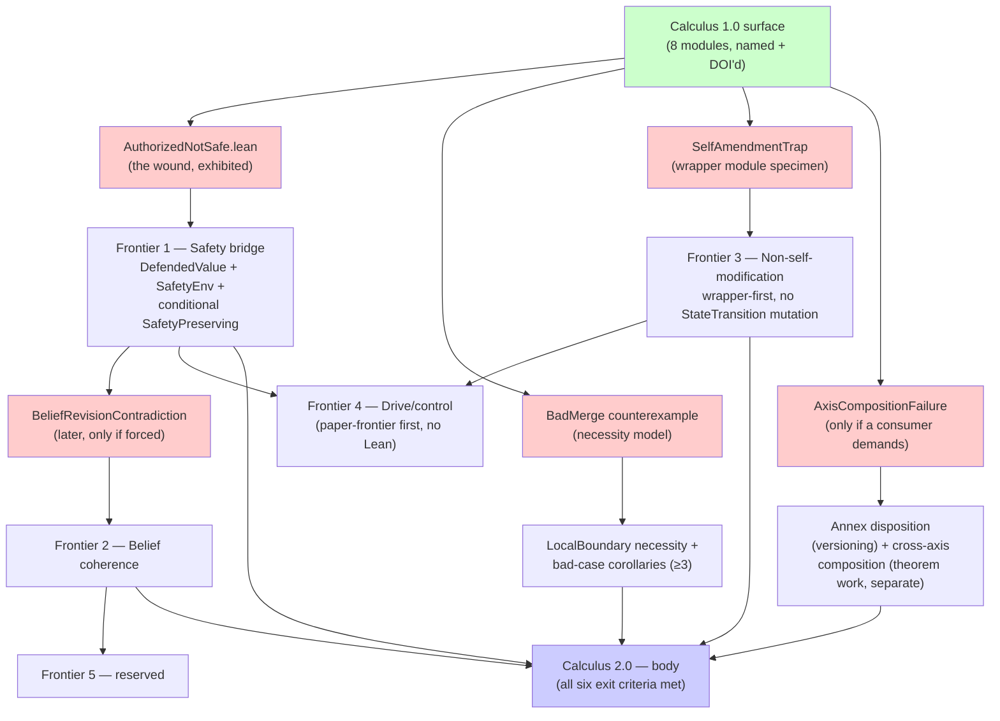

# From kernel to body: a map for Admissibility Calculus

> **Status:** internal roadmap / body map.
> Not a 2.0 commitment. Not an implementation queue. Not a public-surface promise.
> Each slice requires its own forcing case before code.
> The 2.0 body is allowed to remain partially unbuilt. This map names dependency order, not destiny.

Companion documents:

- [[calculus-2-exit-criteria]] — the six conditions under which "Calculus 2.0" is a thing that exists.
- [[frontier-proof-obligations]] — the per-slice five-step proof pattern + the ledger table.

## Context

The Lean repo (~/git/lean) already carries most of the diagnosis: `FRONTIERS.md` names four load-bearing gaps (+ a reserved fifth), `LocalBoundary.lean` is an aperture toward the process-composition track, and `LeanProofs/Admissibility/README.md` distinguishes the 1.0 public surface (8 modules) from a green-but-unpromised annex (13 modules) plus paper-anchored specimens.

This map does not invent a new agenda. It synthesizes what's already in the register, orders it by load-bearing dependency (per `FRONTIERS.md`: load-bearing first, not tractable first), and turns each frontier into a proof obligation with a counterexample-first cadence.

Exit criteria live in [[calculus-2-exit-criteria]]. The proof pattern + ledger live in [[frontier-proof-obligations]].

## Dependency shape

Green = shipped. Red = counterexample specimens (the negative testimony each slice must land *before* any bridge theorem). Blue = the destination, allowed to remain unbuilt. Edges are *requires*, not *suggests*.

## Slice-by-slice — what each piece actually adds

### Slice A — Safety bridge (Frontier 1, load-bearing)

Without a safety bridge, the kernel may claim authorization discipline, but not value preservation or safety. That is the whole of the public framing the bridge buys; nothing larger.

**First executable step — and the only file this plan asks for as Phase 1:**

- `LeanProofs/Admissibility/AuthorizedNotSafe.lean` — two states, one authorized step, one defended value, value decreases. Therefore `AuthorizedStep` does not imply `SafetyPreserving`. Small enough that it cannot become a framework.

> This proves `AuthorizedStep` does not imply preservation of *arbitrary* defended value. It does not prove that no safety bridge exists.

That single file does real work. It mechanically exhibits the wound the rest of Slice A is allowed to address. Stop after it lands. Inspect the shape. Then the next plan-side sentence becomes earned:

> Since authorization alone does not imply preservation of defended value, any safety claim requires additional bridge structure.

Only then, and only if the shape forces it, the rest of Slice A:

- `DefendedValue.lean` — abstract opaque type, same discipline as `Freshness.Time`.
- `SafetyPreserving.lean` — predicate over `Step` parameterized by `DefendedValue`. Three candidate bridge predicates as separate definitions so future work can compare: `WitnessSafetyPreserving` (lift `EncapsulatedWrt`), `AggregatorSafetyPreserving` (lift papers-side $D_A$), `ReceiptSafetyPreserving` (placeholder; depends on receipt doctrine).
- `SafetyBridge.lean` — `SafetyEnv` bundle (same shape as `Corrective.RecoveryEnv`) under which `AuthorizedStep ∧ SafetyEnv.witness → SafetyPreserving`.
- `ExamplesTwo.lean` entry; `WHAT-THE-LEAN-STACK-PROVES.md` non-claim update.

Reuse: `Corrective.RecoveryEnv` is the model — a bundled-obligation structure that makes a discipline non-optional at the type level. `SafetyEnv` is its sibling, not a parallel invention.

### Slice B — Process calculus completion (close the LocalBoundary aperture)

`LocalBoundary.lean` already lists its open obligations (lines 264–294). Body work, in order:

1. **`BadMerge.lean`** — counterexample. Construct `lb₁`, `lb₂`, `lbₘ` and exhibit a `ComponentReach` from `⟨P|Q, initialConfig⟩` that violates `NoInternalExternalExposure lbₘ.partition` when `MergeAdmissible.left_sound` fails. Until this lands, `MergeAdmissible` could be vacuously satisfiable and the aperture means nothing.
2. **Necessity theorem** — `merge_admissible_necessary`: necessity *for the named exposure-safety property under the current `LocalBoundary` model*. Not global necessity, not all process composition, not the laws of physics wearing Pi-calculus pajamas. Builds on the counterexample.
3. **Three+ bad-case corollaries** — boundary collision, authority widening, projection laundering (the easiest three to instantiate first; containment inversion and ambient authority leak come later). Each is a specific violation of `MergeAdmissible`. Currently paper-shaped in `papers/working/models/boundary-calculus/notes/locality-and-merge.md`; the work is to Lean-shape them.
4. **Restriction (ν)** — *only if a downstream consumer forces it.* Hiding changes the action surface and would force a separate `LocalBoundaryHiding.lean` brick. Default: deferred.
5. **Determinism + confluence** for `ComponentStep` — *only when a downstream calculus theorem (refinement, trace equivalence) forces it.* Default: deferred.

Once items 1–3 land, `LocalBoundary.lean` is eligible to be wired into `LeanProofs.lean` and out of the experimental ghetto. That is the move that would earn a compositional / process-calculus claim, which 1.0 explicitly does not make.

### Slice C — Non-self-modification (Frontier 3, wrapper-first)

Most theorem-shaped of the frontiers, deliberately deferred per dependency order. **First pass is a wrapper module, not a mutation of `StateTransition.lean`.** Mutating the 1.0 transition primitives this early leaks the 2.0 surface backward into the 1.0 era and risks reopening the named compatibility claim.

`LeanProofs/Admissibility/SelfModification.lean`:

- `StepAllowedWithActor` — wrapper over the existing `StepAllowed`, adding an actor-policy binding parameter (relation `Binds : Actor → Policy → Prop`).
- A wrapper-level *policy-amending step shape* — an action class classified by the wrapper, not assumed as an existing `Step` constructor in the 1.0 kernel.
- `IsSelfAmendment : Actor → Step → Prop` — true when the wrapper classifies a step as mutating a policy that binds the actor.
- `SelfAmendmentTrap.lean` (counterexample first) — actor uses authorized machinery to mutate its own binding rule.
- Bridge theorem: `no_self_amendment_authorized_step` under the wrapper.

Only if a later consumer forces the shape back into the core kernel does `StateTransition.lean` get touched. Default: it does not.

### Slice D — Belief coherence (Frontier 2)

After A and C are in, the kernel has enough vocabulary to take belief revision seriously without metastasizing into general epistemology. Per the Frontier doc's containment caution: *only the authorized-revision discipline, not belief revision in general.*

- `BeliefRevisionContradiction.lean` — counterexample. Authorized belief revision leaves dependents in contradiction.
- `BeliefCoherence.lean` — `BeliefState`, `Dependency`, `Contradicts`, `Revise` with the obligation *invalidate or revalidate dependents*.
- Bridge theorem: coherent revision under explicit dependency-bookkeeping hypothesis.

### Slice E — Annex disposition AND cross-axis composition (two separate things)

These are two different kinds of work and the plan keeps them separate:

**E.1 — Annex disposition (versioning/surface decision, not theorem work).** For each annex module, pick one of three fates:

| Disposition | Candidates |
| ----------- | ---------- |
| **Promote** | `RecoveryMargin`, `ClosureEligibility`, `PublicReceiptRefinement` — recovery is currently scope-fenced out of 1.0; a body that claims recovery should name it. |
| **Keep annex / amputate** | `CrossBoundary*` family — either commit to the projection-discipline pattern as load-bearing or label as specimens. |
| **Defer** | everything else, until forced. |

**E.2 — Cross-axis composition (theorem work, but only on demand).** `FiatAdmissibility`, `NumericalAdmissibility`, and `WitnessInvariance` each explicitly defer composition lemmas. The work to bridge them is real, but:

- **Do not** create `Axes.lean` as an aesthetic aggregator. Premature symmetry is the square root of the thing.
- **Do** create the first cross-axis lemma only when a specific consumer needs one. The forcing case will name itself.
- Land `AxisCompositionFailure.lean` (counterexample) first if and when the work starts.

### Slice F — Drive/control (Frontier 4)

Paper-frontier first per existing doctrine. Lean treatment is downstream of finding the right primitive in prose. No file work proposed here. Do not let Lean become a wood chipper for half-shaped primitives.

## Files in scope across the whole body (cumulative, not Phase 1)

New (Slices A–D), in the order each becomes eligible:

- `LeanProofs/Admissibility/AuthorizedNotSafe.lean` *(Phase 1 — only this)*
- `LeanProofs/Admissibility/DefendedValue.lean`
- `LeanProofs/Admissibility/SafetyPreserving.lean`
- `LeanProofs/Admissibility/SafetyBridge.lean`
- `LeanProofs/Admissibility/BadMerge.lean`
- `LeanProofs/Admissibility/LocalBoundaryBadCases.lean`
- `LeanProofs/Admissibility/SelfModification.lean`
- `LeanProofs/Admissibility/SelfAmendmentTrap.lean`
- `LeanProofs/Admissibility/BeliefRevisionContradiction.lean`
- `LeanProofs/Admissibility/BeliefCoherence.lean`
- `LeanProofs/Admissibility/AxisCompositionFailure.lean` *(only if forced)*
- `LeanProofs/Admissibility/ExamplesTwo.lean` (grows with each landing)

Modified (only when forced):

- `LeanProofs/Admissibility/LocalBoundary.lean` — remove EXPERIMENTAL status when Slice B items 1–3 land; wire into `LeanProofs.lean` root.
- `LeanProofs.lean` — wire new modules in as each lands.
- `FRONTIERS.md` — update each frontier's status; the doc already anticipates this.
- `WHAT-THE-LEAN-STACK-PROVES.md` — non-claim update after each slice.

Explicitly **not** modified by this plan:

- `CalculusOne.lean` — 1.0 surface is named and DOI'd. A 2.0 aggregator, if it ever exists, is a separate file (`CalculusTwo.lean`), not a mutation.
- `StateTransition.lean` — Slice C is wrapper-first.
- `Authority.lean`, `Derivation.lean`, `Execution.lean`, `Corrective.lean`, `Freshness.lean`, `SurfaceAuthorization.lean`, `WitnessInvariance.lean` — all 1.0 surface, untouched.

## Phase 1 — the only thing this plan asks for now

Ship `LeanProofs/Admissibility/AuthorizedNotSafe.lean`. One file. One counterexample. No bridge. No `SafetyEnv`. No new `DefendedValue` abstraction beyond what the counterexample requires inline. Build green. No `sorry`. Wire into `LeanProofs.lean`.

> Root-wired means build-covered; it does not mean public-surface-promised.

Then stop. The next move is decided after inspecting the shape of the wound that file makes visible — not before.

## Guardrails

- **Counterexample first.** Every slice ships its negative model before any bridge predicate. Otherwise the bridge predicate becomes attractive definition-shaped assertion, not earned structure.
- **Each row in the ledger pays rent.** A frontier with no row in [[frontier-proof-obligations]] is not closed.
- **Tractability is not load-bearing.** The temptation to start with Slice C (most theorem-shaped) is exactly the discipline-failure `FRONTIERS.md` warns against.
- **No sorry-based stubs.** Repo invariant since 2026-05-08; preserved here.
- **No 1.0 surface mutation.** The body is a successor, not a stealth rewrite.
- **The body is allowed to remain partially unbuilt.** This map names dependency order, not destiny.
- **Harder to fake, easier to reject.** Anything added to this plan should make the next theorem clearer to force, not the diagram prettier.
