# Internet substrate failure map

**Status:** Routing artifact. Second of three spike outputs (sibling to `forbidden-inference-register.md` + `annex-sketch-pack.md`). Filed 2026-05-26 under `prior-art-spike-plan.md` as the first internet-substrate spike session.

**Posture:** Failure-mode routing table. Organized by **failure family** rather than by protocol family. Each failure family clusters internet substrate mechanisms that all block a related forbidden inference. The map is the routing layer for future spike work — when a new pattern surfaces, the map says where it goes.

**Doctrine header:**

> **Protocols become specimens, not gods in little RFC hats.**

---

## Why this organization

The standard internet-textbook organization is by **protocol family** (DNS, BGP, TLS, HTTP, etc.) or by **OSI layer** (transport, application, presentation). Neither feeds a refusal-kernel calculus directly, because protocols mix concerns — a single protocol may block multiple distinct forbidden inferences, and a single forbidden inference may have multiple protocol witnesses.

The useful axis is the **failure family**: which inference does the substrate exist to block? That maps directly onto the calculus's refusal-kernel structure.

## The nine failure families

```mermaid
flowchart TD
    A[Internet failure modes] --> B[Reachability / resolution]
    A --> C[Freshness / staleness]
    A --> D[Authority / delegation]
    A --> E[Ordering / causality]
    A --> F[Custody / provenance]
    A --> G[Consensus / partition]
    A --> H[Replay / dedup]
    A --> I[Overload / backpressure]
    A --> J[Routing policy attacks]

    B --> B1[DNS delegation and glue]
    B --> B2[RPKI origin validation]
    B --> B3[QUIC address validation]

    C --> C1[TTL and cache freshness]
    C --> C2[Negative caching]
    C --> C3[If-Match and generation preconditions]

    D --> D1[Zone authority]
    D --> D2[ROAs and resource certificates]
    D --> D3[Certificate chains and revocation]
    D --> D4[Propagation scope via BGP Roles / OTC]

    E --> E1[Lamport clocks]
    E --> E2[Vector clocks]
    E --> E3[Linearizable vs serializable reads]

    F --> F1[Transparency logs]
    F --> F2[Merkle consistency and inclusion]
    F --> F3[Git and object-store provenance]

    G --> G1[Raft or Paxos quorums]
    G --> G2[Sloppy quorum and hinted handoff]
    G --> G3[CRDT convergence]

    H --> H1[Idempotent methods]
    H --> H2[Idempotency keys]
    H --> H3[Transport ACK is not application receipt]

    I --> I1[TCP congestion control]
    I --> I2[429 Retry-After]
    I --> I3[Backoff and jitter]

    J --> J1[Route leaks]
    J --> J2[Origin hijacks]
    J --> J3[Policy-constrained export]
```

## Family-by-family

### B. Reachability / resolution

> *Blocks:* "I can resolve / reach / verify something, therefore it is authorized."

A name resolves; a route delivers; an address answers. None of these confer authority. The substrate mechanisms here all separate "the path exists" from "the path-walker has standing."

- **DNS delegation, zone cuts, glue** — parent referral is not child-zone authoritative content; glue is bootstrap routing, not the child's signed word.
- **RPKI origin validation** — a ROA authorizes an AS to originate a prefix; it does NOT confer path-validity.
- **QUIC address validation** — before validation, reply budget is bounded (3× bytes received); reachability does not imply reply rights.

**Existing-primitive routing:** mostly `authority + scope`. Glossary handle: *Reachability is not legitimacy.*

### C. Freshness / staleness

> *Blocks:* "It was true once, therefore it is true now" / "TTL not expired, therefore current."

Time-bounded reuse policies. Substrate carries explicit freshness windows; consumers must check before using.

- **TTL and cache freshness** (RFC 9111) — `max-age`, `must-revalidate`, freshness lifetime.
- **Negative caching** — NXDOMAIN and failure answers cached for bounded periods (RFC 2308); negative does not become permanent.
- **stale-while-revalidate / stale-if-error** (RFC 5861) — bounded stale reuse under degraded conditions.
- **If-Match / generation preconditions** — though structurally these belong in the **state-conditional action** family (see sketches), not pure freshness.

**Existing-primitive routing:** `Freshness.lean` already covers this. Substrate maps onto refinements (explicit TTL parameters, allowed-stale policy), not new kernels.

### D. Authority / delegation

> *Blocks:* "Signature verifies, therefore current authority" / "Chain builds, therefore live."

Authority delegation chains with live-status checks. Substrate enforces that *current* authority is distinct from *historical* authority.

- **Zone authority** (DNS hierarchy) — delegated authority across namespace cuts.
- **ROAs and resource certificates** — narrowly-scoped authorization to originate.
- **Certificate chains + OCSP/CRL** — chain validity AND current revocation status both required.
- **Propagation scope (BGP OTC, RFC 9234)** — *origin* authorization does NOT imply *propagation* authorization. **This is the residue family** — see propagation-scope authority kernel sketch.

**Existing-primitive routing:** mostly `Authority + Freshness`. The propagation-scope sub-family is the kernel candidate.

### E. Ordering / causality

> *Blocks:* "Timestamp later, therefore caused after" / "All events totally ordered."

Distributed events are not naturally totally ordered. Substrate mechanisms here enforce that order claims need explicit causal witnesses.

- **Lamport clocks** — consistent total order extending happened-before.
- **Vector clocks / happens-before** — partial order; detects incomparability.
- **Linearizable vs serializable reads** — linearizable reflects current consensus; serializable local reads may be stale.

**Existing-primitive routing:** `time-decomposition` (operator/metric/phase) already covers this. Vector clocks add causal partial-order to the framework as an annex theorem if a concurrency forcing case fires.

### F. Custody / provenance

> *Blocks:* "Logged, therefore custodial" / "Visible in public log, therefore history not rewritten."

Append-only public auditability. Substrate proves shape, not content authority.

- **Transparency logs** (CT) — signed timestamps, inclusion proofs, consistency proofs.
- **Merkle consistency / inclusion** — append-only-extension proofs; divergence-range proofs.
- **Git and object-store provenance** — content-addressable shape; commit history.

**Existing-primitive routing:** `witness + receipt + provenance`. Annex-witness only — explicit non-claim: *A log is not custody.* See dangerous-analogies section below.

### G. Consensus / partition

> *Blocks:* "Any majority is enough" / "Reachable replica answer is current."

Quorum-based coordination under partial visibility. Substrate enforces intersection properties, not headcount.

- **Raft / Paxos quorums** — intersecting majorities; leadered log replication.
- **Sloppy quorum + hinted handoff** — accepted-now, settled-later (Dynamo).
- **CRDT convergence** — coordinator-free merge under delivery assumptions.

**Existing-primitive routing:** mostly `authority + standing`. Quorum-intersection is the strongest Public Phase D candidate after the chain refusal kernels — see register entry 10. Currently working-note only.

### H. Replay / dedup

> *Blocks:* "Timeout means no effect" / "Same payload means same operation."

Operation identity distinct from delivery semantics. Substrate carries explicit operation IDs and dedup windows.

- **Idempotent methods** (HTTP) — intended effect on server, not identical response.
- **Idempotency keys** — caller-provided IDs with bounded dedup window.
- **Transport ACK ≠ application receipt** — TCP/HTTP ack does not imply application commit.

**Existing-primitive routing:** `action + receipt + refusal composition`. **Operation identity is the residue family** — see replay-safe action identity in sketch pack (optional fourth kernel).

### I. Overload / backpressure

> *Blocks:* "Valid request, therefore admissible now" / "Retries are neutral."

Operational refusal for system preservation. Substrate makes refusal a first-class signal, not an error.

- **TCP congestion control** — explicit injection-rate limits.
- **HTTP 429 / Retry-After** — timed refusal with re-entry condition.
- **Backoff and jitter** — coordinated retry avoidance.

**Existing-primitive routing:** `refusal composition + time decomposition`. Failure-mode map entry; not yet a kernel candidate.

### J. Routing policy attacks

> *Blocks:* "Visible route, therefore legitimate" / "Origin valid, therefore export valid."

Adversarial routing manipulation. Substrate enforces export-scope policy and origin-attestation separately.

- **Route leaks** — accidentally propagating routes outside policy.
- **Origin hijacks** — claiming to originate a prefix the AS doesn't hold.
- **Policy-constrained export** (RFC 9234 OTC) — propagation-scope enforcement.

**Existing-primitive routing:** intersects with reachability (B) and authority (D); the propagation-scope kernel handles the export-rights gap.

## Three annex refusal-kernel candidates (top of pile)

From the failure families above, three substrate residues survive reduction and merit annex formalization:

1. **State-conditional action** (family C ∩ H) — `VersionBoundAction`. Past witness does not authorize present mutation. Blocks: "I saw v, so I may write."
2. **Proof-carrying denial** (family F-adjacent + Authority) — `AuthenticatedDenial`. Absence is not denial unless authority testifies. Blocks: "No answer means none exists."
3. **Propagation-scope authority** (family D ∩ J) — `FencedEpochAuthority` (subsumes propagation + lease semantics). Authority is not conserved across boundaries; old leases must be fenced. Blocks: "I held authority once, so I still do" and "Valid origin, so valid propagation."

Optional fourth: **operation-identity** (family H) — `ReplaySafeActionIdentity`. Timeout is not no-effect; retry-text is not same-operation. See `annex-sketch-pack.md` for the sketches.

## Three glossary-only handles

Useful explanatory vocabulary; **NOT** new primitives.

- **Transport ACK is not application receipt.** Permanent anti-confusion handle. Substrate witnesses: TCP/HTTP/QUIC delivery vs application commit.
- **Bounded clock uncertainty / commit-wait** (Spanner TrueTime, NTS). Sharpens time-decomposition without minting new axis.
- **TOFU / SSHFP** — first-observed binding is **provisional local standing**, explicitly weaker than certified authority. Useful for naming the bootstrap-trust slot without overpromising it.

## Three dangerous analogies (explicit non-claims)

These are the metaphor-laundering traps. **Nail them to the wall.**

> **Consensus or quorum is not legitimacy, justice, or truth.** Consensus protocols choose one value safely under a fault model; they do not certify correctness, wisdom, or moral authority. Their safety comes from intersection properties, not from "many people agreed." If a system needs *legitimacy*, quorum protocols are mechanism; legitimacy is a separate concern.

> **A log is not custody.** Transparency logs prove publication and append-only consistency; Merkle trees prove inclusion or prefix extension. Neither names transition authority, possession, or contestability on its own. *Merkle proves shape. It does not appoint a custodian.* CT, Git, and blockchain all tempt this confusion.

> **Reachability is not legitimacy. Availability is not authority.** A route may be reachable yet leaked; a name may resolve via glue or referral without the answering party being authoritative for the underlying content; a CDN edge may serve content without origin standing. *The path works ≠ the path-walker has standing.*

## What this map enables

The failure-mode organization gives three operational capabilities:

1. **Routing for future spike sessions.** When a new internet substrate mechanism surfaces in a future spike, the map says which family it belongs to — and therefore which existing primitives it likely overlaps with, what residue (if any) it can contribute, and what bucket (A/B/C/D/E per the spike plan's triage framework) it likely lands in.

2. **Anti-laundering hygiene.** The three dangerous-analogies entries are the explicit non-claims. When someone (operator, model, collaborator) wants to import a substrate guarantee, the map says **whether the import is honest or laundered**. *"This is in the log"* ≠ custody is the test.

3. **Cross-domain ratification.** When the same forbidden inference is blocked by mechanisms in multiple families (e.g., authority + custody + reachability), that confluence is *evidence* the refusal kernel is fundamental — not a substrate-specific quirk. The map clusters by family so the cross-family convergences are visible.

## Cross-references

- [[prior-art-spike-plan]] — parent plan; this map is the second of three spike-session outputs.
- [[forbidden-inference-register]] — sibling matrix; rows of the register correspond to entries in this map's families.
- [[annex-sketch-pack]] — sibling artifact; the three (or four) C-bucket sketches the map points to.
- [[three-time-decomposition]] — family E (ordering/causality) is already largely covered.
- [[byzantine-fault-tolerance-extension]] — family G (consensus/partition) is where Byzantine extensions land most heavily.
- [[cross-kernel-disposition]] — Path C scoping; family G ∩ E is where temporal cross-kernel composition would force a disposition revisit.
- [[refusal-kernel-to-refusal-receipt-seam]] — the families correspond to substrate-domain instances of the operator-family pattern.

## Doctrine keepers

> **Protocols become specimens, not gods in little RFC hats.**

> **The map clusters by failure family, not by protocol family. That is the useful cut.**

> **Reachability is not legitimacy. A log is not custody. Quorum is not justice.**

> **Internet protocols repeatedly rediscovered refusal kernels because distributed systems punish forbidden inferences.**

## Provenance

- **2026-05-26.** Internet-substrate spike (first session under `prior-art-spike-plan.md`). ChatGPT survey + reduction; DeepSeek sanity check / external reader reaction. Three artifacts captured: the matrix (`forbidden-inference-register.md`), this failure-mode map, and the kernel sketches (`annex-sketch-pack.md`).
- Failure-family taxonomy adapted from the ChatGPT spike's reduction pass; cross-validated by DeepSeek's external read.

> **The register is the matrix. The map is the routing layer. The kernels are the probes. All three serve the same anti-slop discipline.**
